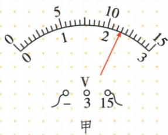
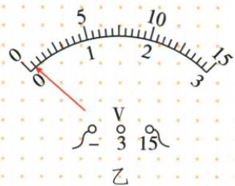
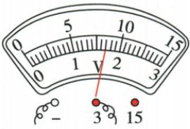

## 讲解

### 是什么

电压表测两端电压，跨接被测部分。实验表3 V档每小格0.1 V，15 V档每小格0.5 V，接线柱决定采用哪个刻度。

### 怎么来的

表需要比较两节点，所以并联；理想电压表电阻很大，支路电流极小，通常不改变被测主电路。调零排除初始偏差，小范围能增加有效偏角但必须不过量程。

### 什么时候能用

在电压可能超过小范围时先选大范围或按规定试触。正端接高电势侧；可在允许量程内直接测电源两极。先断开改线再通电。

## 例题

### 电压表大范围读数与调零

> 来源ID Q16-02；第十六章电压电阻；151-200/full.md 第1907–1947行。原答案与解析定位：151-200/full.md 第1949–1949行。

如图所示，图甲中电压表的分度值为\_\_\_\_ V，读数为\_\_\_\_ V；若使用前出现如图乙所示的情况，则原因是\_\_\_\_。

**原资料答案与解析：**

答案0.5 11.5 没有调零

**展开解析（依据原详解补足理由与步骤）：**

甲接负端和15端，量程为15 V，0至5 V间有10小格，每小格0.5 V；指针位于10之后第3格，$U=10+3\times0.5=11.5\,\mathrm V$。乙题设“使用前”没有测量电压，指针未对零说明未调零，不能误认为正在测量时正负接反。

### 并联电压实验接线及普遍性

> 来源ID Q16-08；第十六章电压电阻；151-200/full.md 第2284–2307；2338–2341行。原答案与解析定位：151-200/full.md 第2313–2332行。

例1（2024山东东营中考）某小组在“探究并联电路中电压的特点”实验中：

(1) 如图甲, 根据电路图, 用笔画线表示导线, 将实物连接起来。

(2) 连接电路时, 开关处于状态。  
(3) 正确连接好电路后,闭合开关,电压表的示数如图乙所示,为 V。  
(4)测得灯泡 $L_{1}$ 两端电压后,再测得灯泡 $L_{2}$ 两端电压和 A、B 两端电压,记录数据。改变两个小灯泡的规格,重复以上操作,其目的是 \_\_\_\_。  
(5)评估交流环节,有同学提出:实验中连接完电路,闭合开关,发现电压表指针反向偏转,原因是\_\_\_\_。

**原资料答案与解析：**

例1 解析（2）为保护电路，连接电路时，开关应处于断开状态。

(3)由图乙可知,电压表的测量范围为0\~3 V,分度值为0.1 V,示数为2.8 V。  
(4)探究并联电路中电压的特点,多次实验的目的是多次测量,以得到普遍的规律。  
(5)闭合开关,电压表指针反向偏转,说明电流从负接线柱流入、从正接线柱流出,原因是电压表正、负接线柱接反。

答案 (1) 如图所示

(2) 断开   
(3)2.8   
(4)使结论具有普遍性  
(5)电压表“+”“-”接线柱接反了

**展开解析（依据原详解补足理由与步骤）：**

按图甲把L1与L2的对应两端分别接公共节点A、B，开关和电源串联到供电干路；电压表正端接高电势侧、负端接低电势侧，跨L1。原连线答案图已保留。(2)接线先断开开关。(3)图乙接3 V端，分度0.1 V，指针为2.8 V。(4)更换不同规格两灯，是检验电压关系是否适用于不同组合，使结论具有普遍性，不是用重复平均减少读数误差。(5)通电后反向偏转才说明正负接线柱反接；与使用前未调零区别。

### 原附录电压表读数示例

> 来源ID Q23-08；附录1常考测量仪器；201-233/full.md 第2055–2055行。原答案与解析定位：201-233/full.md 第2055–2055行。

| 仪器 | 读数步骤 | 注意事项 |
| --- | --- | --- |
| 电压表 | 观察电压表所选的测量范围→确定分度值→确定电压表示数1确定所选的测量范围:0~3V2确定分度值:0.1V3确定电压表示数:$1\,\mathrm{V}+0.1\,\mathrm{V}\times 7=1.7\,\mathrm{V}$ | 1电压表必须和被测用电器并联2选用合适的测量范围3电流“+”进“-”出4可以把电压表直接接在电源两极5使用前进行校零 |

**原资料答案与解析：**

原表给出的读数、步骤与注意事项见上表；未另给独立问答题。

**展开解析（依据原详解补足理由与步骤）：**

原图接负端与3 V端，使用0至3 V刻度；1至2 V之间10格，分度值0.1 V。指针到1后7格，因此$U=1+7\times0.1=1.7\,\mathrm V$。不能读外圈5至10的刻度后直接写V；并联测两节点的电势差，使用前校零且正负接线与测量极性一致。

## 易错

电流表不可仿照直接跨电源；使用前偏零不等于通电后接反。
