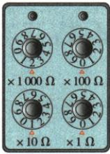
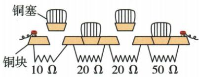

## 讲解

### 是什么

旋盘式按各旋钮读数乘倍率再相加；插塞式拔出的电阻段接入，插着的段由铜塞短接。可直接读出设定阻值，但常见实验电阻箱按离散步进调节。

### 怎么来的

旋盘选择接入的各段电阻；串联电阻段总阻值相加。铜塞作为低电阻旁路，插入后电流主要走铜塞，所以那段不计入有效阻值。

### 什么时候能用

按所给型号的倍率和各插塞状态读数，不能把滑动变阻器连续调节、无读数刻度的特点搬来。读原图而非凭旋盘数字排列猜。

## 例题

### 原资料两类电阻箱读数示例

> 来源ID Q16-12；第十六章电压电阻；151-200/full.md 第2547–2547行。原答案与解析定位：151-200/full.md 第2547–2547行。

| 项目 | 旋盘式电阻箱 | 插塞式电阻箱 |
| --- | --- | --- |
| 图示 |  |  |
| 符号 |  |  |
| 特点 | 能够直接读出接入电路的电阻,但不能连续地改变接入电路的电阻 | 能够直接读出接入电路的电阻,但不能连续地改变接入电路的电阻 |
| 读数 | 旋盘下面“ $\triangle$ ”所对应的示数乘相应的倍数之和图示电阻箱读数为$(2\times 1000+0\times 100+1\times 10+0\times 1)Ω=2010\,\mathrm{\Omega}$ | 拔出铜塞时,对应的那段电阻丝就接入了电路;插入铜塞时,对应的那段电阻丝就会被短路,相当于没有接入电路图示电阻箱读数为$10\,\mathrm{\Omega}+20\,\mathrm{\Omega}=30\,\mathrm{\Omega}$ |

**原资料答案与解析：**

原表读数：旋盘式$(2\times 1000+0\times 100+1\times 10+0\times 1)Ω=2010\,\mathrm{\Omega}$；插塞式$10\,\mathrm{\Omega}+20\,\mathrm{\Omega}=30\,\mathrm{\Omega}$。

**展开解析（依据原详解补足理由与步骤）：**

旋盘式：分别读每个三角标记所指的数字再乘倍率，千位2、百位0、十位1、个位0，$R=(2\times1000+0\times100+1\times10+0\times1)\,\Omega=2010\,\Omega$。插塞式：原图10 Ω和一段20 Ω的铜塞拔出，另一段20 Ω及50 Ω插着被短接；因此$R=10\,\Omega+20\,\Omega=30\,\Omega$。只加拔出的段，不把全部标值相加。本题组是原表自带读数示例，未自编题干。

## 易错

旋盘指向三角而非旋钮顶端；插塞应算拔出段。
