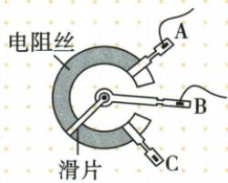
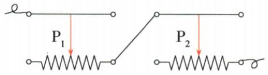

## 讲解

### 判据

滑片运动或题目要某方向增阻，先认出哪端属于电阻丝。

### 流程

1. 确认两个端子是一上一下。2. 找接入电阻丝的下端。3. 标出下端到滑片的有效长度。4. 滑片近它减阻、远它增阻。5. 多只串联求总最大，要每只有效段都最大；电位器同样先找固定丝端与滑片端。

## 例题

### 电位器接AB滑片朝A

> 来源ID Q16-11；第十六章电压电阻；151-200/full.md 第2495–2510行。原答案与解析定位：151-200/full.md 第2549–2551行。

电位器实质是一种变阻器，如图是电位器的结构和连入电路的示意图，A、B、C 是接线柱。当滑片向 A 接线柱旋转时，连入电路的电阻（）

A.变大 B.变小  
C. 不变 D. 先变大后变小

**原资料答案与解析：**

解析 根据图示可知,此时 A、B 两接线柱接入电路中,当滑片向 A 端旋转时,电阻丝接入电路中的长度变短,连入电路的电阻变小,故选 B。

答案 B

**展开解析（依据原详解补足理由与步骤）：**

B连滑片，A连电阻丝一端，接入的是A到滑片之间那段电阻丝。滑片朝A，有效长度缩短，电阻变小，B对。A变大与长度变化相反；C把接入阻值误当整条电阻丝总值；D无越过或折返条件，不出现先增后减。若换接BC，方向结论会变化，要先看接线。

### 两个变阻器总接入阻值最大

> 来源ID Q16-13；第十六章电压电阻；151-200/full.md 第2563–2576行。原答案与解析定位：151-200/full.md 第2578–2580行。

例 如图所示,将两个滑动变阻器串联起来接入电路后,要使这两个滑动变阻器接入电路的总电阻最大,则 ( )

A. $P_{1}$ 移向左端, $P_{2}$ 移向左端   
B. $P_{1}$ 移向右端, $P_{2}$ 移向右端   
C. $P_{1}$ 移向左端, $P_{2}$ 移向右端   
D. $P_{1}$ 移向右端, $P_{2}$ 移向左端

**原资料答案与解析：**

解析 要使这两个滑动变阻器接入电路的总电阻最大,应将两个滑动变阻器的电阻丝全部连入电路。两个变阻器接入电路的下接线柱均为右下接线柱,则滑片均应移向左端。

答案 A

**展开解析（依据原详解补足理由与步骤）：**

图中两只的有效电阻都是滑片到右端之间的一段，且串联。要使总值最大，应使各自有效长度均最大，两滑片都向左，A对。B两者都向右减小；C第二只向右减小；D第一只向右减小，均不能达到总最大。连接上端的导线左右画法不决定增减，实际接入的电阻丝右端才决定。

### 向右移增阻应选哪两端

> 来源ID Q16-14；第十六章电压电阻；151-200/full.md 第2586–2596行。原答案与解析定位：151-200/full.md 第2600–2602行。

例（2024 四川自贡中考）如图所示是滑动变阻器的结构示意图, 当滑片 P 向右移动时, 要使连入电路中的电阻变大, 应选择的接线柱为 ( )

A.A 和 B

B.B 和 C

C.B 和 D

D.A 和 D

**原资料答案与解析：**

例 解析 根据题意可知,当滑片P向右移动时,要使连入电路中的电阻变大,则电阻丝的左半部分接入电路中,即需要接A接线柱,上面的两个接线柱可任意选择,所以应选择的接线柱为A、C或A、D。故D正确。

答案D

**展开解析（依据原详解补足理由与步骤）：**

原图A左下、B右下为电阻丝两端，C、D为金属杆两端。向右滑而增阻需接左下A，使A到滑片的长度增加，再选C或D任一上端。D选AD符合。A选AB接整条电阻丝，移动不变；B选BC及C选BD均接右半段，右移长度缩短，阻值减小。

## 易错

同向移动不必都增阻；“向右就增大”没有通用性。
