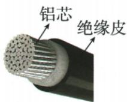

## 讲解

### 判据

问材料、长短、粗细或温度对阻值影响时，先看其他项是否相同。

### 流程

1. 列材料、长度、截面积、温度四项。2. 只允许待比较项变化。3. 同材料同温度越长越大、越粗越小；温度影响依材料判断。4. 实验可用同电源同其余电路条件下电流大小转换，流越小对应阻碍越大。5. 结论写清固定条件，不能把绝缘皮当导电芯。

## 例题

### 铝芯电缆为何减小电阻

> 来源ID Q16-10；第十六章电压电阻；151-200/full.md 第2431–2441行。原答案与解析定位：151-200/full.md 第2461–2463行。

例（2024 天津中考）如图所示的铝芯电缆是一种输电导线。在某村输电线路改造工程中,更换的铝芯电缆比旧铝芯电缆电阻更小,主要是因为新电缆的()

A.铝芯更细

B.铝芯更粗

C.绝缘皮更薄

D.绝缘皮更厚

**原资料答案与解析：**

例 解析 输电线的材料不变(还是铝),长度不变(否则不能满足改造要求),由影响导体电阻大小的因素可知,在其他条件相同时,导体的横截面积越大,其电阻越小,所以新电缆的铝芯更粗;电阻的大小与绝缘皮的厚薄无关,故B正确。

答案B

**展开解析（依据原详解补足理由与步骤）：**

按原题改造情境采用长度、材料和温度相同的比较。A铝芯更细，横截面积小，电阻反而增大，错。B铝芯更粗，横截面积大，导电路径增加，电阻减小，对。C、D仅改变绝缘皮厚薄，没有改变铝导电芯的材料、长度和横截面积，不能解释题设电阻降低。若实际工程还改变长度温度，需另比较，不能只凭照片作普遍结论。

## 易错

原“灯越亮电阻越小”只在电源和比较灯等其他条件相同的实验中成立，不能直接比较不同规格灯亮度。
