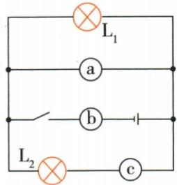

## 讲解

### 判据

题设灯要正常工作，同时几处标未知表。

### 流程

1. 将未知表位置看成支路或必经路。2. 跨负载两端应为高电阻电压表，防止负载被低阻旁路。3. 供电干路或灯唯一通路应为低电阻电流表，保持电流。4. 逐项同时代回，不可只选对一处。去表法检验移除对其他灯的影响。

## 例题

### 三未知表使两灯正常发光

> 来源ID Q16-07；第十六章电压电阻；151-200/full.md 第2251–2268行。原答案与解析定位：151-200/full.md 第2270–2274行。

例2 如图所示电路中,灯泡正常发光,a、b、c是电压表或电流表,其中()

A.a、b为电流表，c为电压表  
B.a 为电压表, b、c 为电流表  
C.a 为电流表, b、c 为电压表  
D.c 为电流表, a、b 为电压表

**原资料答案与解析：**

解析 短路法: 将 a、b、c 三表分别换成一根导线, 将 a 表换成导线时电路出现短路, 所以 a 应为电压表; 将 b、c 表换成导线时电路均未出现短路, 所以 b、c 应为电流表。故选 B。

去表法: 将 a 表去掉, 其他元器件可以正常工作, 所以 a 为电压表; 将 b 表去掉, 电路断开, 将 c 表去掉, 灯泡 $L_{2}$ 所在支路断路, 所以 b、c 为电流表。故选 B。

# 答案 B

**展开解析（依据原详解补足理由与步骤）：**

a直接跨左右公共节点，若为电流表相当于低电阻旁路，短接两灯，故a必须电压表。b在电源共同支路，必须电流表使供电通路连续。c串在L2支路，也应电流表，否则L2几乎无流。B符合。A将a当电流表且c当电压表，两灯不正常；C将a当电流表、b当电压表，既旁路又切断供电；D将a、b均当电压表，b切断供电且c切断L2。短路法、去表法是纸面分析，不是在实物上短接电源。

## 易错

原“换成导线会短路”需分电源短路或用电器旁路，且依题设正常工作条件；只在纸面判断。
