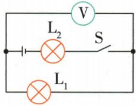
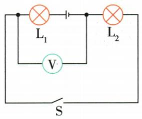
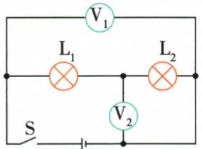
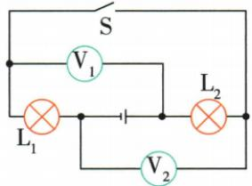

## 讲解

### 判据

电压表引线绕得远或跨过电源支路时，先把导线连接的等电势点合并。

### 流程

1. 记录表两个接线点。2. 仅沿完好理想导线、已闭合开关或理想电流表移动；不能跨电源、用电器、电压表。3. 找哪一段两端恰是这两节点，表便测该段。4. 去源法只作纸面辅助，最终仍核对节点。

## 例题

### 电压表跨过电源支路测谁

> 来源ID Q16-03；第十六章电压电阻；151-200/full.md 第1977–1995行。原答案与解析定位：151-200/full.md 第1997–2001行。

例1 如图所示的电路中,当开关 S 闭合时,电压表测的是

( )

A. $L_{1}$ 两端的电压   
B. $L_{2}$ 两端的电压   
C. $\mathrm{L}_{1}$ 和 $\mathrm{L}_{2}$ 两端的总电压  
D. 电源和 $L_{1}$ 两端的总电压

**原资料答案与解析：**

解析 “去源法”: “去掉”电源, 电压表与 $L_{1}$ 构成一个回路, 即电压表测的是 $L_{1}$ 两端的电压。

“滑线法”: 电压表左端引线可沿导线移至 $L_{1}$ 左端, 右端引线可沿导线移至 $L_{1}$ 右端, 电压表测的是 $L_{1}$ 两端的电压。

答案 A

**展开解析（依据原详解补足理由与步骤）：**

闭合S后，电源和L2在一条支路，两侧节点之间另有L1及电压表。电压表的两引线各可沿无电阻导线移到L1的两端，所以测L1，A对。B错：不能让引线跨电源再当成L2两端。C错：表没有跨两灯串联部分。D错：也没有跨所谓电源与L1的组合。画得靠近电源不代表测电源。

### 并联支路增加两表示数变化

> 来源ID Q16-09；第十六章电压电阻；151-200/full.md 第2345–2363行。原答案与解析定位：151-200/full.md 第2334–2336行。

例2 (2024 重庆中考)如图所示电路,电源电压保持不变, $L_{1}$ 和 $L_{2}$ 是两个相同的小灯泡。先闭合开关 $S_{1}$ , 记录两电表示数; 再闭合开关 $S_{2}$ , 电流表和电压表的示数变化情况是 ()

A.电流表示数减小,电压表示数减小  
B.电流表示数增大,电压表示数减小  
C.电流表示数增大,电压表示数不变  
D.电流表示数不变,电压表示数不变

**原资料答案与解析：**

例2 解析 由题图可知,先闭合开关 $S_{1}$ , 电路中只有灯 $L_{2}$ 工作,电流表测电路中的电流,电压表测电源电压;再闭合开关 $S_{2}$ , 灯 $L_{1}$ 、 $L_{2}$ 并联,电流表测干路电流,电压表仍然测电源电压,则闭合开关 $S_{2}$ 后,电压表示数不变,电流表示数增大,C 正确。

答案 C

**展开解析（依据原详解补足理由与步骤）：**

只合S1，L2成通路，表V跨L2，也跨供电节点，A读L2电流。再合S2，L1作为新增并联支路，L2仍跨同一电源；题设电源电压不变，所以电压表示数不变。原L2电流维持，新增L1电流汇入干路，A示数增大，C对。A、B均说电压下降，违背条件；D把干路表错看成只测原支路。

### 原电路清单示例10：V测L2两端的电压

> 来源ID Q28-30；前置清单与使用示例；1-50/full.md 第1555–1555行。原答案与解析定位：1-50/full.md 第1555–1555行。

V测L2两端的电压

**原资料答案与解析：**

原表配图后的结论：V测L2两端的电压。原图完整保留；工作开关条件在展开中补明。

**展开解析（依据原详解补足理由与步骤）：**

原V一端在L1左侧、另一端在电源右侧。S闭合时外围导线把L1左侧连到L2右侧，故V跨L2两端。图画S为断开，文字未写工作开关状态，原“测L2”需补闭合条件；S断开、理想仪表近似下灯路无有效电流，V不能仍按L2正常工作电压认。

### 原电路清单示例11：V1测L1、L2两端的总电压(电源电压),V2测L2两端的电压

> 来源ID Q28-31；前置清单与使用示例；1-50/full.md 第1555–1555行。原答案与解析定位：1-50/full.md 第1555–1555行。

V1测L1、L2两端的总电压(电源电压),V2测L2两端的电压

**原资料答案与解析：**

原表配图后的结论：V1测L1、L2两端的总电压(电源电压),V2测L2两端的电压。原图完整保留；工作开关条件在展开中补明。

**展开解析（依据原详解补足理由与步骤）：**

V1跨整个L1+L2串联段，V2一端接两灯中点、另一端经闭合S接L2右侧，所以V2测L2；在S闭合工作状态，V1也是电源两端电压。S断开时供电节点连接改变，不能将同一说明无条件套用。

### 原电路清单示例12：V1测L2两端的电压,V2测L1两端的电压

> 来源ID Q28-32；前置清单与使用示例；1-50/full.md 第1555–1555行。原答案与解析定位：1-50/full.md 第1555–1555行。

V1测L2两端的电压,V2测L1两端的电压

**原资料答案与解析：**

原表配图后的结论：V1测L2两端的电压,V2测L1两端的电压。原图完整保留；工作开关条件在展开中补明。

**展开解析（依据原详解补足理由与步骤）：**

S闭合时上方导线将左节点与L2右端相连，V1由该左节点到电源右端，跨L2；V2从L1右端到外围右节点，跨L1。原图S画断开而原表结论按闭合状态成立，必须说明。断开时不能把电源与某灯混合的两点无条件换成两灯正常电压。

## 易错

不能沿断开的开关滑线，不能凭图面上下位置判断。
