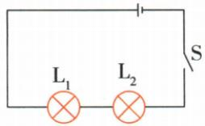

## 讲解

### 判据

看到灯灭、表零或接近电源电压，先定位跨哪盏灯，再检验表到电源两极的连续路径。

### 流程

1. 按题设确认单故障还是允许两故障。2. 假设每个选项，把短路画成导线、断路画成缺口。3. 检查主回路电流是否存在及灯能否亮。4. 检查电压表能否经完好路径接到电源两极，以及是否跨同一导线。5. 所有现象同时吻合才保留。理想大电阻表在断路测量时仅有极小电流，所以其他灯仍不亮。

## 例题

### 两次跨灯测压区分双故障

> 来源ID Q16-04；第十六章电压电阻；151-200/full.md 第2019–2035行。原答案与解析定位：151-200/full.md 第2037–2039行。

例2 如图为简单的串联电路,电源电压为 $6 \, V$ ,闭合开关 S 后,两灯均不亮,用电压表测得 $L_{1}$ 两端的电压为零, $L_{2}$ 两端的电压为 $6 \, V$ ,故电路故障可能为 ( )

A. $\mathrm{L}_1$ 和 $\mathrm{L}_2$ 均短路

B. $\mathrm{L}_{1}$ 和 $\mathrm{L}_{2}$ 均断路

C. $L_{1}$ 断路, $L_{2}$ 短路

D. $L_{1}$ 短路, $L_{2}$ 断路

**原资料答案与解析：**

解析 若 $L_{1}$ 、 $L_{2}$ 均短路，则电压表无论接到哪盏灯的两端，均相当于测量一段导线两端的电压，示数均为零，A 不正确；若 $L_{1}$ 与 $L_{2}$ 均断路，则电压表接到 $L_{1}$ 或 $L_{2}$ 两端时均只有一个接线柱接到电源一极，另一个接线柱没有接到电源上，示数均为零，B 不正确；若 $L_{1}$ 断路， $L_{2}$ 短路，电压表接到 $L_{1}$ 两端时，相当于电压表直接接到电源两端，电压表示数为 6 V，C 不正确；当 $L_{1}$ 短路， $L_{2}$ 断路时，电压表接在 $L_{1}$ 两端时未接入电路，示数为零，接到 $L_{2}$ 两端时相当于把电压表直接接在电源两端，示数为 6 V，D 正确。

答案 D

**展开解析（依据原详解补足理由与步骤）：**

A两灯均短路：跨任一灯只是跨导线，两次均应为零，不合L2为6 V。B两灯均断路：测一盏时另一处仍断开，表无法经导电元件接到电源两极，两次为零。C L1断L2短：跨L1时表经短接L2接到电源，应读6 V，与L1实测零冲突。D L1短L2断：跨L1为零，跨L2时表两端经L1短接及开关分别接电源两极，读6 V，符合。题目允许双故障，不能机械套单故障表。

### 电压表零示数多选单故障

> 来源ID Q16-05；第十六章电压电阻；151-200/full.md 第2049–2068行。原答案与解析定位：151-200/full.md 第2074–2076行。

例（2024 山东烟台中考）(多选)如图所示,电源电压保持不变,闭合开关后发现电压表无示数,假设电路中只有一个元器件发生故障,则故障的原因可能是()

A. 灯泡 $\mathrm{L}_{1}$ 短路

B.灯泡 $\mathrm{L}_2$ 短路

C.灯泡 $\mathrm{L}_1$ 断路

D.灯泡 $\mathrm{L}_2$ 断路

**原资料答案与解析：**

例 解析 根据题意可知,电压表无示数,故障原因可能是与电压表并联部分短路,即灯泡 $L_{1}$ 短路,也可能是电压表两接线柱到电源两极中间某处断路,即灯泡 $L_{2}$ 断路,A、D 正确,B、C 错误。

答案 AD

**展开解析（依据原详解补足理由与步骤）：**

图中表跨L1。A L1短路：跨同一近似等电势导线，示数零，对。B L2短路：L1直接承受电源电压，表非零，错。C L1断路：表经完好L2接到电源两极，可读接近电源电压，错。D L2断路：表所在部分与电源的连接路径被切断，不能建立相应两端电压，示数零，对。选AD；题设只有一个元器件故障，不增加表坏、电源坏等选项。

### 两灯灭电流零电压有偏转

> 来源ID Q16-06；第十六章电压电阻；151-200/full.md 第2217–2237行。原答案与解析定位：151-200/full.md 第2239–2241行。

例1 如图所示的电路,闭合开关,两个灯泡都不发光,电流表没有示数,电压表指针有明显偏转。则故障可能是 ( )

A.灯泡 $\mathbf{L}_1$ 的灯丝断了

B.电流表内部出现断路

C.灯泡 $\mathrm{L}_2$ 的灯丝断了

D.电源接线处接触不良

**原资料答案与解析：**

解析 两灯泡串联,电压表测量灯泡 $L_{1}$ 两端的电压,电流表测量电路中的电流,闭合开关,两个灯泡都不发光,电流表没有示数,电压表指针有明显偏转,说明电流表中几乎没有电流通过,发生断路现象,且电压表的两端与电源连接完好,则可能是灯泡 $L_{1}$ 的灯丝断了。

# 答案 A

**展开解析（依据原详解补足理由与步骤）：**

表跨L1，L2与电流表在共同通路。A L1断路时主路无流两灯灭，电压表经完好L2、电流表和开关接到电源，能偏转，对。B电流表断路会切断电压表通向电源一极的路径，不能有该偏转。C L2断路同样切断这一路径。D电源接触不良若形成题设的断路，也不能给表建立驱动电压。B、C、D均与表有偏转冲突。

## 易错

“电压非零必灯完好”错误，跨被测灯断路也能有接近电源电压；原分类表不是所有电路的万能表。
