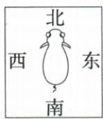
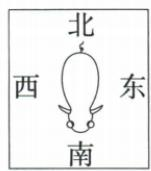
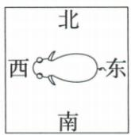
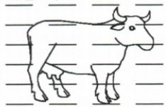
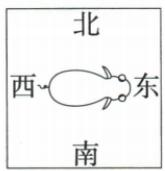

## 讲解

### 是什么

地球附近有地磁场，教学极性模型中地理北附近对应能吸引磁针N的地磁南极，地理南附近对应地磁北极。指南针沿当地场的水平指向。

### 怎么来的

自由磁针受地磁力转到稳定方向，N大体朝地理北、S大体朝南。地磁轴与地理轴不完全重合，实际当地磁北与地理正北可能不同；磁偏角指当地磁北方向与地理北方向在水平面内的夹角。

### 什么时候能用

不能把磁偏角定义成“两地理极与两地磁极之间的夹角”。这里不指定随时间变化的极点坐标，导航还需当地偏角。原牛题只分析给定假说，非替书证实动物报道。

磁针沿所在地磁场水平分量方向指向，不能认为必然指向某一个地磁极点；磁偏角会随地点和时间变化。[NOAA官方定义与指南针说明](https://www.ncei.noaa.gov/products/magnetic-declination)。

## 例题

### 牛身体朝向检验地磁假说

> 来源ID Q20-02；第二十章电与磁；201-233/full.md 第819–844行。原答案与解析定位：201-233/full.md 第912–914行。

例1（2024 江苏常州中考）美国《发现》网站于 2023 年 10 月报道：“牛能感知地球磁场，吃草、休息时，其身体朝向习惯与地磁场磁感线平行（如图所示）。”为求证真伪，同学们设计如下实验方案：在四周

无明显差异的草地上,多次观察牛吃草、休息时的身体朝向,若报道真实,则牛的身体朝向习惯性呈现四个场景中的()

  
①

  
②

  
③

磁感线  

A.①和②

B.③和④

C.①和③

  
④

D.②和④

**原资料答案与解析：**

例1 解析 地磁北极在地理南极附近,地磁南极在地理北极附近;地磁场的磁感线从地磁的北极出来,回到地磁的南极。若牛的身体朝向习惯与地磁场磁感线平行,则牛的身体朝向应该是南北方向,故①②符合题意。

答案A

**展开解析（依据原详解补足理由与步骤）：**

题设只检验“身体轴线与当地地磁线平行”这个假说，并不要求头一定向北。①头北尾南与②头南尾北都沿南北方向，③④沿东西不符；A①②对，B③④均不符，C①③混入不符，D②④也混入不符。原报道身份和牛真实行为未外部核实，不能把假说当已证事实。四周无明显差异及多次观察用于减少其他因素与偶然性的干扰。

## 易错

磁针N指地理北附近，不是指本章按极性定义的地磁北极。
