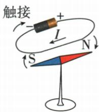
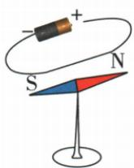
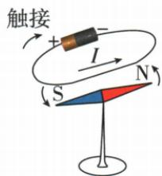

## 讲解

### 是什么

通电导线周围存在磁场，方向与电流方向有关，称电流磁效应。

### 怎么来的

奥斯特通断比较排除仅地磁或静止导线造成的同样偏转；只反电流观察偏转反向，把方向变化归到电流。用小磁针观察不可见场是转换观察思路。

### 什么时候能用

本章单一导线自身产生的磁场方向由电流方向及几何位置决定；仅改电流大小主要改强弱，叠加地磁等时合场方向还可改变。原实验宜低压短时，不能把短路源长期通电。

## 例题

### 奥斯特原实验通断与反电流

> 来源ID Q20-18；第二十章电与磁；201-233/full.md 第872–906行。原答案与解析定位：201-233/full.md 第908–908行。

# 2.奥斯特实验

# (1) 实验过程及现象 1

甲 通电

  
乙 断电

丙 改变电流方向

**原资料答案与解析：**

(2)实验结论:①通电导线和磁体一样,周围存在磁场。②电流产生的磁场方向跟电流的方向有关。②

**展开解析（依据原详解补足理由与步骤）：**

甲通电使附近小针偏，乙断电回复地磁方向，说明通电导线周围存在磁场；丙仅改变电流方向针偏转方向相反，说明电流产生的场方向与电流方向有关。针是显示场的工具，不是产生此导线磁场的原因。原短时直连电源的实验要限低压和规定试触，不把短接源当持续运行接法。

## 易错

电流效应不同于导体在外磁场受力和运动产生感应。
