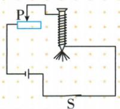
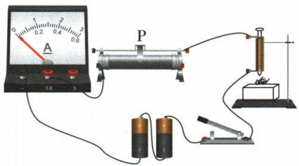
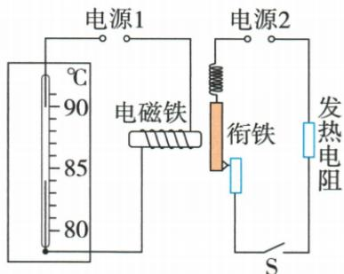

## 讲解

### 是什么

电磁铁是线圈加易磁化铁芯的可控磁体。原模型同匝电流大更强，同电流、外形等条件相同匝多更强。

### 怎么来的

铁芯在通电线圈场中被磁化，场叠加增强；易去磁软铁有助于断电后释放，而硬磁钢可能保留明显磁性。电流大小控制强弱，方向控制极性，通断控制有无。

### 什么时候能用

实验控制铁芯、外形和针等比较条件。软铁断电后可有少量剩磁，教材“磁性消失”指显著减弱便于控制，不保证精确为零。实际铁芯饱和等边界不以无限增I必无限增磁概括。

## 例题

### 自制电磁铁增吸针应如何滑

> 来源ID Q20-08；第二十章电与磁；201-233/full.md 第1119–1121行。原答案与解析定位：201-233/full.md 第1123–1125行。

如图所示,小李利用铁钉制作了一个电磁铁,闭合开关,铁钉吸起了几颗大头针,要使电磁铁吸引大头针的数量增多,可将滑动变阻器的滑片P向\_\_\_\_移动。

**原资料答案与解析：**

解析 使电磁铁吸引大头针的数目增多,也就是使其磁性增强,则应使电路中的电流变大,由欧姆定律可知,应使电路中的电阻变小,则滑动变阻器的滑片应向左移动。

答案 左

**展开解析（依据原详解补足理由与步骤）：**

原变阻器接左丝端，P向左有效丝段变短、阻值小，恒定电源下电流增。其他条件不变，铁钉线圈磁性增强，可吸更多大头针。结论左。先从期望磁强增加推电流，再推阻值、最后读具体端子，不背通用左右口诀。

### 电磁铁匝数及电流原实验

> 来源ID Q20-19；第二十章电与磁；201-233/full.md 第1147–1166行。原答案与解析定位：201-233/full.md 第1161–1166行。

# 2. 实验过程

(1) 把滑动变阻器、电流表和一定匝数的线圈(内部含有铁芯)串联起来,通过开关接到电源上,闭合开关,改变电路中的电流,观察电磁铁吸引大头针的数量。

(2) 将两个匝数不同 (其他条件相同) 的电磁铁串联, 比较不同匝数电磁铁吸引大头针的数量。

3.实验结论：匝数一定时,通入的电流越大,电磁铁的磁性越强;电流一定时,外形相同的螺线管,匝数越多,电磁铁的磁性越强。

# 4.实验评估与总结

(1) 转换法在实验中的应用: 用吸引大头针数目的多少来判断电磁铁磁性的强弱。  
(2) 控制变量法在实验中的应用: ①探究电磁铁磁性强弱与电流的关系时, 控制其他因素不变, 改变电路中的电流; ②探究电磁铁磁性强弱与线圈匝数的关系时, 控制其他因素不变, 改变线圈的匝数。

**原资料答案与解析：**

3.实验结论：匝数一定时,通入的电流越大,电磁铁的磁性越强;电流一定时,外形相同的螺线管,匝数越多,电磁铁的磁性越强。

# 4.实验评估与总结

(1) 转换法在实验中的应用: 用吸引大头针数目的多少来判断电磁铁磁性的强弱。  
(2) 控制变量法在实验中的应用: ①探究电磁铁磁性强弱与电流的关系时, 控制其他因素不变, 改变电路中的电流; ②探究电磁铁磁性强弱与线圈匝数的关系时, 控制其他因素不变, 改变线圈的匝数。

**展开解析（依据原详解补足理由与步骤）：**

同一线圈调变阻改变I，匝数、铁芯等保持，吸针数量变化用于比较I影响；两个外形等其他条件相同、匝数不同的电磁铁串联使I相同，再比较吸针数量研究匝数。用吸针数量代磁强属转换法，分开固定另一个因素属控制变量法。串联同时通电保障电流相同，不能因匝数多线圈阻大就推串联两流不同。

### 水银温控温度电源与增磁

> 来源ID Q20-10；第二十章电与磁；201-233/full.md 第1234–1259行。原答案与解析定位：201-233/full.md 第1265–1273行。

例1（2024 湖北武汉中考）如图所示是一种温度自动控制装置的原理图。制作水银温度计时在玻璃管中封入一段金属丝，“电源 1”的两极分别与水银和金属丝相连。

(1)闭合开关 S 后, 当温度达到 \_\_\_\_ ℃ 时, 发热电阻就停止加热。  
(2)当电磁铁中有电流通过时,若它的左端为 N 极,则“电源 1”的 \_\_\_\_ 端为正极。  
(3)为增强电磁铁的磁性,下列措施一定可行的是\_\_\_\_(填序号)。

①增大“电源1”的电压  
②减小“电源2”的电压  
③减少电磁铁线圈匝数  
④改变电磁铁中电流方向

**原资料答案与解析：**

例1 解析（1）水银可导电，当温度达到90℃时，水银柱接触到温度计上端的金属丝，电磁铁所在电路连通，电磁铁产生磁性，吸引衔铁，发热电阻所在电路断开，停止加热；

(2)根据安培定则,可判断电磁铁线圈的电流方向向上,由此可推断出,电源1右端为正极;   
(3)增强电磁铁磁性的方式有:增大电流、使线圈匝数增多,故选①。

答案 (1)90

(2) 右  
(3)①

**展开解析（依据原详解补足理由与步骤）：**

(1)原图金属丝端在90°C，水银升到这里导通控制路，磁铁吸衔铁使发热工作路断开，停止加热。(2)左端要N，右手拇指朝左，按绕线电流所需正面朝上，追图源1右端正。(3)①提高控制源1电压，在阻与其他条件不变时增电流，增强，对；②减工作源2只影响发热工作路，不直接增控制磁强；③减少匝数削弱；④反向改变磁极而非一定增强。故①。

## 易错

改工作路电压不等于改控制电磁铁电流；反电流只换极不一定增磁。
