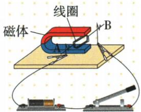
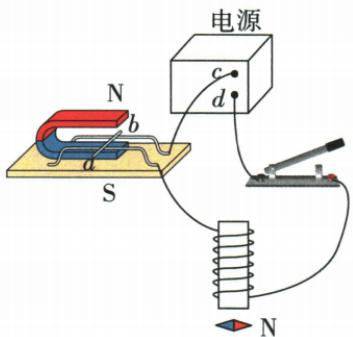
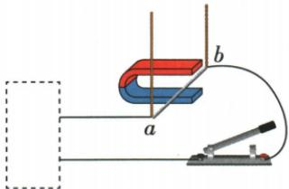

## 讲解

### 是什么

按本章导体横跨磁场实验，通电导体受磁力，方向与电流、外磁场方向有关；只反一项力反，两项都反力不变。

### 怎么来的

先保持磁场只反电流观察导体运动反向，再保持电流只反磁场重复，排除另一变量。二者各反一次可按两次反向推力回复原方向。

### 什么时候能用

须有电流且导体方向含垂直场的分量；与场完全平行时并非一定有该磁力。力能推动运动，将电能转成机械；条件相同增流或增场可增强作用。

## 例题

### 自制电动机支架及单换磁极

> 来源ID Q20-12；第二十章电与磁；201-233/full.md 第1317–1328行。原答案与解析定位：201-233/full.md 第1330–1330行。

(2024 广东中考)将自制的电动机接入电路, 如图所示, 其中支架 A 是 \_\_\_\_ (选填 “导体” 或 “绝缘体”)。闭合开关, 线圈开始转动, 磁场对线圈 \_\_\_\_ (选填 “有” 或 “无”) 作用力。仅调换磁体的磁极, 线圈转动方向与原转动方向 \_\_\_\_ 。

**原资料答案与解析：**

答案 导体 有 相反

**展开解析（依据原详解补足理由与步骤）：**

线圈需经支架A与外电路接通，A是导体；线圈通电后转动说明磁场对线圈有力。只调换磁体两极使B方向反而电流不变，受力及转动方向反，所以填导体、有、相反。支架同时承担导电连接和支撑两种作用。

### 电流反向与磁场反向联合实验

> 来源ID Q20-13；第二十章电与磁；201-233/full.md 第1396–1415行。原答案与解析定位：201-233/full.md 第1445–1447行。

例 (2024 四川绵阳中考) 如图所示电路中, 导体棒 ab 放在蹄形磁体的磁场里, 小磁针放在螺线管正下方。闭合开关, 发现导体棒 ab 向右运动, 小磁针的 N 极向下偏转, 则下列说法正确的是 ( )

A. $c, d$ 分别是电源的负极、正极  
B. 仅对调电源正负极, 闭合开关, 则导体棒 ab 向左运动, 小磁针 N 极向上偏转  
C. 对调电源正负极和蹄形磁体 N、S 极, 闭合开关, 则导体棒 ab 向左运动  
D. 对调电源正负极和蹄形磁体 N、S 极, 闭合开关, 则小磁针 N 极仍然向下偏转

**原资料答案与解析：**

例 解析 小磁针的 N 极向下偏转,说明螺线管正下方为 N 极,根据安培定则可知电流从上方流入,下方流出,故 c、d 分别是电源的正极、负极,A 错误;仅对调电源正负极,闭合开关,则导体棒 ab 向左运动,小磁针 N 极向上偏转,B 正确;对调电源正负极和蹄形磁体 N、S 极,闭合开关,则导体棒 ab 仍向右运动、小磁针 N 极向上偏转,故 C、D 错误。

答案 B

**展开解析（依据原详解补足理由与步骤）：**

针N向下指示线圈下端N，沿绕向用右手反推电流从上端流入下端流出，c正d负，A反说错。B只反电源，电流反：导体受力向左，螺线管磁极反使针N向上，对。C同时反电流及蹄形磁场，导体力两次反转而仍向右，C说左错。D换蹄形磁极不改变下方螺线管自身绕向；电源反已使螺线管磁极反，针N向上，D说仍向下错。选B。必须分别分析两套磁场。

### 虚线框接源或灵敏表辨原理

> 来源ID Q20-15；第二十章电与磁；201-233/full.md 第1559–1564；1568–1574行。原答案与解析定位：201-233/full.md 第1566–1566行；201-233/full.md 第1576–1576行。

例 如图所示,两根绝缘细线悬挂着的导体 ab 放在蹄形磁体中,ab 两端连接着导线,在虚线框中接入的器材及对应的作用正确的是 ( )

A. 接入电源, 可演示电磁感应现象  
B.接入电源,可说明磁场对通电导体有力的作用  
C.接入灵敏电流计,可解释电动机的工作原理  
D.接入灵敏电流计,可说明通电导体的周围存在着磁场

**原资料答案与解析：**

解析 接入电源,可说明磁场对通电导体有力的作用,是电动机的工作原理,A 错误,B 正确;接入灵敏电流计,可演示电磁感应现象,是发电机的工作原理,C、D 错误。

答案 B

**展开解析（依据原详解补足理由与步骤）：**

A接电源时主动给导体通电，演示受力而不是以机械运动发电，错。B电源使导体电流与外磁场作用，可演示电动机原理，对。C接灵敏表且手动切割时显示感应电流，是发电原理不是电动机，错。D该接法不是靠小磁针检验电流周围场的奥斯特实验，错。选B。电源有无是此类给定实验的识别信号，不是现实每台发电机附近必无辅助电源。

## 易错

两种场要分开：换蹄形磁极不会自动换螺线管电流磁场。
