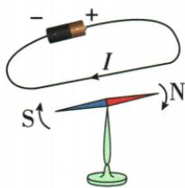
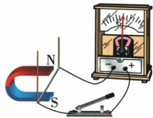
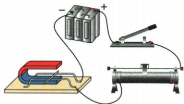
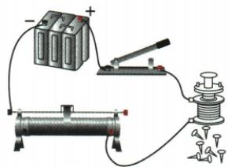
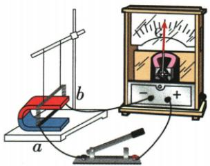

## 讲解

### 判据

图含电源、磁针、导体运动或灵敏表，问工作原理相同。

### 流程

1. 通电线附近针偏说明电流产生场。2. 外源给导体电流而在外场受力运动说明电动机原理。3. 外力使导体切割、无驱动源而表检测电流说明电磁感应发电。4. 核能量箭头电转机还是机转电，再逐项分类，不能仅因都有磁体或线圈认为同原理。

## 例题

### 虚线框接源或灵敏表辨原理

> 来源ID Q20-15；第二十章电与磁；201-233/full.md 第1559–1564；1568–1574行。原答案与解析定位：201-233/full.md 第1566–1566行；201-233/full.md 第1576–1576行。

例 如图所示,两根绝缘细线悬挂着的导体 ab 放在蹄形磁体中,ab 两端连接着导线,在虚线框中接入的器材及对应的作用正确的是 ( )

A. 接入电源, 可演示电磁感应现象  
B.接入电源,可说明磁场对通电导体有力的作用  
C.接入灵敏电流计,可解释电动机的工作原理  
D.接入灵敏电流计,可说明通电导体的周围存在着磁场

**原资料答案与解析：**

解析 接入电源,可说明磁场对通电导体有力的作用,是电动机的工作原理,A 错误,B 正确;接入灵敏电流计,可演示电磁感应现象,是发电机的工作原理,C、D 错误。

答案 B

**展开解析（依据原详解补足理由与步骤）：**

A接电源时主动给导体通电，演示受力而不是以机械运动发电，错。B电源使导体电流与外磁场作用，可演示电动机原理，对。C接灵敏表且手动切割时显示感应电流，是发电原理不是电动机，错。D该接法不是靠小磁针检验电流周围场的奥斯特实验，错。选B。电源有无是此类给定实验的识别信号，不是现实每台发电机附近必无辅助电源。

### 题设金属探测仪的感应原理

> 来源ID Q20-16；第二十章电与磁；201-233/full.md 第1600–1645行。原答案与解析定位：201-233/full.md 第1582–1584行。

例1（2024 山东菏泽中考）如图所示是安检使用的一种金属探测仪。当探测仪靠近金属物体时,会产生感应电流,发出报警信号。其工作原理与下列实验原理相同的是()

A

B

C

D

**原资料答案与解析：**

例1 解析 探测器靠近金属物体时,相当于闭合电路的部分导体在切割磁感线,从而产生了感应电流,发出报警信号,其原理是电磁感应。A图所示装置是奥斯特实验的装置,证明电流周围存在磁场,A不符合题意;B图所示装置的工作原理是电磁感应,B符合题意;C图所示装置的工作原理是通电导体在磁场中受到力的作用,C不符合题意;D图所示装置的工作原理是电流的磁效应,D不符合题意。

答案B

**展开解析（依据原详解补足理由与步骤）：**

题干明确产生感应电流，因此匹配B无外电源、导体运动与灵敏表的电磁感应装置。A电源导线使磁针偏转，是电流磁效应；C有电源通电导体受磁力，是电动机原理；D电磁铁吸针是电流磁效应。A、C、D不匹配。原解把靠近金属“相当于切割”作为类比，实际探测仪也可由变化磁场产生感应，不能断言所有探测仪必须金属机械切割场线。

### 感应实验控制变量与能量角色

> 来源ID Q20-17；第二十章电与磁；201-233/full.md 第1649–1667行。原答案与解析定位：201-233/full.md 第1586–1596行。

例2 (2024 陕西中考)如图,是“探究导体在磁场中运动时产生感应电流的条件”的实验装置。

| 实验次数 | 导体 ab 在磁场中的运动情况 | 灵敏电流计指针偏转情况 |
| --- | --- | --- |
| 1 | 静止 | 不偏转 |
| 2 | 上下运动 | 不偏转 |
| 3 | 左右运动 | 偏转 |

(1)闭合开关后,观察各种情况下灵敏电流计指针偏转情况,将实验现象记录在表格中。分析实验现象可知:闭合电路中的一部分导体在磁场中做\_\_\_\_运动时,电路中会产生感应电流。产生感应电流时,导体ab相当于电路中的\_\_\_\_(填电路元器件名称)。  
(2)若要探究感应电流方向与磁场方向的关系,应保持导体 ab 运动方向不变,将\_\_\_\_对调,观察灵敏电流计指针偏转情况。  
(3)下列物品中,应用该实验结论工作的是\_\_\_\_(填选项字母)。

A.电风扇

B. 手摇发电手电筒

**原资料答案与解析：**

例2 解析（1）闭合电路中的一部分导体在磁场中做切割磁感线运动时，电路中会产生感应电流；此时导体 ab 相当于电路中的电源。

(2) 若要探究感应电流方向与磁场方向的关系, 应保持导体 ab 运动方向不变, 将磁极对调, 观察灵敏电流计指针偏转情况。

(3)电风扇是利用通电导体在磁场中受力运动的原理工作的,手摇发电手电筒是利用电磁感应原理工作的,故选B。

答案（1）切割磁感线 电源

(2) 磁极

(3)B

**展开解析（依据原详解补足理由与步骤）：**

静止及沿图中磁场方向上下运动表不偏，左右运动切割则偏，所以条件为闭合路的一部分导体切割磁感线；导体ab将机械输入转成电能，在该电路等效为电源。(2)固定运动方向而改变磁场，交换磁极，观察偏转方向。(3)A电风扇由电能驱动机械，原理通电导体受力；B手摇发电手电筒将机械转成电，选B。灵敏表的偏转用于检测，不把表本身当外加电源。

## 易错

电源信号只用于这些明确实验结构，实际辅助源和复杂器件不能机械照套。
