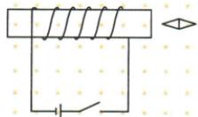
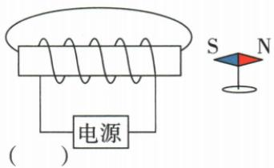
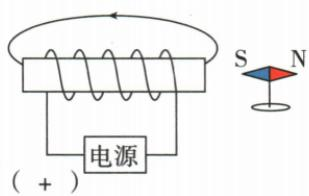
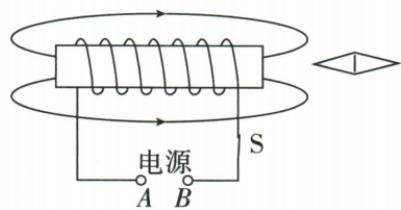
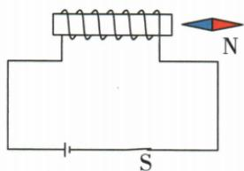

## 讲解

### 判据

求线圈极、针极、电源端正负，或由箭头补电源。

### 流程

1. 已知电源先标从正出负回的线圈电流。2. 右手四指沿环绕电流，拇指定位N端。3. 外场从N出S入，针N跟场。4. 反推则从针或外线得到线圈N，再右手反推电流，沿导线找源正负。5. 对调电源后重判磁极，不改绕线便已改变电流。

## 例题

### 螺线管反接及插铁棒

> 来源ID Q20-04；第二十章电与磁；201-233/full.md 第932–938行。原答案与解析定位：201-233/full.md 第940–943行。

(2024 吉林长春中考)在“探究通电螺线管外部的磁场分布”的实验中:

(1)如图所示,闭合开关,通电螺线管的右端为\_\_\_\_极,小磁针的左端为\_\_\_\_极。  
(2)对调电源正、负极,小磁针N极指向与(1)中相反,这表明,通电螺线管外部的磁场方向与\_的方向有关。  
(3)在螺线管中插入一根铁棒,可使通电螺线管的磁性\_\_\_\_。

**原资料答案与解析：**

答案 (1)N S

(2) 电流  
(3) 增强

**展开解析（依据原详解补足理由与步骤）：**

沿原电源正极到负极标电流，经图示绕线右手四指顺电流环绕，拇指向右，右端N。右侧小针N向右，靠螺线管的左端S。对调电源则环绕电流反，磁场方向反；插铁棒因磁化叠加磁场增强磁性。三个答项分别N、S；电流；增强。

### 由磁针推线圈和电源正极

> 来源ID Q20-05；第二十章电与磁；201-233/full.md 第1018–1028行。原答案与解析定位：201-233/full.md 第1030–1043行。

例 根据图中小磁针静止时的指向,标出通电螺线管外部磁感线的方向和电源左端的极性(“+”或“-”)。

**原资料答案与解析：**

解析 由小磁针静止时的指向知,通电螺线管的右端为 N 极,则螺线管外部的磁感线方向为由右向左;利用安培定则可判定,电源的左端为正极。

答案 如图所示

**展开解析（依据原详解补足理由与步骤）：**

小针右N左S在螺线管右侧，N向右沿外部场离开右端，故右端N、左S。上方外部磁感线从右N回左S，箭头向左。右手拇指向右，四指沿原绕线所需电流，从图示引线追到电源左端为正。先判极再反推绕向，不能仅用电源在左就猜正。

### 启动器磁场箭头反推三空

> 来源ID Q20-06；第二十章电与磁；201-233/full.md 第1058–1067行。原答案与解析定位：201-233/full.md 第1090–1090行。

例1（2024 山东烟台中考）螺线管是汽车启动器的一个重要部件,驾驶员转动钥匙发动汽车时,相当于给螺线管通电。如图所示,螺线管的左端为\_\_\_\_极,小磁针的左端为\_\_\_\_极,A 为电源的\_\_\_\_极。

**原资料答案与解析：**

例1 解析 在磁体外部,磁感线从磁体的 N 极出发,回到 S 极,由图可知,螺线管的左端为 N 极,右端为 S 极;根据异名磁极相互吸引可知,小磁针的左端为 N 极;根据安培定则可知,螺线管上电流方向朝上,所以 A 为电源的负极。答案 N N 负

**展开解析（依据原详解补足理由与步骤）：**

上下外部线箭头均向右，所以外部从左端N出右端S入。右侧磁针N端向左顺场靠近右S，小针左端N。右手拇指朝左N，四指对应图上正面线圈电流朝上；沿连线由B供入、A流回，A为负。答案N、N、负。

### 螺线管探究四项边界

> 来源ID Q20-07；第二十章电与磁；201-233/full.md 第1071–1084行。原答案与解析定位：201-233/full.md 第1092–1093行。

例2（2024四川成都中考）如图是小李同学探究“通电螺线管的磁场方向”的实验示意图。闭合开关，小磁针静止时N极的指向如图所示。下列说法正确的是 （）

A.根据小磁针指向可以判定，通电螺线管的右端为S极  
B. 小磁针静止时 N 极所指方向就是该点的磁场方向  
C. 将小磁针移到其他位置, N 极所指方向一定不变  
D.本实验可以得出:通电螺线管的磁极与电流方向无关

**原资料答案与解析：**

例2 解析 根据磁极间相互作用规律,结合小磁针静止时 N 极的指向可以判断通电螺线管右端为 N 极,A 错误。物理学中规定小磁针静止时 N 极的指向为该点的磁场方向,通电螺线管外部的磁场与条形磁体磁场基本一致,不同位置的磁场方向可能不同,B 正确,C 错误。改变电流方向,通电螺线管的磁极会改变,D 错误。
答案 B

**展开解析（依据原详解补足理由与步骤）：**

右侧针N向右，局部场离开螺线管右端，故右N，A说S错。B针静止N指向用来规定该点场方向，对。C磁场各处方向可不同，移动到别处不能保证N方向不变，错。D只凭一次静态图不能推出无关，改变电流会换极，错。选B。

## 易错

不能用左手，不能只认前表线斜向而不追丝线。
