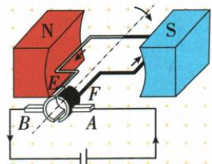

## 讲解

### 判据

对调电源、换外磁极或同时对调，另有线圈小磁针。

### 流程

1. 列导体自身电流和它所在外场。2. 单反其中一项受力反，两项都反受力不变。3. 另一螺线管周围场仅由其电流和绕向判断，不受把远处外磁极调换自动改变。4. 根据原运动方向将新力方向转换为运动方向结论。

## 例题

### 自制电动机支架及单换磁极

> 来源ID Q20-12；第二十章电与磁；201-233/full.md 第1317–1328行。原答案与解析定位：201-233/full.md 第1330–1330行。

(2024 广东中考)将自制的电动机接入电路, 如图所示, 其中支架 A 是 \_\_\_\_ (选填 “导体” 或 “绝缘体”)。闭合开关, 线圈开始转动, 磁场对线圈 \_\_\_\_ (选填 “有” 或 “无”) 作用力。仅调换磁体的磁极, 线圈转动方向与原转动方向 \_\_\_\_ 。

**原资料答案与解析：**

答案 导体 有 相反

**展开解析（依据原详解补足理由与步骤）：**

线圈需经支架A与外电路接通，A是导体；线圈通电后转动说明磁场对线圈有力。只调换磁体两极使B方向反而电流不变，受力及转动方向反，所以填导体、有、相反。支架同时承担导电连接和支撑两种作用。

### 电流反向与磁场反向联合实验

> 来源ID Q20-13；第二十章电与磁；201-233/full.md 第1396–1415行。原答案与解析定位：201-233/full.md 第1445–1447行。

例 (2024 四川绵阳中考) 如图所示电路中, 导体棒 ab 放在蹄形磁体的磁场里, 小磁针放在螺线管正下方。闭合开关, 发现导体棒 ab 向右运动, 小磁针的 N 极向下偏转, 则下列说法正确的是 ( )

A. $c, d$ 分别是电源的负极、正极  
B. 仅对调电源正负极, 闭合开关, 则导体棒 ab 向左运动, 小磁针 N 极向上偏转  
C. 对调电源正负极和蹄形磁体 N、S 极, 闭合开关, 则导体棒 ab 向左运动  
D. 对调电源正负极和蹄形磁体 N、S 极, 闭合开关, 则小磁针 N 极仍然向下偏转

**原资料答案与解析：**

例 解析 小磁针的 N 极向下偏转,说明螺线管正下方为 N 极,根据安培定则可知电流从上方流入,下方流出,故 c、d 分别是电源的正极、负极,A 错误;仅对调电源正负极,闭合开关,则导体棒 ab 向左运动,小磁针 N 极向上偏转,B 正确;对调电源正负极和蹄形磁体 N、S 极,闭合开关,则导体棒 ab 仍向右运动、小磁针 N 极向上偏转,故 C、D 错误。

答案 B

**展开解析（依据原详解补足理由与步骤）：**

针N向下指示线圈下端N，沿绕向用右手反推电流从上端流入下端流出，c正d负，A反说错。B只反电源，电流反：导体受力向左，螺线管磁极反使针N向上，对。C同时反电流及蹄形磁场，导体力两次反转而仍向右，C说左错。D换蹄形磁极不改变下方螺线管自身绕向；电源反已使螺线管磁极反，针N向上，D说仍向下错。选B。必须分别分析两套磁场。

### 直流电动机原理换向与能量

> 来源ID Q20-14；第二十章电与磁；201-233/full.md 第1419–1437行。原答案与解析定位：201-233/full.md 第1439–1441行。

（多选）如图为直流电动机的基本构造示意图。以下相关的分析中正确的是 （）

A. 电动机是利用通电导线在磁场中受力的作用的原理工作的  
B. 电动机工作过程中，消耗的电能全部转化为机械能  
C.使线圈连续不停地转动下去是靠电磁继电器来实现的  
D. 仅改变电流的方向可以改变线圈转动的方向

**原资料答案与解析：**

解析 电动机是利用通电导线在磁场中受力的作用的原理工作的，A 正确；电动机工作过程中，消耗的电能大部分转化为机械能，有一部分电能转化成了内能，B 错误；使线圈连续不停地转动下去是靠换向器来实现的，C 错误；线圈转动的方向与电流的方向和磁场的方向有关，仅改变电流的方向可以改变线圈转动的方向，D 正确。

答案 AD

**展开解析（依据原详解补足理由与步骤）：**

A对，通电线圈在磁场受力形成转动。B错，输入电能还包括电阻发热等损耗，非全部机械。C错，原简易直流电动机靠换向器在过平衡位置时改变线圈电流方向，使转矩继续同向；电磁继电器是受控开关，不能替代该换向功能。D对，只改变电流且磁场不变时转向改变。选AD。

## 易错

力方向与转动方向关联按题设初始正常模型，不把全部装置混为一场。
