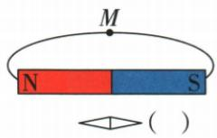
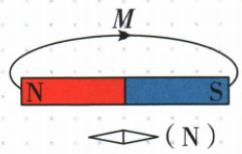

## 讲解

### 判据

已知磁极、磁针N端或外部线箭头，求另一类信息。

### 流程

1. 磁体外线从N到S。2. 针N顺当地线切线，S反向。3. 已知针可反推附近场及磁极；已知磁极先画线再判针。4. 外部弧线标箭头在要求点沿切线，不穿越或交叉；地磁题区别地理名与磁极性。

## 例题

### 牛身体朝向检验地磁假说

> 来源ID Q20-02；第二十章电与磁；201-233/full.md 第819–844行。原答案与解析定位：201-233/full.md 第912–914行。

例1（2024 江苏常州中考）美国《发现》网站于 2023 年 10 月报道：“牛能感知地球磁场，吃草、休息时，其身体朝向习惯与地磁场磁感线平行（如图所示）。”为求证真伪，同学们设计如下实验方案：在四周

无明显差异的草地上,多次观察牛吃草、休息时的身体朝向,若报道真实,则牛的身体朝向习惯性呈现四个场景中的()

  
①

  
②

  
③

磁感线  

A.①和②

B.③和④

C.①和③

  
④

D.②和④

**原资料答案与解析：**

例1 解析 地磁北极在地理南极附近,地磁南极在地理北极附近;地磁场的磁感线从地磁的北极出来,回到地磁的南极。若牛的身体朝向习惯与地磁场磁感线平行,则牛的身体朝向应该是南北方向,故①②符合题意。

答案A

**展开解析（依据原详解补足理由与步骤）：**

题设只检验“身体轴线与当地地磁线平行”这个假说，并不要求头一定向北。①头北尾南与②头南尾北都沿南北方向，③④沿东西不符；A①②对，B③④均不符，C①③混入不符，D②④也混入不符。原报道身份和牛真实行为未外部核实，不能把假说当已证事实。四周无明显差异及多次观察用于减少其他因素与偶然性的干扰。

### 条形磁体画线及小磁针右端

> 来源ID Q20-03；第二十章电与磁；201-233/full.md 第848–850行。原答案与解析定位：201-233/full.md 第916–918行。

例2（2023 陕西中考）如图,请在括号中标出小磁针静止时右侧磁极的名称,并用箭头在 M 点标出磁感线的方向。

**原资料答案与解析：**

例2 答案 如图所示

**展开解析（依据原详解补足理由与步骤）：**

磁体左N右S，外部磁感线从左N指向右S。M处切线近水平向右，标箭头向右；磁体下方的场也由左侧N向右侧S，小磁针N端沿局部场朝右，所以括号右端N。不能把小磁针靠近右S便说其右端也S，异名相吸才符合。

### 螺线管探究四项边界

> 来源ID Q20-07；第二十章电与磁；201-233/full.md 第1071–1084行。原答案与解析定位：201-233/full.md 第1092–1093行。

例2（2024四川成都中考）如图是小李同学探究“通电螺线管的磁场方向”的实验示意图。闭合开关，小磁针静止时N极的指向如图所示。下列说法正确的是 （）

A.根据小磁针指向可以判定，通电螺线管的右端为S极  
B. 小磁针静止时 N 极所指方向就是该点的磁场方向  
C. 将小磁针移到其他位置, N 极所指方向一定不变  
D.本实验可以得出:通电螺线管的磁极与电流方向无关

**原资料答案与解析：**

例2 解析 根据磁极间相互作用规律,结合小磁针静止时 N 极的指向可以判断通电螺线管右端为 N 极,A 错误。物理学中规定小磁针静止时 N 极的指向为该点的磁场方向,通电螺线管外部的磁场与条形磁体磁场基本一致,不同位置的磁场方向可能不同,B 正确,C 错误。改变电流方向,通电螺线管的磁极会改变,D 错误。
答案 B

**展开解析（依据原详解补足理由与步骤）：**

右侧针N向右，局部场离开螺线管右端，故右N，A说S错。B针静止N指向用来规定该点场方向，对。C磁场各处方向可不同，移动到别处不能保证N方向不变，错。D只凭一次静态图不能推出无关，改变电流会换极，错。选B。

## 易错

磁针轴平行场可以两种头尾方向，题目给N端时才确定定向。
