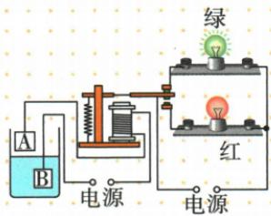
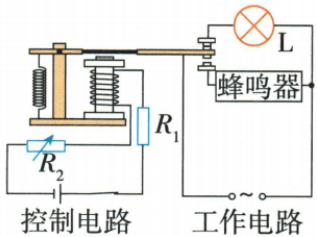

## 讲解

### 判据

水位、温度、热敏电阻使接点或电流改变，继电器切换负载。

### 流程

1. 先找控制路电源及传感元件，判是否闭合或I是否变大。2. 判电磁铁吸合还是释放。3. 沿工作触点看接到哪一灯、报警器或加热支路。4. 定报警温度变化时用同吸合阈值列$I_c=U/(R_1+R_2)$，反求R1需求，再按R1随温度规律判断。5. 磁极空另用安培，不能由开关动作猜N、S。

## 例题

### 水位报警红绿灯与上端磁极

> 来源ID Q20-09；第二十章电与磁；201-233/full.md 第1203–1216行。原答案与解析定位：201-233/full.md 第1218–1218行。

如图所示是一种水位自动报警器的原理图。当水位到达金属块A时，\_\_\_\_灯亮；控制电路的电源右端为正极时，电磁铁的上端为\_\_\_\_极（一般的水都能导电）。

**原资料答案与解析：**

答案 红 N

**展开解析（依据原详解补足理由与步骤）：**

水到A时通过一般水与B连通控制路，电磁铁通电吸下衔铁，触点切到原图下方红灯支路，红亮、绿断。控制源右正时按其正端经铁芯线圈到左负标电流，右手四指沿实际绕向，拇指上，铁芯上端N。水的导电路径闭合的是控制路，灯颜色需看工作路触点，不是因“水高必红”的无图口诀。

### 水银温控温度电源与增磁

> 来源ID Q20-10；第二十章电与磁；201-233/full.md 第1234–1259行。原答案与解析定位：201-233/full.md 第1265–1273行。

例1（2024 湖北武汉中考）如图所示是一种温度自动控制装置的原理图。制作水银温度计时在玻璃管中封入一段金属丝，“电源 1”的两极分别与水银和金属丝相连。

(1)闭合开关 S 后, 当温度达到 \_\_\_\_ ℃ 时, 发热电阻就停止加热。  
(2)当电磁铁中有电流通过时,若它的左端为 N 极,则“电源 1”的 \_\_\_\_ 端为正极。  
(3)为增强电磁铁的磁性,下列措施一定可行的是\_\_\_\_(填序号)。

①增大“电源1”的电压  
②减小“电源2”的电压  
③减少电磁铁线圈匝数  
④改变电磁铁中电流方向

**原资料答案与解析：**

例1 解析（1）水银可导电，当温度达到90℃时，水银柱接触到温度计上端的金属丝，电磁铁所在电路连通，电磁铁产生磁性，吸引衔铁，发热电阻所在电路断开，停止加热；

(2)根据安培定则,可判断电磁铁线圈的电流方向向上,由此可推断出,电源1右端为正极;   
(3)增强电磁铁磁性的方式有:增大电流、使线圈匝数增多,故选①。

答案 (1)90

(2) 右  
(3)①

**展开解析（依据原详解补足理由与步骤）：**

(1)原图金属丝端在90°C，水银升到这里导通控制路，磁铁吸衔铁使发热工作路断开，停止加热。(2)左端要N，右手拇指朝左，按绕线电流所需正面朝上，追图源1右端正。(3)①提高控制源1电压，在阻与其他条件不变时增电流，增强，对；②减工作源2只影响发热工作路，不直接增控制磁强；③减少匝数削弱；④反向改变磁极而非一定增强。故①。

### 热敏仓库报警阈值多选

> 来源ID Q20-11；第二十章电与磁；201-233/full.md 第1281–1299行。原答案与解析定位：201-233/full.md 第1275–1277行。

例2（2024 河南中考）(多选)如图是小明为某仓库设计的温度报警电路。热敏电阻的阻值 $R_{1}$ 随温度的变化而变化；变阻器的阻值 $R_{2}$ 可调。温度正常时指示灯 L 发光，当温度升高到报警温度时，指示灯熄灭，蜂鸣器报警。下列判断正确的是（）

A. $R_{1}$ 随温度的升高而增大  
B. 温度升高过程中,电磁铁磁性增强   
C. 若要调低报警温度, 可将 $R_{2}$ 调大  
D. 若控制电路电源电压降低, 报警温度将升高

**原资料答案与解析：**

例2 解析 当温度升高到报警温度时,蜂鸣器报警,可知电磁铁的磁性增强,控制电路中电流增大、总电阻减小,而 $R_{2}$ 不变,所以 $R_{1}$ 变小,即 $R_{1}$ 随温度的升高而减小,A 错误,B 正确;控制电路中电流 $I=\frac{U}{R_{1}+R_{2}}$ ,将 $R_{2}$ 调大,或将 U 降低, $R_{1}$ 都应更小,则要在更高的温度下控制电路电流才能达到能吸下衔铁的临界值,即报警温度会升高,C 错误,D 正确。

答案 BD

**展开解析（依据原详解补足理由与步骤）：**

高温由灯亮换成蜂鸣器，须衔铁被吸下，说明控制电流达到阈值且磁性增强，B对。恒压、R2不变时$I=U/(R_1+R_2)$，温升使I增，所以R1减，A说增错。设吸合电流$I_c$，所需热敏阻$R_{1c}=U/I_c-R_2$。C调大R2使所需R1更小，须更高温，报警温升而非降低，错。D降低U也让所需R1更小，须更高温，D对。此判断限定其余阈值稳定且目标仍在热敏阻可达范围。

## 易错

传感阻增减须题设或状态推断；报警温升结论需目标可达、阈值等其他条件稳定。
