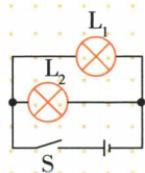
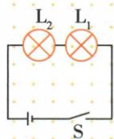
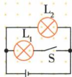
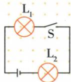
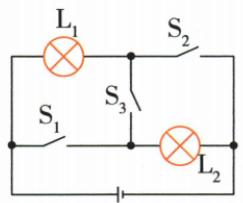

## 讲解

### 是什么

串联负载顺次相接、单一路径；并联负载分别接同一对节点、有多条支路。串联一路断开均不通，并联支路断开通常不影响其他完整支路。

### 怎么来的

串联各器件在同一路径上，任何一个断开都截断整条通路。并联每条支路分别跨接供电两端，能独立形成通路；干路开关在所有支路公共路径中，支路开关只控制自己的路径。

### 什么时候能用

独立性以恒压电源等常用条件为前提；支路短路可能影响全电路，不能一概“互不影响”。灯外观并排不等于并联，功能同时开启也不自动证明串联或并联；确认共同节点与路径。

## 例题

### 一灯断丝不影响另灯且总开关控制

> 来源ID Q15-06；第十五章电流和电路；151-200/full.md 第1270–1282行。原答案与解析定位：151-200/full.md 第1284–1286行。

如图所示电路中，开关能同时控制两盏灯，若一盏灯的灯丝断了，不影响另一盏灯工作的电路是 \_\_\_\_ （）

  
A

  
B

  
C

  
D

**原资料答案与解析：**

解析 由题意可知,两灯工作是互不影响的,所以两灯应并联;开关能同时控制这两盏灯,所以开关应位于干路,故选A。

答案A

**展开解析（依据原详解补足理由与步骤）：**

A两灯分别接同一对节点，并联，S在干路，符合两条件。B两灯串联，一个断丝全部断路，不符；C虽并联但S只在L1支路，不能同时控制两灯；D仍为单一路径串联，一灯断丝另灯不工作。故A。能同时开关不独自证明并联，要加“不互相影响”条件。

### 三个开关使两灯串联

> 来源ID Q15-07；第十五章电流和电路；151-200/full.md 第1299–1319行。原答案与解析定位：151-200/full.md 第1321–1323行。

例1 下列操作能使图中的小灯泡 $\mathrm{L}_{1}$ 和 $\mathrm{L}_{2}$ 组成串联电路的是 ( )

A.闭合开关 $\mathrm{S}_1$ 、 $\mathrm{S}_2$ 和 $\mathrm{S}_3$

B. 只闭合开关 $\mathrm{S}_1$ 和 $\mathrm{S}_2$

C. 只闭合开关 $\mathrm{S}_2$ 和 $\mathrm{S}_3$

D. 只闭合开关 $\mathrm{S}_3$

**原资料答案与解析：**

解析 要使小灯泡 $L_{1}$ 和 $L_{2}$ 组成串联电路, 应将小灯泡 $L_{1}$ 和 $L_{2}$ 首尾相连接到电源两端, 由题图可知, 应只闭合开关 $S_{3}$ , 断开 $S_{1}$ 、 $S_{2}$ , 故选 D。

答案 D

**展开解析（依据原详解补足理由与步骤）：**

D只闭合S3：电流沿L1、S3、L2顺次回源，只有一条负载路径，串联。B闭合S1和S2、S3断开时两灯分别形成路径，是并联。A全闭时S1、S3、S2构成直通电源的导线支路，电源短路。C只闭S2、S3时L2被导线旁路，只有L1有效工作，不是两灯串联。故D。每项应按开关闭合视为导线、断开删除路径重画。

### 冰箱照明与压缩机独立控制

> 来源ID Q15-09；第十五章电流和电路；151-200/full.md 第1386–1420行。原答案与解析定位：151-200/full.md 第1422–1424行。

例3 (2024 江苏无锡中考)电冰箱冷藏室中的照明灯 L 由门控开关 $S_{1}$ 控制, 压缩机(电动机)由温控开关 $S_{2}$ 控制, 要求照明灯和压缩机既能单独工作又能同时工作。下列电路中符合上述特点的是 ( )

  
A

  
B

C

D

**原资料答案与解析：**

解析 由照明灯和压缩机既能单独工作又能同时工作可知,压缩机和照明灯并联,且各支路分别有一个开关。A 正确。

答案 A

**展开解析（依据原详解补足理由与步骤）：**

A灯和电动机并联，各支路各有指定开关，能分别工作也能同时工作，正确。B把S1放干路，灯能单独亮，但电动机工作必须S1闭且灯也亮，不能电机单独工作。C灯和电机串联，两开关控制同一路径；D也串联，只把两开关位置交换，均不能独立工作。判断关键是功能组合，不是电机与灯图标的位置。

### 人脸加密码或钥匙的逻辑电路

> 来源ID Q15-10；第十五章电流和电路；151-200/full.md 第1430–1430；1440–1467行。原答案与解析定位：151-200/full.md 第1434–1438行。

例（2024 湖南中考）科技小组模拟“智能开锁”设计的电路图，有两种开锁方式，即“人脸识别”与输入“密码”匹配成功，或“人脸识别”与使用“钥匙”匹配成功才可开锁。现用 $S_{1}$ 表示人脸识别， $S_{2}$ 、 $S_{3}$ 表示密码、钥匙。匹配成功后对应开关自动闭合，电动机才工作开锁。满足上述两种方式都能开锁的电路是（）

B

D

**原资料答案与解析：**

例 解析 两种开锁方式都需要“人脸识别”，即 $S_{1}$ 闭合；开关 $S_{1}$ 闭合后，“密码” $S_{2}$ 或“钥匙” $S_{3}$ 有一个闭合，电动机就能工作开锁，则 $S_{1}$ 在干路中， $S_{2}$ 、 $S_{3}$ 并

联,B 正确。

答案B

**展开解析（依据原详解补足理由与步骤）：**

必要条件人脸S1必须闭合，再满足密码S2或钥匙S3之一。B把S1与电机及S2、S3并联组合串接，符合。A三个开关串联，要求密码和钥匙同时，过严。C把人脸与钥匙并联、再串密码，变成人脸或钥匙加密码，缺人脸也可开，不符。D把人脸与密码并联、再串钥匙，变成人脸或密码加钥匙，也不符。应检验S1断开时任意S2S3组合均不能使电机运行。

## 易错

并联判断看同一对节点；串联电流相同但亮度可能不同。
