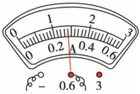

## 讲解

### 是什么

电流I表示电流强弱，单位安培A；$1\,\mathrm A=1000\,\mathrm{mA}$，$1\,\mathrm{mA}=1000\,\mathrm{\mu A}$。电流表应串联进要测的电流路径，电流正端进入、负端流出。

### 怎么来的

表本身电阻很小，串联后让所测电流通过它；直接并在负载或源上会旁路原来路径，所以不是正常测量电流的方法。常用双量程表由所接端子选择对应刻度，同偏角在不同量程代表不同数值。

### 什么时候能用

使用前调零，先估范围；不清楚时选较大量程短暂试触，确认无超量程后可改适当较小量程。断开开关再改线，读数要平视。不能用“靠近哪盏灯”决定测量对象。

## 例题

### 电流表所接量程与1.7安读数

> 来源ID Q15-11；第十五章电流和电路；151-200/full.md 第1485–1503行。原答案与解析定位：151-200/full.md 第1504–1506行。

(2024 江苏镇江中考节选)电流表示数为 \_\_\_\_ A。

**原资料答案与解析：**

解析 由图可知,电流表所选测量范围为 0\~3 A, 分度值为 0.1 A。观察指针位置,电流表的示数为 1.7 A。

答案 1.7

**展开解析（依据原详解补足理由与步骤）：**

原图导线接负端与3 A端，读0至3 A刻度。0到1之间十格，每格0.1 A；指针在1之后第七小格，读1.7 A。同角度小量程刻度会读0.34 A，但本图并未接0.6端，不能换用它。量程由接线柱决定，先量程再分度值再指针。

### 电流表反偏与大范围小偏角

> 来源ID Q15-12；第十五章电流和电路；151-200/full.md 第1534–1579行。原答案与解析定位：151-200/full.md 第1581–1583行。

例1 小莹同学测量电流时,连接好电路,试触时发现电流表指针偏转至如图甲所示位置,原因是\_\_\_\_;断开开关,纠正错误后,再进行试触时,发现指针偏转至如图乙所示位置,接下来的操作是断开开关,\_\_\_\_,继续进行实验。

甲

乙

**原资料答案与解析：**

解析 图甲中电流表指针反偏,说明电流表正、负接线柱接反了;纠正错误后,再进行试触时,发现指针偏转角度太小,说明所选的测量范围太大,应断开开关,换接0\~0.6 A的测量范围,继续进行实验。

答案 正、负接线柱接反了 换接 0\~0.6 A 的测量范围

**展开解析（依据原详解补足理由与步骤）：**

甲指针向零刻度左侧偏，是接线正负反了；断开开关改成电流正端流入、负端流出。乙改正后偏角太小，说明现有测量范围太大，在确认电流低于小量程范围后断开开关、改接0至0.6 A再测。试触应从较大范围开始，换线必须断开。不能把反偏读成负的正常电流数值继续使用。

### 四图中测灯L2的电流对象

> 来源ID Q15-13；第十五章电流和电路；151-200/full.md 第1589–1601行。原答案与解析定位：151-200/full.md 第1603–1605行。

例2 下列电路中,闭合开关后,电流表能正确测量出通过灯泡 $L_{2}$ 的电流的是 ( )

  
A

  
B

  
C

  
D

**原资料答案与解析：**

解析 A 选项电流表与 $L_{2}$ 并联, 不符合题意; B 选项为并联电路, 电流表与 $L_{1}$ 串联在支路中, 测量的是通过灯泡 $L_{1}$ 的电流, 不符合题意; C 选项为并联电路, 电流表串联在干路中, 测量的是干路中的电流, 无法直接测量通过灯泡 $L_{2}$ 的电流, 不符合题意; D 选项为串联电路, 电流表能测量通过灯泡 $L_{2}$ 的电流, 符合题意。

答案 D

**展开解析（依据原详解补足理由与步骤）：**

A电流表并在L2两端，近似短接L2，接法不对。B电流表在L1支路，只测L1。C表在两灯公共干路，测两支路之和，不能直接作L2。D两灯与表串联，一路电流相同，表测L2也测L1，符合，D对。无需把表物理上贴着L2才叫测它，要看它是否位于L2必经而不分流的路径。

### 原附录电流表读数示例

> 来源ID Q23-07；附录1常考测量仪器；201-233/full.md 第2055–2055行。原答案与解析定位：201-233/full.md 第2055–2055行。

| 仪器 | 读数步骤 | 注意事项 |
| --- | --- | --- |
| 电流表 | 观察电流表所选的测量范围→确定分度值→确定电流表示数1确定所选的测量范围:0~0.6A2确定分度值:0.02A3确定电流表示数:$0.2\,\mathrm{A}+0.02\,\mathrm{A}\times 4=0.28\,\mathrm{A}$ | 1电流表必须和被测用电器串联2选用合适的测量范围3电流“+”进“-”出4不允许把电流表直接连接到电源两极5使用前进行校零 |

**原资料答案与解析：**

原表给出的读数、步骤与注意事项见上表；未另给独立问答题。

**展开解析（依据原详解补足理由与步骤）：**

原图导线接负端和0.6端，所选0至0.6 A，不能按上方0至3的刻度值直接读。0.2至0.4 A之间10格，每格0.02 A，指针在0.2后4格：$I=0.2+4\times0.02=0.28\,\mathrm A$。若误按3 A量程会大5倍；量程由接线柱决定。

## 易错

同一表两量程一般相差五倍，0.34与1.7不能任选。
