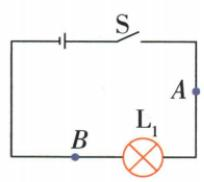
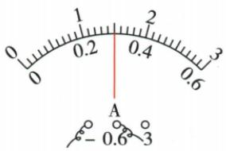
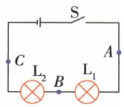

## 讲解

### 是什么

电荷定向移动形成电流。规定正电荷定向移动方向为电流方向；金属中自由电子向相反方向定向移动。电源外部通常从正极经负载流向负极。

### 怎么来的

导体内部自由电荷原本有无规则运动，电源作用使它们出现有方向的整体迁移，才形成电流。正负载流电荷的实际移动方向不同，规定电流方向让所有电路讨论统一。

### 什么时候能用

要有可维持电势差的电源和相应闭合通路，才有持续常规电流。用电器消耗电能，不消耗电荷守恒下的串联电流。别把电源外部方向照抄到电源内部，也不要说所有导体都由电子一种载流。

## 例题

### 串联电流是否被用电器消耗

> 来源ID Q15-15；第十五章电流和电路；151-200/full.md 第1689–1720；1749–1751行。原答案与解析定位：151-200/full.md 第1723–1731行。

例1 (2024 江苏苏州中考改编) 探究串联电路中电流的特点。

(1)猜想:由于用电器耗电,电流流过用电器会减小。

  
甲

乙

  
丙

(2) 按图甲接好电路, 闭合开关后发现灯不亮, 已知电源完好。为了找出原因, 将电流表串联在电路中, 闭合开关发现电流表无示数, 说明 $\mathrm{L}_{1}$ 可能存在 \_\_\_\_ 故障。  
(3) 排除故障后, 用电流表测出 A 点电流, 如图乙所示, 则 $I_{A} = \_\_\_\_A$ ,

再测出 B 点电流, 得到 A、B 两点电流相等。更换不同规格的灯泡, 重复上述实验, 都得到相同结论, 由此判断猜想是 \_\_\_\_ 的。

(4)为进一步得出两个灯串联时电流的规律,小明按图丙连接电路,测量A、B、C三点的电流,得出 $I_{A}=I_{B}=I_{C}$ ;小华认为不需要再测量,在(3)结论的基础上,通过推理也可以得出相同结论,请写出小华的推理过程:\_\_\_\_。

**原资料答案与解析：**

例1 解析（2）电源完好，灯泡不亮，电流表无示数，说明 $L_{1}$ 可能存在断路故障。

(3) 图乙中电流表选择的测量范围为 0\~0.6 A, 示数为 0.3 A; 得到 A、B 两点电流相等的结论, 说明猜想是错误的。  
(4) 推理过程如下: 因为 $I_{A}=I_{B}$ , $I_{B}=I_{C}$ ，所以 $I_{A}=I_{B}=I_{C}$ 。

答案 (2) 断路

(3)0.3 错误   
(4) 因为 $I_{A}=I_{B}, I_{B}=I_{C}$ ，所以 $I_{A}=I_{B}=I_{C}$

**展开解析（依据原详解补足理由与步骤）：**

电源完好而表无电流、灯不亮，L1可能断路。乙表接0至0.6 A量程，指针中点读0.3 A。A、B两点测流相等且不同规格重复仍相等，否定“流过用电器电流减小”猜想，填错误。单灯两侧电流相等关系可分别用到两灯：$I_A=I_B$且$I_B=I_C$，由相等量的传递性得三处都相等。电器消耗的是电能，不是把持续电流逐个吃掉。

## 易错

电子方向与规定电流方向相反；不是所有分子热运动都构成电流。
