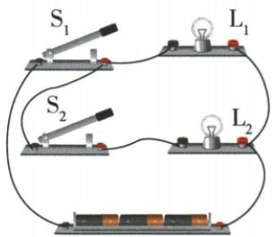
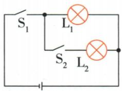

## 讲解

### 是什么

简单电路由电源、用电器、导线和开关组成。电源提供电能，用电器把电能转化或储存，导线连接路径，开关控制通断。电路图用规定符号表达连接。

### 怎么来的

元件角色根据能量方向确定：充电宝受能时相当于用电器，供给手机时相当于电源。同一实际设备可在不同过程承担不同角色。把实物连接抽象为节点和符号，可消除外观干扰。

### 什么时候能用

绘图中电源长线为正、短线为负，导线连接点用实心点；交叉未相连不能随意并为节点。使用低压教材电路时连接或改变接线先断开开关；角色必须与所研究过程一致。

## 例题

### 充电宝在两种过程中的电路角色

> 来源ID Q15-04；第十五章电流和电路；151-200/full.md 第1155–1155行。原答案与解析定位：151-200/full.md 第1157–1159行。

简单电路是由电源、用电器、开关和导线组成的。给充电宝充电时，充电宝相当于简单电路中的\_\_\_\_；充电宝给手机充电时，充电宝相当于简单电路中的\_\_\_\_。

**原资料答案与解析：**

解析 给充电宝充电时,充电宝消耗电能,相当于简单电路中的用电器。充电宝给手机充电时,充电宝提供电能,相当于简单电路中的电源。

答案 用电器 电源

**展开解析（依据原详解补足理由与步骤）：**

给充电宝充电时它接受外部电能并储存能量，相当于用电器；给手机供电时它向外提供电能，相当于电源。同一实物的角色按研究过程与能量方向判断，而非永久固定为电源。两个空分别用电器、电源。

### 实物图画总开关与支路开关

> 来源ID Q15-08；第十五章电流和电路；151-200/full.md 第1329–1341行。原答案与解析定位：151-200/full.md 第1350–1364行。

例2 请将图中实物图的电路图画到虚线框内。

**原资料答案与解析：**

解析 由题图可知,电流从电源正极出发,分成两条支路,分流点在 $L_{2}$ 右侧接线柱,合流点在开关 $S_{1}$ 右侧接线柱;开关 $S_{1}$ 和电源在分流点和合流点之外,位于干路; $L_{1}$ 位于一条支路, $L_{2}$ 和 $S_{2}$ 位于另一条支路。

答案 如图所示

**展开解析（依据原详解补足理由与步骤）：**

从电池正极出发，灯L2右接线柱为分流点；一路经L1，另一路经L2和S2，再在S1右接线柱合流，经过S1回电源。等效图为两灯并联、S1干路、S2只与L2串联，答案图一致。画符号可移动形状但不能改变接线节点；交点相连标实心点。S1总控制，S2只控L2。

## 易错

电源不是只凭电池外形判断；充电前后能量方向不同。
