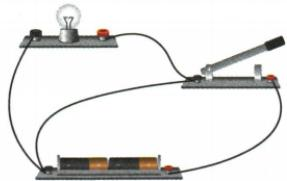

## 讲解

### 是什么

正常闭合经过负载的路径叫通路；断开使相应路径不通是断路；导线直接旁路负载叫该负载短路；低阻直接连接电源两端是电源短路。

### 怎么来的

理想导线电阻近零，旁路使负载两端近似同电势而几乎无电流；若直接跨电源，电流缺乏负载限制而可能很大。并联一支断路只切断该支，干路断开则全部切断。

### 什么时候能用

灯不亮不能单凭现象唯一判短路或断路，需要看电流和其他支路。原资料“用电器短路不会损坏”只描述被旁路器件通常不再通电，不保证其余元件和电源安全，不能推广成整个电路没问题。

## 例题

### 闭合开关使电源被短接

> 来源ID Q15-05；第十五章电流和电路；151-200/full.md 第1229–1237；1241–1248行。原答案与解析定位：151-200/full.md 第1239–1239行；151-200/full.md 第1249–1249行。

例（2024 江苏徐州中考）如图所示电路,闭合开关,电路所处的状态是 ( )

A.通路

B. 断路

C. 短路

D.无法判断

**原资料答案与解析：**

解析 由题图可知,当开关闭合时,相当于一根导线直接接在电源的两端,此时用电器不工作,电路中有电流,电流不经过用电器,直接从电源的正极回到电源的负极,电源被短路,故选 C。

答案 C

**展开解析（依据原详解补足理由与步骤）：**

原实物图把开关直接跨接电源两端，闭合后出现不经过灯泡的导线通路，是电源短路，C对。A正常通路不符，因为电流绕过负载；B断路不符，开关已接通；D图中接线能确定，无需猜测。判定应跟踪导线端点而不是看到灯与电池就默认串联。

### 搭接电流表检测两灯串联断路

> 来源ID Q15-14；第十五章电流和电路；151-200/full.md 第1651–1673行。原答案与解析定位：151-200/full.md 第1675–1677行。

例 如图所示,小明在“探究串联电路中电流的规律”实验中,闭合开关后,两灯均不亮,他用一个电流表去检测电路故障。当电流表接A、B两点时两灯均不亮,电流表没有示数;当电流表接B、C两点时,有一盏灯亮了,且电流表有示数,产生这一现象的原因可能是()

A. $\mathrm{L}_{1}$ 断路

B. $L_{1}$ 短路

C. $\mathrm{L}_2$ 断路

D. $\mathrm{L}_{2}$ 短路

**原资料答案与解析：**

解析 当电流表接 A、B 两点时,两灯均不亮,电流表没有示数,说明未与电流表并联的部分电路存在断路,即 A、B 两点以外的部分电路存在断路;当电流表接 B、C 两点时,有一盏灯亮了,且电流表有示数,即灯 $L_{1}$ 亮了,说明与电流表并联的部分电路存在断路,可能是 $L_{2}$ 断路,故选 C。

答案 C

**展开解析（依据原详解补足理由与步骤）：**

初始两灯不亮。表搭AB旁路L1后仍无电流，说明问题不只在L1；搭BC旁路L2后L1亮且表有电流，说明其余路径可通、L2所在BC间原来断开，C对。A若L1断路，搭AB应恢复L2亮，与第一次不符。B或D单灯短路通常另一灯能亮，不符原两灯全不亮。此法限题设低压且经另一负载限流的模型，不把电流表直接跨电源两端。

## 易错

开关接通不保证正常通路，可能形成电源短路。
