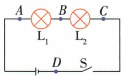
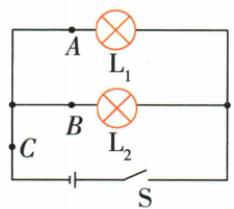
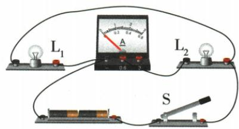

## 讲解

### 判据

先确认电源和开关完好，再结合电流、两灯亮灭和旁路检测判断；表数据要验干路等于支路和的数量级。

### 流程

1. 两灯串联全不亮、无流，考虑断路。2. 用题设允许的低压旁路检测观察哪段被接通后恢复另一灯，定位原断路段。3. 并联一灯闪烁另一灯正常，考虑闪烁支路接触不良，断开后处理。4. 用不同规格元件测多组数据检验普遍规律。5. 小差考虑分度值与误差，大到干路小于支路的异常要重查，不把所有差别都叫误差。

## 例题

### 搭接电流表检测两灯串联断路

> 来源ID Q15-14；第十五章电流和电路；151-200/full.md 第1651–1673行。原答案与解析定位：151-200/full.md 第1675–1677行。

例 如图所示,小明在“探究串联电路中电流的规律”实验中,闭合开关后,两灯均不亮,他用一个电流表去检测电路故障。当电流表接A、B两点时两灯均不亮,电流表没有示数;当电流表接B、C两点时,有一盏灯亮了,且电流表有示数,产生这一现象的原因可能是()

A. $\mathrm{L}_{1}$ 断路

B. $L_{1}$ 短路

C. $\mathrm{L}_2$ 断路

D. $\mathrm{L}_{2}$ 短路

**原资料答案与解析：**

解析 当电流表接 A、B 两点时,两灯均不亮,电流表没有示数,说明未与电流表并联的部分电路存在断路,即 A、B 两点以外的部分电路存在断路;当电流表接 B、C 两点时,有一盏灯亮了,且电流表有示数,即灯 $L_{1}$ 亮了,说明与电流表并联的部分电路存在断路,可能是 $L_{2}$ 断路,故选 C。

答案 C

**展开解析（依据原详解补足理由与步骤）：**

初始两灯不亮。表搭AB旁路L1后仍无电流，说明问题不只在L1；搭BC旁路L2后L1亮且表有电流，说明其余路径可通、L2所在BC间原来断开，C对。A若L1断路，搭AB应恢复L2亮，与第一次不符。B或D单灯短路通常另一灯能亮，不符原两灯全不亮。此法限题设低压且经另一负载限流的模型，不把电流表直接跨电源两端。

### 串联电流是否被用电器消耗

> 来源ID Q15-15；第十五章电流和电路；151-200/full.md 第1689–1720；1749–1751行。原答案与解析定位：151-200/full.md 第1723–1731行。

例1 (2024 江苏苏州中考改编) 探究串联电路中电流的特点。

(1)猜想:由于用电器耗电,电流流过用电器会减小。

  
甲

乙

  
丙

(2) 按图甲接好电路, 闭合开关后发现灯不亮, 已知电源完好。为了找出原因, 将电流表串联在电路中, 闭合开关发现电流表无示数, 说明 $\mathrm{L}_{1}$ 可能存在 \_\_\_\_ 故障。  
(3) 排除故障后, 用电流表测出 A 点电流, 如图乙所示, 则 $I_{A} = \_\_\_\_A$ ,

再测出 B 点电流, 得到 A、B 两点电流相等。更换不同规格的灯泡, 重复上述实验, 都得到相同结论, 由此判断猜想是 \_\_\_\_ 的。

(4)为进一步得出两个灯串联时电流的规律,小明按图丙连接电路,测量A、B、C三点的电流,得出 $I_{A}=I_{B}=I_{C}$ ;小华认为不需要再测量,在(3)结论的基础上,通过推理也可以得出相同结论,请写出小华的推理过程:\_\_\_\_。

**原资料答案与解析：**

例1 解析（2）电源完好，灯泡不亮，电流表无示数，说明 $L_{1}$ 可能存在断路故障。

(3) 图乙中电流表选择的测量范围为 0\~0.6 A, 示数为 0.3 A; 得到 A、B 两点电流相等的结论, 说明猜想是错误的。  
(4) 推理过程如下: 因为 $I_{A}=I_{B}$ , $I_{B}=I_{C}$ ，所以 $I_{A}=I_{B}=I_{C}$ 。

答案 (2) 断路

(3)0.3 错误   
(4) 因为 $I_{A}=I_{B}, I_{B}=I_{C}$ ，所以 $I_{A}=I_{B}=I_{C}$

**展开解析（依据原详解补足理由与步骤）：**

电源完好而表无电流、灯不亮，L1可能断路。乙表接0至0.6 A量程，指针中点读0.3 A。A、B两点测流相等且不同规格重复仍相等，否定“流过用电器电流减小”猜想，填错误。单灯两侧电流相等关系可分别用到两灯：$I_A=I_B$且$I_B=I_C$，由相等量的传递性得三处都相等。电器消耗的是电能，不是把持续电流逐个吃掉。

### 并联电流实验误差与接触不良

> 来源ID Q15-16；第十五章电流和电路；151-200/full.md 第1753–1798行。原答案与解析定位：151-200/full.md 第1733–1743行。

例2（2024 四川成都中考）在“探究并联电路中的电流特点”实验中，图甲是某小组同学设计的电路图。

甲

乙

(1)图乙是该小组连接的电路,闭合开关 S,电流表测通过\_\_\_\_的电流。

(2)该小组同学换用不同规格的小灯泡进行实验,用电流表多次测 A、B、C 三点电流,记录实验数据如下表。

| 实验次数 | $I_A/A$ | $I_B/A$ | $I_C/A$ |
| --- | --- | --- | --- |
| 第1次 | 0.30 | 0.22 | 0.50 |
| 第2次 | 0.22 | 0.28 | 0.50 |
| 第3次 | 0.24 | 0.22 | 0.46 |
| 第4次 | 0.28 | 0.30 | 0.28 |

分析表中数据,以下说法不合理的是\_\_\_\_。

A.四次实验中电流表选用的测量范围为0\~0.6 A

B.表中的数据均在误差范围内

C.此实验还可测量更多组数据

D.通过多次实验,可避免偶然性

(3)小成同学测量通过灯泡 $\mathrm{L}_{1}$ 电流时, $\mathrm{L}_{1}$ 正常发光, $\mathrm{L}_{2}$ 忽亮忽灭, 他接下来的操作应该是\_\_\_\_。(写出一条即可)

**原资料答案与解析：**

例2 解析（1）由图乙电路实物图可以看出电流表与灯泡 $L_{2}$ 串联在支路上，所以电流表测通过 $L_{2}$ 所在支路的电流。

(2) 分析表中数据可以发现电流表的最大示数应为 0.58 A, 因此四次实验中电流表选用的测量范围为 0\~0.6 A, A 正确; 本实验是探究并联电路中的电流特点, 所以多测几组数据寻找普遍规律, 可以避免结论的偶然性, C、D 正确; 表中第四次数据存在错误, 不在误差范围内, B 错误。故选 B。

(3) $L_{1}$ 正常发光,说明电路正常接通, $L_{2}$ 忽亮忽灭,说明小灯泡 $L_{2}$ 处接触不良,所以小成接下来应该把灯泡 $L_{2}$ 拧一拧,或者断开开关,换用新的小灯泡。

答案 (1) $\mathrm{L}_2$ (或 $B$ 点)

(2) B

(3) 将灯泡 $L_{2}$ 拧一拧 (或按一按、断开开关、换灯泡等)

**展开解析（依据原详解补足理由与步骤）：**

乙表沿L2所在支路接入，测L2或B点电流。小量程0至0.6 A可覆盖正常数据，A为合理选择；C、D多组不同灯数据帮助检查普遍规律，也合理。B“不论数据均在误差内”不合理：第4次支路和$0.28+0.30=0.58\,\mathrm A$，干路却0.28，甚至比一支路还小，远超本表小格误差。第1次0.52与0.50的小差可考虑测量误差，不能用它包庇第4次。L1正常、L2忽亮忽灭说明L2支路接触不良，断开开关后检查、拧紧接触或更换灯泡，不在带电状态重接。

## 易错

一灯不亮可能还涉及元件规格等，原故障结论按单故障、正常规格和理想接线条件使用。
