## 讲解

### 判据

先接线柱决定量程，再看所处干路或支路。电流表物理位置离灯近不能代替路径判断。

### 流程

1. 检查表串联且正入负出。2. 确定接负和哪个正端，选择相应标数。3. 算分度值逐格读。4. 跟踪电流经过哪些负载且有无分流，干路测总、独支测支。5. 反偏或超范围先断开纠正，小偏角经确认后改适当小范围。

## 例题

### 电流表所接量程与1.7安读数

> 来源ID Q15-11；第十五章电流和电路；151-200/full.md 第1485–1503行。原答案与解析定位：151-200/full.md 第1504–1506行。

(2024 江苏镇江中考节选)电流表示数为 \_\_\_\_ A。

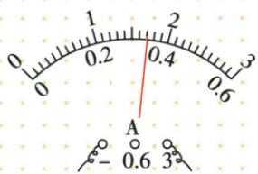

**原资料答案与解析：**

解析 由图可知,电流表所选测量范围为 0\~3 A, 分度值为 0.1 A。观察指针位置,电流表的示数为 1.7 A。

答案 1.7

**展开解析（依据原详解补足理由与步骤）：**

原图导线接负端与3 A端，读0至3 A刻度。0到1之间十格，每格0.1 A；指针在1之后第七小格，读1.7 A。同角度小量程刻度会读0.34 A，但本图并未接0.6端，不能换用它。量程由接线柱决定，先量程再分度值再指针。

### 电流表反偏与大范围小偏角

> 来源ID Q15-12；第十五章电流和电路；151-200/full.md 第1534–1579行。原答案与解析定位：151-200/full.md 第1581–1583行。

例1 小莹同学测量电流时,连接好电路,试触时发现电流表指针偏转至如图甲所示位置,原因是\_\_\_\_;断开开关,纠正错误后,再进行试触时,发现指针偏转至如图乙所示位置,接下来的操作是断开开关,\_\_\_\_,继续进行实验。

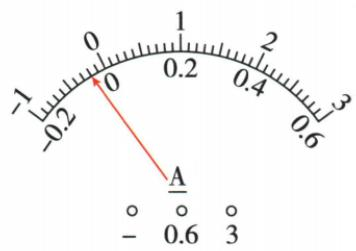

甲

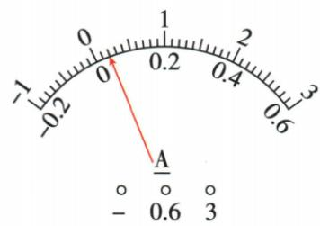

乙

**原资料答案与解析：**

解析 图甲中电流表指针反偏,说明电流表正、负接线柱接反了;纠正错误后,再进行试触时,发现指针偏转角度太小,说明所选的测量范围太大,应断开开关,换接0\~0.6 A的测量范围,继续进行实验。

答案 正、负接线柱接反了 换接 0\~0.6 A 的测量范围

**展开解析（依据原详解补足理由与步骤）：**

甲指针向零刻度左侧偏，是接线正负反了；断开开关改成电流正端流入、负端流出。乙改正后偏角太小，说明现有测量范围太大，在确认电流低于小量程范围后断开开关、改接0至0.6 A再测。试触应从较大范围开始，换线必须断开。不能把反偏读成负的正常电流数值继续使用。

### 四图中测灯L2的电流对象

> 来源ID Q15-13；第十五章电流和电路；151-200/full.md 第1589–1601行。原答案与解析定位：151-200/full.md 第1603–1605行。

例2 下列电路中,闭合开关后,电流表能正确测量出通过灯泡 $L_{2}$ 的电流的是 ( )

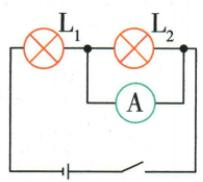  
A

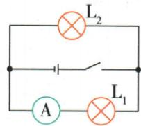  
B

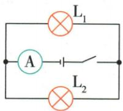  
C

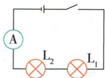  
D

**原资料答案与解析：**

解析 A 选项电流表与 $L_{2}$ 并联, 不符合题意; B 选项为并联电路, 电流表与 $L_{1}$ 串联在支路中, 测量的是通过灯泡 $L_{1}$ 的电流, 不符合题意; C 选项为并联电路, 电流表串联在干路中, 测量的是干路中的电流, 无法直接测量通过灯泡 $L_{2}$ 的电流, 不符合题意; D 选项为串联电路, 电流表能测量通过灯泡 $L_{2}$ 的电流, 符合题意。

答案 D

**展开解析（依据原详解补足理由与步骤）：**

A电流表并在L2两端，近似短接L2，接法不对。B电流表在L1支路，只测L1。C表在两灯公共干路，测两支路之和，不能直接作L2。D两灯与表串联，一路电流相同，表测L2也测L1，符合，D对。无需把表物理上贴着L2才叫测它，要看它是否位于L2必经而不分流的路径。

### 总表与支路开关的电流变化

> 来源ID Q15-17；第十五章电流和电路；151-200/full.md 第1802–1812行。原答案与解析定位：151-200/full.md 第1745–1747行。

例3（2024陕西中考改编）如图，电源电压不变。闭合开关 $\mathrm{S}_1$ 和 $\mathrm{S}_2$ ，小灯泡 $\mathrm{L}_1$ 和 $\mathrm{L}_2$ 均正常发光，电流表有示数。下列分析正确的是 （）

A. 小灯泡 $\mathrm{L}_{1}$ 和 $\mathrm{L}_{2}$ 串联

B.若断开开关 $\mathrm{S}_2$ ，电流表示数会变小

C.电流表测通过小灯泡 $\mathrm{L}_1$ 的电流

D. 若只闭合开关 $S_{2}$ ，电路中只有小灯泡 $L_{2}$ 发光

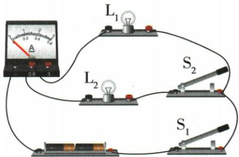

**原资料答案与解析：**

例3 解析 闭合开关 $S_{1}$ 、 $S_{2}$ ， $L_{1}$ 、 $L_{2}$ 并联，A 错误；电流表测量干路中的总电流，若断开 $S_{2}$ ，电路中只有 $L_{1}$ 工作，电流表只测量通过 $L_{1}$ 的电流，示数会变小，B 正确，C 错误；若只闭合开关 $S_{2}$ ， $L_{1}$ 、 $L_{2}$ 均不发光，D 错误。

答案 B

**展开解析（依据原详解补足理由与步骤）：**

两开关都闭合时两灯接同一对源节点，并联，A错。电流表在干路，示数为两支路电流之和，C把它只当L1电流，错。S2断开仅撤去L2支路，源电压不变，L1原有支路电流保持，干路总流减小，B对。S1是干路开关，只闭S2而S1断开两灯均不亮，D错。结论采用理想恒压源与两支路各自参数不变。

### 原电路清单示例13：L1、L2并联,A1测干路电流,A2测L1所在支路电流

> 来源ID Q28-33；前置清单与使用示例；1-50/full.md 第1555–1555行。原答案与解析定位：1-50/full.md 第1555–1555行。

L1、L2并联,A1测干路电流,A2测L1所在支路电流

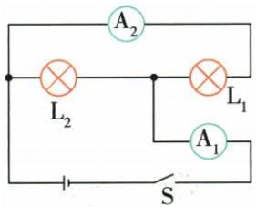

**原资料答案与解析：**

原表配图后的结论：L1、L2并联,A1测干路电流,A2测L1所在支路电流。原图完整保留；工作开关条件在展开中补明。

**展开解析（依据原详解补足理由与步骤）：**

把理想电流表视为低电阻连接：A2在L1支路，A1在两灯电流汇合后的干路，所以A2测L1、A1测总电流；两灯各跨电源两节点并联。不是表挨着哪灯就测哪灯。

### 原电路清单示例14：L1、L2、L3并联,A1测L1、L2所在支路电流之和,A2测L2、L3所在支路电流之和

> 来源ID Q28-34；前置清单与使用示例；1-50/full.md 第1555–1555行。原答案与解析定位：1-50/full.md 第1555–1555行。

L1、L2、L3并联,A1测L1、L2所在支路电流之和,A2测L2、L3所在支路电流之和

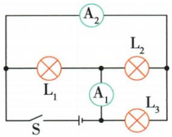

**原资料答案与解析：**

原表配图后的结论：L1、L2、L3并联,A1测L1、L2所在支路电流之和,A2测L2、L3所在支路电流之和。原图完整保留；工作开关条件在展开中补明。

**展开解析（依据原详解补足理由与步骤）：**

三灯通过理想A1、A2等连线实际跨同一对电源节点，均并联。A1处于L1与L2支路电流合流处，测$I_1+I_2$；A2处于L2与L3通路共同部分，测$I_2+I_3$。不能把二者都叫全干路表，三支路汇合的节点须真的都经过才是总电流。

### 原电路清单示例15：L1、L2、L3并联,A1测L2、L3所在支路电流之和,A2测L1、L2所在支路电流之和,A3测干路电流

> 来源ID Q28-35；前置清单与使用示例；1-50/full.md 第1555–1555行。原答案与解析定位：1-50/full.md 第1555–1555行。

L1、L2、L3并联,A1测L2、L3所在支路电流之和,A2测L1、L2所在支路电流之和,A3测干路电流

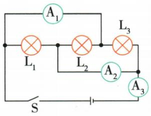

**原资料答案与解析：**

原表配图后的结论：L1、L2、L3并联,A1测L2、L3所在支路电流之和,A2测L1、L2所在支路电流之和,A3测干路电流。原图完整保留；工作开关条件在展开中补明。

**展开解析（依据原详解补足理由与步骤）：**

三灯并联：A1通路包含L2与L3的电流，测$I_2+I_3$；A2通路包含L1与L2电流，测$I_1+I_2$；A3在全部支路汇合回电源通路，测$I_1+I_2+I_3$。按导线电流去向逐节点核对，不按表与灯的视觉距离判断。

## 易错

电流表跨灯等于近似短接，不是测该灯正常工作电流。
