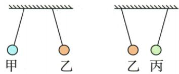
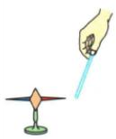

## 讲解

### 判据

有已知带电球与多球相互作用时，先找排斥对，两者确定同种带电，再借吸引和已知符号推下一球。

### 流程

1. 逐对记吸引或排斥。2. 排斥证明两者同种且都带电。3. 若另一球已证明带电，与已知符号球吸引才得异种。4. 如果仅有吸引又无其他带电证据，保留中性可能。5. 对各选项的一定、可能逐字核对。

## 例题

### 三球吸引排斥判正负电荷

> 来源ID Q15-01；第十五章电流和电路；151-200/full.md 第1066–1085行。原答案与解析定位：151-200/full.md 第1087–1089行。

例（2024 山东东营中考）甲、乙、丙三个轻质小球用绝缘细线悬挂，相互作用情况如图所示。如果丙带负电，则甲 （）

A.一定带负电

B.一定带正电

C.一定不带电

D. 可能带负电

**原资料答案与解析：**

解析 由图知,甲与乙靠近时相互排斥,所以甲和乙一定带同种电荷;乙和丙相互吸引,丙带负电,则乙带正电,甲也带正电,故 B 正确。

答案 B

**展开解析（依据原详解补足理由与步骤）：**

先看甲乙排斥，说明两者都带电且同种，乙不是不带电物体。再看乙与已知负电丙吸引，在已知乙带电的前提下才推出乙正电。甲与乙同种，所以甲一定正电，B对。A负电、C不带电、D可能负电都被甲乙排斥及丙负电条件排除。若只给乙丙吸引，单独不能排除乙不带电；推理顺序不能省掉第一步。

### 摩擦吸管吸引纸星星

> 来源ID Q15-02；第十五章电流和电路；151-200/full.md 第1093–1100行。原答案与解析定位：151-200/full.md 第1104–1106行。

例（2024 福建中考）如图，用轻薄的纸折成小星星，轻放于地面的小钢针上，用与布摩擦过的吸管靠近，小星星被吸引着转动，此过程中 （）

A.摩擦创造了电荷   
B.布和吸管带上同种电荷   
C. 吸管和小星星带上同种电荷   
D. 吸管带电后能吸引轻小物体

**原资料答案与解析：**

例 解析 小星星能被吸引着转动,说明用布摩擦过的吸管带了电荷。摩擦起电的实质是电荷从一个物体转移到另一个物体,因此吸管和布带异种电荷,A、B错误;带电体的性质之一是能够吸引轻小物体,C错误,D正确。

答案 D

**展开解析（依据原详解补足理由与步骤）：**

A错：摩擦转移电子，不创造电荷。B错：两个原先中性物体相互摩擦、无其他电荷交换时，得到等量异种净电荷。C错：同种应排斥，吸引轻小纸星不证明纸星与吸管同种带电。D对：带电吸管可吸引轻小物体，符合转动观察。不能从吸引独自确定纸星必带异种电荷。

## 易错

不能把任何吸引都直接判异种；不创造电子。
