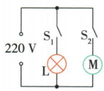
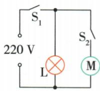
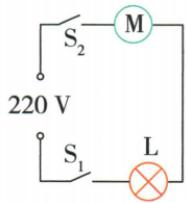
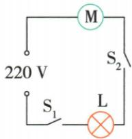
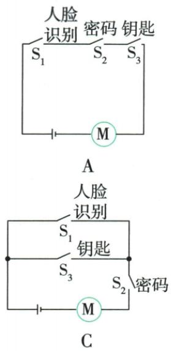
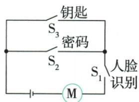
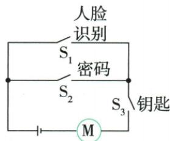

## 讲解

### 判据

两个器件能独立工作应并联独立控制；同一电机需条件都满足，用开关串联；满足任意一个即可的条件开关并联。

### 流程

1. 列所需工作组合。2. 对独立器件各设支路开关。3. 同一负载必要条件的开关放公共路径。4. 可二选一的两个条件开关并联成一段。5. 验证所有必要条件断开时均不能工作，任一允许组合闭合时都可工作，排除短接负载的画法。

## 例题

### 冰箱照明与压缩机独立控制

> 来源ID Q15-09；第十五章电流和电路；151-200/full.md 第1386–1420行。原答案与解析定位：151-200/full.md 第1422–1424行。

例3 (2024 江苏无锡中考)电冰箱冷藏室中的照明灯 L 由门控开关 $S_{1}$ 控制, 压缩机(电动机)由温控开关 $S_{2}$ 控制, 要求照明灯和压缩机既能单独工作又能同时工作。下列电路中符合上述特点的是 ( )

  
A

  
B

C

D

**原资料答案与解析：**

解析 由照明灯和压缩机既能单独工作又能同时工作可知,压缩机和照明灯并联,且各支路分别有一个开关。A 正确。

答案 A

**展开解析（依据原详解补足理由与步骤）：**

A灯和电动机并联，各支路各有指定开关，能分别工作也能同时工作，正确。B把S1放干路，灯能单独亮，但电动机工作必须S1闭且灯也亮，不能电机单独工作。C灯和电机串联，两开关控制同一路径；D也串联，只把两开关位置交换，均不能独立工作。判断关键是功能组合，不是电机与灯图标的位置。

### 人脸加密码或钥匙的逻辑电路

> 来源ID Q15-10；第十五章电流和电路；151-200/full.md 第1430–1430；1440–1467行。原答案与解析定位：151-200/full.md 第1434–1438行。

例（2024 湖南中考）科技小组模拟“智能开锁”设计的电路图，有两种开锁方式，即“人脸识别”与输入“密码”匹配成功，或“人脸识别”与使用“钥匙”匹配成功才可开锁。现用 $S_{1}$ 表示人脸识别， $S_{2}$ 、 $S_{3}$ 表示密码、钥匙。匹配成功后对应开关自动闭合，电动机才工作开锁。满足上述两种方式都能开锁的电路是（）

B

D

**原资料答案与解析：**

例 解析 两种开锁方式都需要“人脸识别”，即 $S_{1}$ 闭合；开关 $S_{1}$ 闭合后，“密码” $S_{2}$ 或“钥匙” $S_{3}$ 有一个闭合，电动机就能工作开锁，则 $S_{1}$ 在干路中， $S_{2}$ 、 $S_{3}$ 并

联,B 正确。

答案B

**展开解析（依据原详解补足理由与步骤）：**

必要条件人脸S1必须闭合，再满足密码S2或钥匙S3之一。B把S1与电机及S2、S3并联组合串接，符合。A三个开关串联，要求密码和钥匙同时，过严。C把人脸与钥匙并联、再串密码，变成人脸或钥匙加密码，缺人脸也可开，不符。D把人脸与密码并联、再串钥匙，变成人脸或密码加钥匙，也不符。应检验S1断开时任意S2S3组合均不能使电机运行。

## 易错

“同时控制两灯”不唯一判连接，需要同时检查是否可独立及断丝影响。
