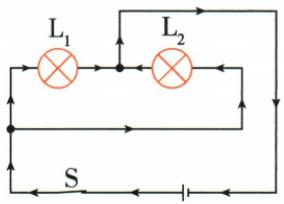
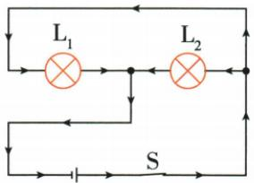
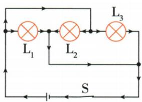
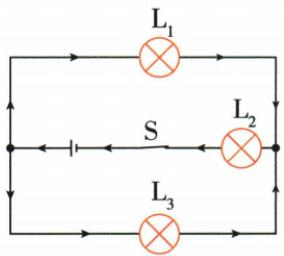
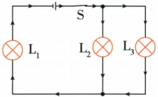
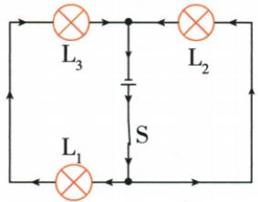
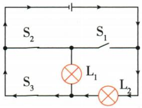
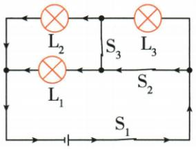
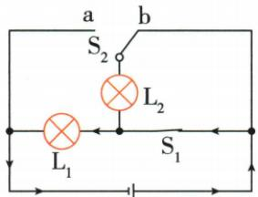

## 讲解

### 判据

同一连续理想导线可视为同节点；闭合开关可视导线，断开开关删掉该路径，再从源正端逐条走到负端。

### 流程

1. 按题中开关状态重画有效连接。2. 相同连续线合并为节点，不把未相连交叉当节点。3. 单一路径依次过两灯判串联，分别跨同节点对判并联。4. 检查有没有绕过负载的旁路，尤其直接连源的短路。5. 不按图形上下左右相邻判断。

## 例题

### 闭合开关使电源被短接

> 来源ID Q15-05；第十五章电流和电路；151-200/full.md 第1229–1237；1241–1248行。原答案与解析定位：151-200/full.md 第1239–1239行；151-200/full.md 第1249–1249行。

例（2024 江苏徐州中考）如图所示电路,闭合开关,电路所处的状态是 ( )

A.通路

B. 断路

C. 短路

D.无法判断

**原资料答案与解析：**

解析 由题图可知,当开关闭合时,相当于一根导线直接接在电源的两端,此时用电器不工作,电路中有电流,电流不经过用电器,直接从电源的正极回到电源的负极,电源被短路,故选 C。

答案 C

**展开解析（依据原详解补足理由与步骤）：**

原实物图把开关直接跨接电源两端，闭合后出现不经过灯泡的导线通路，是电源短路，C对。A正常通路不符，因为电流绕过负载；B断路不符，开关已接通；D图中接线能确定，无需猜测。判定应跟踪导线端点而不是看到灯与电池就默认串联。

### 一灯断丝不影响另灯且总开关控制

> 来源ID Q15-06；第十五章电流和电路；151-200/full.md 第1270–1282行。原答案与解析定位：151-200/full.md 第1284–1286行。

如图所示电路中，开关能同时控制两盏灯，若一盏灯的灯丝断了，不影响另一盏灯工作的电路是 \_\_\_\_ （）

  
A

  
B

  
C

  
D

**原资料答案与解析：**

解析 由题意可知,两灯工作是互不影响的,所以两灯应并联;开关能同时控制这两盏灯,所以开关应位于干路,故选A。

答案A

**展开解析（依据原详解补足理由与步骤）：**

A两灯分别接同一对节点，并联，S在干路，符合两条件。B两灯串联，一个断丝全部断路，不符；C虽并联但S只在L1支路，不能同时控制两灯；D仍为单一路径串联，一灯断丝另灯不工作。故A。能同时开关不独自证明并联，要加“不互相影响”条件。

### 三个开关使两灯串联

> 来源ID Q15-07；第十五章电流和电路；151-200/full.md 第1299–1319行。原答案与解析定位：151-200/full.md 第1321–1323行。

例1 下列操作能使图中的小灯泡 $\mathrm{L}_{1}$ 和 $\mathrm{L}_{2}$ 组成串联电路的是 ( )

A.闭合开关 $\mathrm{S}_1$ 、 $\mathrm{S}_2$ 和 $\mathrm{S}_3$

B. 只闭合开关 $\mathrm{S}_1$ 和 $\mathrm{S}_2$

C. 只闭合开关 $\mathrm{S}_2$ 和 $\mathrm{S}_3$

D. 只闭合开关 $\mathrm{S}_3$

**原资料答案与解析：**

解析 要使小灯泡 $L_{1}$ 和 $L_{2}$ 组成串联电路, 应将小灯泡 $L_{1}$ 和 $L_{2}$ 首尾相连接到电源两端, 由题图可知, 应只闭合开关 $S_{3}$ , 断开 $S_{1}$ 、 $S_{2}$ , 故选 D。

答案 D

**展开解析（依据原详解补足理由与步骤）：**

D只闭合S3：电流沿L1、S3、L2顺次回源，只有一条负载路径，串联。B闭合S1和S2、S3断开时两灯分别形成路径，是并联。A全闭时S1、S3、S2构成直通电源的导线支路，电源短路。C只闭S2、S3时L2被导线旁路，只有L1有效工作，不是两灯串联。故D。每项应按开关闭合视为导线、断开删除路径重画。

### 原电路清单示例1：L1、L2并联

> 来源ID Q28-21；前置清单与使用示例；1-50/full.md 第1555–1555行。原答案与解析定位：1-50/full.md 第1555–1555行。

L1、L2并联

**原资料答案与解析：**

原表配图后的结论：L1、L2并联。原图完整保留；工作开关条件在展开中补明。

**展开解析（依据原详解补足理由与步骤）：**

L1两端分别接电源两侧节点；弯折线把L2右端连到L1左端，L2左端连到L1右端，因此两灯跨同一对节点并联。不能按横排外形判串联；工作电流箭头按S闭合状态理解。

### 原电路清单示例2：L1、L2并联

> 来源ID Q28-22；前置清单与使用示例；1-50/full.md 第1555–1555行。原答案与解析定位：1-50/full.md 第1555–1555行。

L1、L2并联

**原资料答案与解析：**

原表配图后的结论：L1、L2并联。原图完整保留；工作开关条件在展开中补明。

**展开解析（依据原详解补足理由与步骤）：**

沿连续导线合并节点：L1左端通过上方导线与L2右端同节点，L1右端通过下方导线与左下电源端同节点。两灯共有两节点并联，不是电流必须从L1再过L2的唯一通路。

### 原电路清单示例3：L1、L2、L3并联

> 来源ID Q28-23；前置清单与使用示例；1-50/full.md 第1555–1555行。原答案与解析定位：1-50/full.md 第1555–1555行。

L1、L2、L3并联

**原资料答案与解析：**

原表配图后的结论：L1、L2、L3并联。原图完整保留；工作开关条件在展开中补明。

**展开解析（依据原详解补足理由与步骤）：**

L1左端与L2右端经上跨线同节点，L1右端与L3右端经下跨线同节点；L2、L3的另两端亦分别归入这两节点，三灯均并联。跨线没有额外元件，不能把灯排成一行就判串联。

### 原电路清单示例4：L1、L3并联后与L2串联

> 来源ID Q28-24；前置清单与使用示例；1-50/full.md 第1555–1555行。原答案与解析定位：1-50/full.md 第1555–1555行。

L1、L3并联后与L2串联

**原资料答案与解析：**

原表配图后的结论：L1、L3并联后与L2串联。原图完整保留；工作开关条件在展开中补明。

**展开解析（依据原详解补足理由与步骤）：**

左右节点之间L1与L3各有一条支路，所以先并联。电源和L2在供电干路，电流经过L2后分到L1/L3，故L1、L3并联后与L2串联；不要把带电源的整条分支误当普通灯串并联支路。

### 原电路清单示例5：L2、L3并联后与L1串联

> 来源ID Q28-25；前置清单与使用示例；1-50/full.md 第1555–1555行。原答案与解析定位：1-50/full.md 第1555–1555行。

L2、L3并联后与L1串联

**原资料答案与解析：**

原表配图后的结论：L2、L3并联后与L1串联。原图完整保留；工作开关条件在展开中补明。

**展开解析（依据原详解补足理由与步骤）：**

L2和L3都跨上右节点与下节点，两灯并联；L1在分流前的干路，故L2、L3并联后与L1串联。L1位置在左边不改变它承受干路总电流的连接关系。

### 原电路清单示例6：L1、L3串联后与L2并联

> 来源ID Q28-26；前置清单与使用示例；1-50/full.md 第1555–1555行。原答案与解析定位：1-50/full.md 第1555–1555行。

L1、L3串联后与L2并联

**原资料答案与解析：**

原表配图后的结论：L1、L3串联后与L2并联。原图完整保留；工作开关条件在展开中补明。

**展开解析（依据原详解补足理由与步骤）：**

原左支路从电源一端依次经过L3、L1，中间无分支，两者串联；右支路只有L2，故L1、L3串联后与L2并联。中间竖线带电源，是供电两端而非把左右灯全部短接的纯导线。

### 原电路清单示例7：开关S2、S3闭合,S1断开后,L1短路,电路中只有L2

> 来源ID Q28-27；前置清单与使用示例；1-50/full.md 第1555–1555行。原答案与解析定位：1-50/full.md 第1555–1555行。

开关S2、S3闭合,S1断开后,L1短路,电路中只有L2

**原资料答案与解析：**

原表配图后的结论：开关S2、S3闭合,S1断开后,L1短路,电路中只有L2。原图完整保留；工作开关条件在展开中补明。

**展开解析（依据原详解补足理由与步骤）：**

S2、S3闭合、S1断开：S2与S3构成L1两端的纯导线旁路，L1短路；电源到回路仍须经过L2，故只有L2工作。若再闭S1，会出现电源导线直通风险，不能把本结论扩到任意开关状态。

### 原电路清单示例8：开关S1、S2、S3闭合后,L3短路,L1、L2并联

> 来源ID Q28-28；前置清单与使用示例；1-50/full.md 第1555–1555行。原答案与解析定位：1-50/full.md 第1555–1555行。

开关S1、S2、S3闭合后,L3短路,L1、L2并联

**原资料答案与解析：**

原表配图后的结论：开关S1、S2、S3闭合后,L3短路,L1、L2并联。原图完整保留；工作开关条件在展开中补明。

**展开解析（依据原详解补足理由与步骤）：**

S1、S2、S3均闭合，S2接通的中支路线与S3竖线让L3两端成为同节点，L3短路；L1、L2跨电源同两节点而并联。依次合并节点后才删短路灯，不能只看S靠近哪只灯。

### 原电路清单示例9：开关S1闭合,S2接b后,L2短路,电路中只有L1

> 来源ID Q28-29；前置清单与使用示例；1-50/full.md 第1555–1555行。原答案与解析定位：1-50/full.md 第1555–1555行。

开关S1闭合,S2接b后,L2短路,电路中只有L1

**原资料答案与解析：**

原表配图后的结论：开关S1闭合,S2接b后,L2短路,电路中只有L1。原图完整保留；工作开关条件在展开中补明。

**展开解析（依据原详解补足理由与步骤）：**

S1闭合且S2接b，L2上端经b与右电源侧相连、下端经闭合S1也到右侧，故L2被旁路短路；L1跨左右电源两节点仍工作。换S2接a条件变了，不能沿用本结果。

## 易错

全闭不一定全亮，可能短路；相同电流不唯一证明串联。
