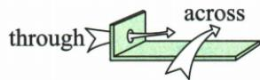

## 讲解

### 是什么

across常表示从一边到另一边，突出跨越表面或一片区域；through突出进入并穿过内部通道或空间。汉语都能译成“穿过”，入口应是移动路线与参照物关系。

### 怎么来的

原He saw me and came to me across the road.路线横过道路，强调从一边到另一边；They walked through the forest.路线在树林内部通过，周围是树林，故through。先确定动作主体和参照物，再想路径是否跨到另一侧、是否在内部穿行，比背“道路across、森林through”更可迁移。

同一个地方可以在不同路线中被不同地表达；如果题目有图，必须读真实路线，不能仅凭名词选介词。原示意图强调这两个典型关系，没有给行进距离或速度，不从线条长度补数值。

through也能表示时间自始至终或凭借手段，原through more practice不是穿越实体内部；辨词性相同不等于词义也相同。

### 什么时候能用

讨论移动、穿越且图或语境明确路线时使用。典型规则不能排除across用于区域、through用于通路的其他搭配；物体名称只是线索，实际动作是依据。静止地点或抽象手段不按穿越图机械判断。

### EN-LEX-T原词汇补充

原The river runs through the city.以city为河流路径内部；The girl is walking across the road.为横过道路表面，进行未报已过；He jumped over the high wall.是跨越高墙。不是forest必through、road必across的所有语境词表，路径观察方式决定用法。原First I have to get through the exams.中get through为通过考试整体义，不按身体穿过试卷空间。

## 例题

**原资料词形、词组或例句，非独立试题。** 本小节未配一题单独检验本概念，保留原材料并解释这一缺口。

| 介词 | 意义 | 用法 | 示例 |
| --- | --- | --- | --- |
| across | 从......一边到另一边;横过 | 含有“从......表面穿过”之意,表示动作是在某个物体的表面进行的,常用于表示过马路或乘船过河 | He saw me and came to me across the road.他看见了我,便穿过马路向我走来。 |
| through | 从......一端至另一端;穿过 | 含有“从......中间穿过”之意,表示动作是在某一物体内或空间里进行的,常用于表示穿过森林、透过/越过窗户等 | They walked through the forest.他们步行穿过了森林。 |

### 原词汇例句补充

**原词目 through**

First I have to get through the exams.首先我必须通过这些考试。

**原辨析及原说明（保留原文，下文区分适用边界）**

易混辨析
through、across 与 over
三者都表示“穿过，通过”，但用法有所不同。
1. through 指从立体空间内部穿过, 可和 forest、city、window 等搭配。
The river runs through the city.
这条河从这座城市中流过。
2. across 指从物体表面穿过, 可和 road、bridge 等搭配。
The girl is walking across the road.
那个女孩正在走着穿过马路。
3.over 指越过高的障碍物等。
He jumped over the high wall. 他跳过高墙。

## 易错

- **所有穿过都写through**：原横过道路突出跨到另一侧。
- **只背森林与道路名词**：改变路线后可能改变表达重点。
- **根据图线段长短算距离**：原图没有比例尺。

补充：going across进行报过完；over必接任何高物不看方向；get through exams译穿纸。

资料定位（题目自带的考试标签按原书保留，未独立核实其真题身份）：

- EN-PREP-K08：201-250/full.md 第9—13行；ba4e76bb-b540-4003-bc21-9e5c24f6b097_origin.pdf实际PDF第1页。

资料定位（题目自带的考试标签按原书保留，未独立核实其真题身份）：

- EN-LEX-T-W051：101-150/full.md 第1333—1360行；3633b6f7-7fc7-4128-b47a-b57176feab86_origin.pdf实际PDF第27、28页。
