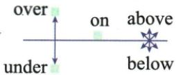

## 讲解

### 是什么

on常表示在表面上，above强调位置较高，below强调位置较低；over、under常突出在上方、下方及跨越、覆盖等关系。这些词表达空间关系，并不是五个互斥的物理区域。

### 怎么来的

原My book is on the desk.突出书与桌面接触；The plane flew above the clouds.只说明飞机比云层高；The bridge is over the river.突出桥跨在河上方。Don't write below this line.要求字处在该线以下，The boat went under the bridge.则说明船从桥下经过。首先确定参照物，再读是静止位置还是移动路径，才能解释介词。

原后文She put a blanket over the sleeping child.明确用over表示盖上毯子，可能接触孩子。因此原前表把over、under和above、below统称不接触过于绝对，不能拿来排除这个原句。over还可表示越过，原jump over the wall描述从墙的一侧跨到另一侧；它不是仅仅停在比墙高的位置。

图中的方位示意只帮助理解典型关系，不能代替句子所表达的覆盖和路径。图没有比例尺，也不能从画得靠近就算出实际距离。

### 什么时候能用

描述物体相对位置、上下移动与覆盖时使用。先确认参照物和动作，on的典型表面意义与over的覆盖意义可能都涉及接触；具体搭配还须看表达重点。数量over twenty与under 6另属数值阈值，不用空间图判断年龄是否免费。

## 例题

**原资料词形、词组或例句，非独立试题。** 本小节未配一题单独检验本概念，保留原材料并解释这一缺口。

| 方位 | 介词 | 意义 | 用法 | 示例 |
| --- | --- | --- | --- | --- |
| 上 | on | 在......上 | 二者表面接触 | My book is on the desk. 我的书在课桌上。 |
| above | 在......上面 | 二者不一定垂直,不接触 | The plane flew above the clouds.飞机在云层上面飞行。 |  |
| over | 悬在......上面 | 表示前者在后者的垂直上方,二者不直接接触 | There is a bridge over the river. 河上有一座桥。 |  |
| 下 | below | 在......下面 | 二者不一定垂直,不接触 | Please don't write below this line.请不要写到这条线下面。 |
| under | 在......下面 | 表示前者在后者的垂直下方,二者不接触 | There is a boat under the bridge. 桥下有一条船。 |  |

原后文：She put a blanket over the sleeping child. 她给那个睡着的孩子盖上了毯子。He can jump over the wall. 他能够跳过那堵墙。

## 易错

- **over一定不接触**：原盖毯子句已是反例。
- **below一定正下方**：它先说明更低，不保证垂直对齐。
- **只看高度忽略动作**：jump over还交代跨越，不只是高于墙。

资料定位（题目自带的考试标签按原书保留，未独立核实其真题身份）：

- EN-PREP-K02：151-200/full.md 第2570—2576行；52f19ba8-584c-475b-8abd-6a3f661ab031_origin.pdf实际PDF第50页。
- EN-PREP-W11：201-250/full.md 第140—142行；ba4e76bb-b540-4003-bc21-9e5c24f6b097_origin.pdf实际PDF第6页。
