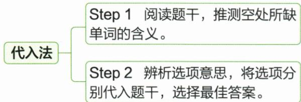

## 讲解

### 判据

选项都为动词，差别主要是含义，且形式常同样合乎句法时，先把空处需要表达的动作或状态读出来。线索可能在答句、后句、目的说明或前后转折中，不限于空前空后一个词。词义选择要让整句和上下文相互接上。

### 流程

1. **确定这个位置的角色**：找主语及后面的对象、补足语，区分动作、状态、系表说明，避免只凭中文近义词选择不合结构的词。
2. **读全线索，先用中文说明所需意义**：若是问答，要看回答是在讲特征、意愿还是行为；若是叙述，找前后因果、时间、否定及转折。先建立句意，才不会被一个熟悉选项带偏。
3. **逐项代入，同时检查意思与搭配**：问该动作能否与主语、对象、语境组成原文关系。不能因为某词会翻译就忽略它与其后宾语、介词或表语的组合。
4. **把形式与意义分开复查**：时态、主语配合、动词是否延续等可以排除结构不合的项，但若所有选项都同为原形或过去式，仍必须靠意义完成区分。
5. **回读含前后句的完整意思**：尤其保留 never、not 等否定，不把“从未想过”变成“理解过”，也不把描写特点误作是否相信对方。

这套流程用于词义区别，选项若只变词形，应转到动词填空与时态、语态判断；不能只用代入后中文顺不顺判断全部语法。

## 例题

### 原例题 EN-VERB-E01

例1 (2024 湖北武汉中考)—Can you \_\_\_\_ your new coach?

—Hmm...I think he's very intelligent and humorous.

A.believe

B. describe

C.support

D.follow

**原答案**：B。

**原解析（原文）**

句意:——你能描述一下你的新教练吗?——嗯……我觉得他很聪明,很幽默。根据回答可推断,此处表示描述教练。believe 相信;describe 描述;support 支持;follow 跟随。故选 B。

**完整解析（依据原解析展开）**

回答中的 intelligent（聪明）和 humorous（幽默）是在说明教练的特点，先据答句判断问句需要“描述”。A believe 是相信，不能引出这样的特征描述；B describe 是描述，能对应答句，两者问答衔接；C support 是支持，讨论是否支持某人不能直接由两项性格形容词回答；D follow 是跟随，也不是请对方介绍人物特点。四项在 can 后都用原形，仅检查形式排除不了任何一项，应选 B。

### 原例题 EN-VERB-E02

例2 (2024 广东中考节选) Betty does not have a natural gift (天赋) for math. She never \_\_\_\_ that she could be a scientist one day when she was little.

A. argued

B.reported

C. thought

D. understood

**原答案**：C。

**原解析（原文）**

句意: Betty 没有数学天赋。她小时候从未想过有一天自己会成为一名科学家。根据语境可知, 设空处表示“想过”。argue 争论; report 报道; think 想, 思考, 认为; understand 理解。故选 C。

**完整解析（依据原解析展开）**

先把两句连起来：Betty 没有数学天赋，小时候 never ... that she could be a scientist，所以要表达她过去“从未想过”自己能成为科学家。A argued 表示争论，原文没有她与人争论的线索；B reported 表示报道，话题是她的内心预想，不是向外报告；C thought 表示想、认为，与 never 及其后那件未曾预想到的事相合；D understood 表示理解，不是这里从未预想自己未来职业的意思。when she was little 定位过去，四个选项都是过去式，单靠时态仍不能区分。选 C。

## 易错

- **先认一个熟悉词就停**：原 E01 四项都合 can 后原形，必须让答句中的特点说明对上 describe。
- **忽略 never 与小时候背景**：E02 要说过去未曾预想，单独认识 understood 并不能作答。
- **把词义辨析当不需要句法**：及物对象、介词搭配、系表关系都可能限制选择。

资料定位（题目自带的考试标签按原书保留，未独立核实其真题身份）：

- EN-VERB-P01：151-200/full.md 第403—447行；52f19ba8-584c-475b-8abd-6a3f661ab031_origin.pdf实际PDF第13页。
- EN-VERB-E01：151-200/full.md 第423—435行；52f19ba8-584c-475b-8abd-6a3f661ab031_origin.pdf实际PDF第13页。
- EN-VERB-E02：151-200/full.md 第437—447行；52f19ba8-584c-475b-8abd-6a3f661ab031_origin.pdf实际PDF第13页。
