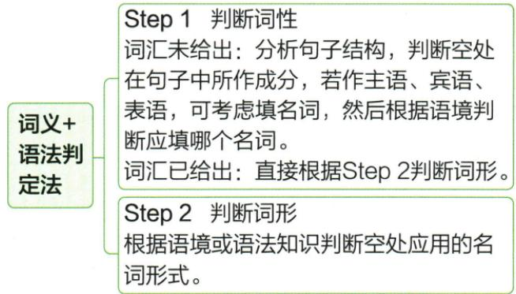

## 讲解

### 判据

题目要求写名词形式，或选项区别在名词的数时，首先判断该词在当前句意下可不可数，再寻找直接作用于它的数量线索。数词、限定语、并列成分、谓语和语境可以互相核对，但不能把任意一个词当成通用答案开关。

### 流程

1. **确认这里要表达哪个名词和哪个词义**：方框题先通过句法位置和语境选词；若是 paper、chicken 等，先分清具体义项。
2. **确认可数性及中心词**：不可数用法通常不加复数；有 pair、cup 等单位结构时，要认清数量作用于单位还是内容。
3. **读取数的证据**：a/an、one、each、every 等在相应普通可数名词结构中支持单数；many、several、a few 支持复数；some、a lot of 要与可数性一起判断。并列的名词和谓语可以用于复核，但不会自动代替语义。
4. **采用具体复数形式**：规则词按拼写，不规则词按约定；合成词找中心及特殊变化，单复数同形词不要强加 s。
5. **检查是否还需所有格或单位表达**：确定数只是一个维度；句子需要“谁的”时，还要处理所属关系。

集体名词的谓语、glasses 与 pair 的关系、名词作定语的单复数，都提醒我们必须先确定句子在数什么。下面原题考的是普通可数名词 movie，不代表一题已经验证全部这些分支。

### 本章补充：EN-LEXUSE

当前energy指从食物取得的总能量，按不可数表达。a fifth of数的是该总量的一份比例，不是五个名为energy的对象，故energy不加s。brain的2%体重与能量五分之一是不同被计量的量，不能互换为同一比例；本条只核原题词形，不认证最新生理数据。

## 例题

### 原例题 E03

来源：EN-NOUN-E03；原书的年份、地区及“节选／改编”标注照录，未另行核验真题身份。

例 (2024 河南中考改编)

从方框中选择适当的词并用其正确形式填空。

sell he popular movie great

Many of the stories about Bao Qingtian were made into some \_\_\_\_, novels, operas and so on. Today Bao is still considered as one of the greatest officials in history and is loved by Chinese people.

**原答案：movies。**

**原解析（原文）**

Step 1 判断词性：空处与 novels、operas 并列，作介词 into 的宾语，故应填名词。结合语境和备选词可知，movie“电影”符合语境。

Step 2 判断词形: movie 是可数名词, 空前的 some 修饰可数名词复数, 故此处填 movies。由与空处并列的名词 novels、operas 也可判断出此处填 movie 的复数形式 movies。

**完整解析（依据原解析展开）**

先识别空格与 novels、operas 由并列关系连接，共同作 made into 的宾语，表示故事被改编成哪些作品。词框里的 movie 命名电影，符合这个类别；sell 表示卖，he 是代词，popular 和 great 是描述性质的词，均不能在原句此处直接命名并列作品。

选定 movie 后再判数：本题 some 修饰可数名词 movie，表示一些电影；novels、operas 也为复数，与此判断互相支持。movie 词尾虽有字母 ie，却不是“辅音字母＋y”结构，按一般规则加 s，得到 movies。完整填写要同时完成“选对词”和“写对形式”。

### 原例题 EN-LEXUSE-E09

3.(2024 四川成都中考)The brain makes up 2% of our body weight but uses about a fifth of the e\_\_\_\_ we get from food.

**原答案**：energy。

**原解析（原文）**

3. 结合首字母, 由 we get from food 可知, 此处指我们从食物中获取的能量。energy 是不可数名词, 故填 energy。

**完整解析（依据原解析展开）**

e提示energy，we get from food修饰能量来源，the后所指总能量。energy此义不可数，a fifth of表达这份总量的五分之一，不让energy改energies。brain makes up与uses分别说体重占比和用能占比，原2%与a fifth不属同一量，不能互相换。本文只核原英语填词，不将题内比例认证为最新生理统计。

## 易错

- **选出 movie 就停止**：原题要求用正确形式，some 与并列的 novels、operas 支持 movies。
- **把 some 规定为只能接复数**：它也可接不可数名词；本题之所以用复数，前提是 movie 在这里可数。
- **看见字母结尾就照口诀变形**：movie 不以 y 结尾，不能仿 city→cities 进行错误变化。
- **扩大本题覆盖范围**：资料没有在本小节给出另一道题检验不规则复数、单位词或集体名词；这些分支用原例句说明，不能宣称原题已全部考到。

资料定位：

- EN-NOUN-K03：3633b6f7-7fc7-4128-b47a-b57176feab86_origin.pdf，实际PDF第43页；full.md第2182—2186；2180—2180行
- EN-NOUN-K04：3633b6f7-7fc7-4128-b47a-b57176feab86_origin.pdf，实际PDF第44页；full.md第2190—2216行
- EN-NOUN-K05：3633b6f7-7fc7-4128-b47a-b57176feab86_origin.pdf，实际PDF第44、45页；full.md第2218—2220；2200—2200行
- EN-NOUN-K06：3633b6f7-7fc7-4128-b47a-b57176feab86_origin.pdf，实际PDF第45页；full.md第2222—2232行
- EN-NOUN-K07：3633b6f7-7fc7-4128-b47a-b57176feab86_origin.pdf，实际PDF第43、45页；full.md第2166—2170；2234—2238行
- EN-NOUN-K08：3633b6f7-7fc7-4128-b47a-b57176feab86_origin.pdf，实际PDF第45、46页；full.md第2240—2252行
- EN-NOUN-K09：3633b6f7-7fc7-4128-b47a-b57176feab86_origin.pdf，实际PDF第46、47页；full.md第2254—2267；2290—2292行
- EN-NOUN-K10：3633b6f7-7fc7-4128-b47a-b57176feab86_origin.pdf，实际PDF第46、47页；full.md第2269—2280行
- EN-NOUN-K11：3633b6f7-7fc7-4128-b47a-b57176feab86_origin.pdf，实际PDF第47页；full.md第2282—2288行
- EN-NOUN-E03：3633b6f7-7fc7-4128-b47a-b57176feab86_origin.pdf，实际PDF第50页；full.md第2411—2423行

资料定位（题目自带的考试标签按原书保留，未独立核实其真题身份）：

- EN-LEXUSE-E09：301-350/full.md 第2878—2878；2884—2884行；6659d931-51af-404a-81a1-a09f940e70c3_origin.pdf实际PDF第44页。
