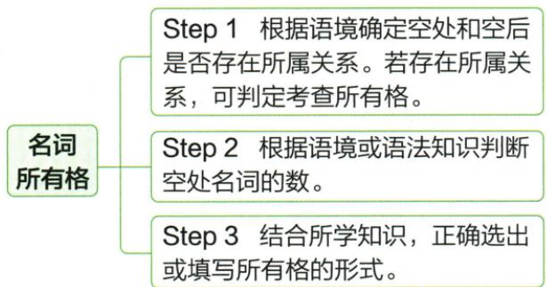

## 讲解

### 判据

空格与后面的对象存在“谁的、哪段时间的”等所属或关联关系，或选项含普通形式与撇号形式时，考虑所有格。后面出现名词只是线索，不是充分条件：名词定语也能修饰名词；语境明确时所有格后又可能省略名词。

### 流程

1. **读出中心对象和关系**：问句子究竟是在说谁的帮助、哪天的天气，还是一种物品类别。先识别关系，避免见名词就加撇号。
2. **确定关联名词的数**：说一个还是多个，依据限定语和语境；先完成 teacher→teachers，不能期待撇号同时表达复数。
3. **选合适的关系结构**：原题的时间和人物关系使用撇号所有格；理解 of 时还应区分内容、所属及双重所有格。
4. **落实标记位置**：单数或不以 s 结尾的复数通常加 's；已以 s 结尾的复数加撇号；并列所属关系还要区分共同与分别拥有。
5. **带回原句读含义**：检查数、关系和词形三者都满足。不能为了支持选项擅自改 other、冠词或后面的名词。

原流程图先判关系，再判数，再写形式。每一步都有独立任务，跳过判数会混淆 teacher's 与 teachers'，跳过判关系又会把 teachers 当成完整的所属表达。

## 例题

### 原例题 E04

来源：EN-NOUN-E04；原书的年份、地区及“节选／改编”标注照录，未另行核验真题身份。

例1 （2024 江苏扬州中考）For further information on \_\_\_\_ weather conditions, call the hotline below. (明天)

**原答案：tomorrow's。**

**原解析（原文）**

根据语境可知此处表示明天的天气情况,要用名词所有格形式。故填 tomorrow's。

**完整解析（依据原解析展开）**

中文提示给出 tomorrow，空后的 weather conditions 表示天气情况。这里要限定的是“哪一天的天气情况”，需要表达明天与天气的时间关联，不能只写普通时间副词 tomorrow。

名词所有格可用于时间，并不限于有生命的拥有者。tomorrow 在这里不是复数，接 's，填写 tomorrow's。这个步骤来自题干的时间关系与所有格形式，不是单凭后面有名词就机械加撇号。

### 原例题 E05

来源：EN-NOUN-E05；原书的年份、地区及“节选／改编”标注照录，未另行核验真题身份。

例2 (2024 重庆中考 A 节选) With other \_\_\_\_ help, I did very well.

A.teacher

B.teacher's

C.teachers'

**原答案：C。**

**原解析（原文）**

由语境可知空处和空后的 help 存在所属关系,所以应用名词所有格;根据语境,此处表示其他的老师,不止一人,故用复数形式的所有格,故选 C。

**完整解析（依据原解析展开）**

先读出 help 与老师之间的关系：在其他老师的帮助下，我表现得很好。本题需要表示“老师的”，再根据 other 后的普通可数名词用法判断多人。

- A teacher：既未写复数，也未标出题目需要的所属关系，不能表达原题的“其他老师的帮助”。
- B teacher's：是单数老师的所有格；本题 other 后裸接普通单数可数名词缺乏相应单数限定，不能据此读作多位其他老师。若改为 another 或 the other，已是改变题干，不能用来证明 B 在原题成立。
- C teachers'：先把 teacher 变为 teachers，表示其他多位老师；teachers 已以 s 结尾，只添撇号表示所属，符合本题。

两个判断缺一不可：teachers 解决“多少人”，末尾撇号解决“谁的帮助”。原题没有 teachers 这个选项，也不能自行补一个选项来代替逐项核对。

## 易错

- **有生命才可以所有格**：tomorrow's 是时间关联，原题并非给“明天”虚构一个生命身份。
- **直接选带 's 的项**：teacher's 只处理单数所属，不满足原题 other 后的多人语境。
- **只写复数不表达所属**：teachers 与 teachers' 不同，前者没有原题需要的所有格标记。
- **默认 of 都能互换**：照片上的人和照片的拥有者是不同关系，原资料的 photo 对照应保留区别。

资料定位：

- EN-NOUN-K12：3633b6f7-7fc7-4128-b47a-b57176feab86_origin.pdf，实际PDF第48页；full.md第2294—2304行
- EN-NOUN-K13：3633b6f7-7fc7-4128-b47a-b57176feab86_origin.pdf，实际PDF第49页；full.md第2306—2314行
- EN-NOUN-K14：3633b6f7-7fc7-4128-b47a-b57176feab86_origin.pdf，实际PDF第49页；full.md第2316—2334行
- EN-NOUN-E04：3633b6f7-7fc7-4128-b47a-b57176feab86_origin.pdf，实际PDF第50页；full.md第2446—2448行
- EN-NOUN-E05：3633b6f7-7fc7-4128-b47a-b57176feab86_origin.pdf，实际PDF第50页；full.md第2450—2458行
