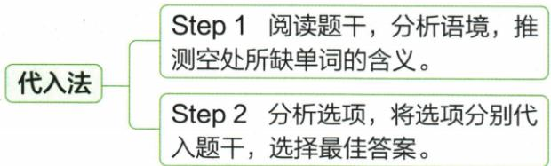

## 讲解

### 判据

选项都是名词、在语法位置上都可能接入时，先判断题干说的对象和关系是什么。若出现答语、举例、转折、原因等信息，优先寻找能明确约束空格含义的线索。词性筛选只是入口，不能代替意义比较。

### 流程

1. **读出空格的关系**：是给物件命名、给类别命名，还是作比喻？这样才知道要找的不是孤立词义。
2. **找能限制含义的证据**：答语可能解释前句，such as 后的例子可能指向上位类别；把线索与空格建立直接关系。
3. **给每个选项带入相同证据**：说明它指什么、能否包括这些例子或表达这层关系。不能因词熟悉或与前句一个词有关就先入为主。
4. **回到全句复核**：意思贯通后，仍检查可数性、限定语与搭配。词义适合不保证任何词形都成立。

原资料使用“阅读语境→代入选项”的简图。实际操作需要把起决定作用的证据说出来，才能把这一步迁移到另一题。

## 例题

### 原例题 E01

来源：EN-NOUN-E01；原书的年份、地区及“节选／改编”标注照录，未另行核验真题身份。

例1 (2024 安徽中考)—Art serves as a \_\_\_\_ between different nations.

—Yes. It really helps cross-cultural communication.

A.river

B. wall

C.palace

D.bridge

**原答案：D。**

**原解析（原文）**

river 河; wall 墙; palace 宫殿; bridge 桥。结合“它确实有助于跨文化交流”可推测, 这里指“艺术可以当作不同国家之间的桥梁”, bridge 符合题意。故选 D。

**完整解析（依据原解析展开）**

先读答语 It really helps cross-cultural communication，发现艺术促进的是跨文化沟通。题干把艺术说成两个国家之间的某种东西，语义上要选能“连接双方”的形象。

- A river（河）：本身不能直接表示建立文化沟通的通道；给定答语支持连接双方的桥梁。
- B wall（墙）：在这组比喻中通常形成阻隔，与 helps communication 的积极连接作用不相符。
- C palace（宫殿）：是建筑物，没有语境证据把它与两国之间的沟通联系起来。
- D bridge（桥）：连接两端，符合艺术帮助不同国家交流的作用。

四个选项都是名词，词性不能再帮助区分；真正决定答案的是答语与 bridge 的语义对应。

### 原例题 E02

来源：EN-NOUN-E02；原书的年份、地区及“节选／改编”标注照录，未另行核验真题身份。

例2（2024 广西中考节选）Sometimes we go to places that we can only reach by boat. We often find plenty of \_\_\_\_, such as broken toys and plastic bags.

A. rubbish

B.fruit

C.fish

**原答案：A。**

**原解析（原文）**

rubbish 垃圾; fruit 水果; fish 鱼。根据空后的 such as broken toys and plastic bags 可知, 此处指我们经常会发现大量的垃圾。故选 A。

**完整解析（依据原解析展开）**

先看空后的 such as，它在举例，说明这些例子应属于空格词所表示的同一类别。broken toys 是坏玩具，plastic bags 是塑料袋；在原段收集废弃物的语境中，这些都是垃圾。

- A rubbish（垃圾）：能把这两类废弃物包括在内，符合上位类别与例子的关系。
- B fruit（水果）：坏玩具和塑料袋不是水果，不能被这个类别统领。
- C fish（鱼）：两种例子都不是鱼；前句的 by boat 只说明到达方式，不能据此忽略后面的直接分类证据。

plenty of 可修饰不可数名词，rubbish 在这里无须改成复数。这里先由词义选答案，不是见到 plenty of 就只能选某一词性或数。

## 易错

- **四个词都是名词就靠熟悉程度猜**：艺术题的关键是答语“帮助跨文化沟通”，不是哪个建筑名词最熟。
- **拿 by boat 推断 fish**：船只说明到达方式；such as 后的坏玩具、塑料袋才是本空直接分类证据。
- **挑一个线索却不解释它与空格的关系**：应明确“举例属于空格类别”或“答语解释沟通作用”，否则仍可能套错词。

资料定位：

- EN-NOUN-K01：3633b6f7-7fc7-4128-b47a-b57176feab86_origin.pdf，实际PDF第42、43页；full.md第2139—2174行
- EN-NOUN-K10：3633b6f7-7fc7-4128-b47a-b57176feab86_origin.pdf，实际PDF第46、47页；full.md第2269—2280行
- EN-NOUN-E01：3633b6f7-7fc7-4128-b47a-b57176feab86_origin.pdf，实际PDF第49页；full.md第2366—2378行
- EN-NOUN-E02：3633b6f7-7fc7-4128-b47a-b57176feab86_origin.pdf，实际PDF第49页；full.md第2380—2388行
