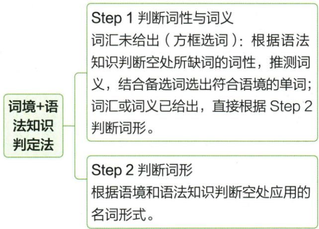

## 讲解

### 判据

提示词是动词、形容词等，而句子的中心位置及语境需要给人、事物或概念命名时，考虑对应名词。要把“位置需要什么”和“语义具体指什么”结合起来；词框题还需先确定哪个基本词合适。

### 流程

1. **读完整短语并找主干**：判断空格是中心名词的位置还是修饰词位置。介词后、限定词后、主语等位置只是线索，不是充分条件。
2. **选具体名词含义**：原题获胜者要命名人，不能仅用“获胜”的动作形式；固定表达“说实话”要读出 truth 的概念意义。
3. **写约定派生形式**：winner 双写 n，truth 不是把 true 直接加 s。派生形式不能仅靠通用“加个后缀”猜出。
4. **再检查数和所属**：名词形成后仍可能需要单复数或所有格。has 支持 winner 单数；固定表达 to tell the truth 使用原资料约定形式。
5. **带回原句检验**：主干、搭配和语义同时通顺才算完成，不能只因某个词是名词就填入。

原图给出了判断词性词义、再判断词形的两段流程；下面两题把为什么需要这两个具体名词补完整。其他词缀与义项不由这两题推断。

### 本章补充：EN-LEXUSE

本原tour提示先选含义：城市提供体验给游客，不是提供给游览动作，因此派生人名词tourist。its限定后中心名词，但不能凭这个位置决定数；原泛指来访游客的群体读法用tourists。原没有显式人数，复数解释按资料语境与原答保留，不称its强制复数。-ist是tourist的约定构成，不任意给每个游览相关动词造人名词。

## 例题

### 原例题 E06

来源：EN-NOUN-E06；原书的年份、地区及“节选／改编”标注照录，未另行核验真题身份。

例1（2024 山东临沂中考节选）The \_\_\_\_ (win) has a chance to invent a name for a planet—that's exciting, isn't it?

**原答案：winner。**

**原解析（原文）**

此处缺少主语,应用名词,winner“获胜者”,结合 has 可知,用单数形式。故填 winner。

**完整解析（依据原解析展开）**

先找主干 The ... has a chance...，空格所在短语为主语。后面说有机会给一颗行星命名，语境需要表示能够获得机会的人。给定 win 是“获胜”，对应“获胜者”的名词为 winner。

再检查数：原谓语 has 对应单数主语，winner 用单数。最后检查拼写：原资料给出的约定形式是 winner，词中双写 n。win 或 wins 没有表示获胜者这个人；只把词改成动词变化形式不能满足题义。

### 原例题 E07

来源：EN-NOUN-E07；原书的年份、地区及“节选／改编”标注照录，未另行核验真题身份。

例2（2024黑龙江哈尔滨中考节选）To tell the \_\_\_\_ (true), we not only enjoyed the beauty of the buildings along the street, but also felt the warmth of society that day.

**原答案：truth。**

**原解析（原文）**

由空前的定冠词 the 可知此处应填名词。to tell the truth 说实话，为固定搭配。故填 truth。

**完整解析（依据原解析展开）**

先读完整 To tell the ...，而不是只看 the 后的单个空格。这是固定表达 to tell the truth，意思是“说实话”。true 是形容词“真实的”，对应这里所谈事实的名词 truth。

truth 在该表达中直接作 tell 的宾语，使用约定形式，不加复数 s。原解析“由 the 可知填名词”提供了方向，但只凭 the 不足以判定紧接位置：限定词与中心名词之间可以有修饰语。本题能确定 truth，还必须结合 tell 的宾语关系、词义和完整固定搭配。

### 原例题 EN-LEXUSE-E03

3. (2024 江苏扬州中考) Every year, Yangzhou offers a magical and special experience for its \_\_\_\_. (tour)

**原答案**：tourists。

**原解析（原文）**

3. 设空处位于形容词性物主代词之后, 应用名词形式 tourist, 游客不止一人, 应用复数形式, 故填 tourists。

**完整解析（依据原解析展开）**

for its后是接受城市体验的对象，语境指游客，tour行程或游览变人名词tourist，再按原泛指来访游客读复数tourists。its只说明“它的”，单复数仍看被限定名词，不能说its后永远复数。原题没有明确several数字，复数为原提供的一般游客群体读法；不给出句法强制唯一数的结论。-ist构成人并不意味着任意动词均可加此后缀，tourist是约定词。

## 易错

- **只改成动词三单或复数**：原题需要获胜者，win 的变化形式不等于 winner。
- **认对词性却不验证语义**：句子需要获得机会的人，必须说出 winner 的人称意义。
- **把 the 变成万能判据**：原解析须结合完整结构和固定搭配使用，不能推广为 the 后第一空永远填名词。
- **忽略派生后的数**：原题 has 与单数 winner 相符，应把这个核对步骤保留。

资料定位：

- EN-NOUN-K02：3633b6f7-7fc7-4128-b47a-b57176feab86_origin.pdf，实际PDF第43页；full.md第2176—2180；2188—2188行
- EN-NOUN-K15：3633b6f7-7fc7-4128-b47a-b57176feab86_origin.pdf，实际PDF第50页；full.md第2460—2486行
- EN-NOUN-E06：3633b6f7-7fc7-4128-b47a-b57176feab86_origin.pdf，实际PDF第50页；full.md第2480—2482行
- EN-NOUN-E07：3633b6f7-7fc7-4128-b47a-b57176feab86_origin.pdf，实际PDF第50页；full.md第2484—2486行

资料定位（题目自带的考试标签按原书保留，未独立核实其真题身份）：

- EN-LEXUSE-E03：301-350/full.md 第2835—2835；2839—2839行；6659d931-51af-404a-81a1-a09f940e70c3_origin.pdf实际PDF第43页。
