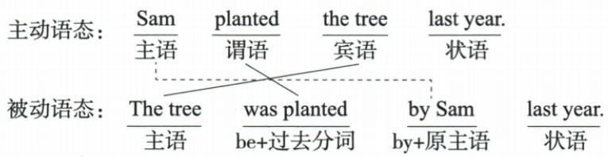

## 讲解

### 是什么

转换可采用被动的主动句时，原动作对象转成新主语，谓语改为相同时间参照的be+分词，原执行者若仍需保留就由by引出。时间、方式等信息不任意改掉；新主语的数决定be或限定助动词的形式，不能继续沿用原主语的数。

### 怎么来的

原Sam planted the tree last year.中Sam执行种树，the tree接受种植，last year为过去参照。把the tree移为新主语The tree；原过去时planted转为过去be+分词，tree单数用was，plant分词planted，得到was planted；保留执行者写by Sam；时间仍last year。完整为The tree was planted by Sam last year.，原tree没有增加或变成新的一棵。

若原宾语是宾格代词，新主语需变主格；原主语作by对象则需宾格。这个格变化来自句中任务变化，不是人称身份变化。原I heard ...与Jane ... by me等转换中，me说明听见者仍是原I，角色不被倒置。

口诀“原主成by宾”是保留施事时的转换练习路径；真实表达可以因施事不重要省略by短语。没有合适对象或当前动词不自然被动时，不能靠口诀强行建立新主语。

### 什么时候能用

先核对原结构是否可转，再逐项移动和变形，最后按新主语检查时态层与数。时态保持不意味着原助动词拼写必须原封不动；同一过去时可以随新主语由were改was。原图箭头只说明位置关系，不代替词义和完整谓语检查。

## 例题

**原资料词形、词组或例句，非独立试题。** 本小节未配一题单独检验本概念，保留原材料并解释这一缺口。

原句：Sam planted the tree last year. → The tree was planted by Sam last year.

成分分析及每一步依据见讲解；该图是说明例句，不是独立试题。

## 易错

- 只移主宾不加be：不能形成英语被动谓语。
- 新主语单数却沿用原复数助动：按新主语检查数。
- 为了完成转换改时间或数量：保留原条件。

资料定位（题目自带的考试标签按原书保留，未独立核实其真题身份）：

- EN-PASSIVE-K06：251-300/full.md 第183—224行；6a4ea2a3-bafa-48b3-86d2-957f22a16e66_origin.pdf实际PDF第5页。
- EN-PASSIVE-K09：251-300/full.md 第314—367行；6a4ea2a3-bafa-48b3-86d2-957f22a16e66_origin.pdf实际PDF第6页。
