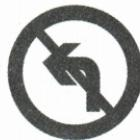

## 讲解

### 判据

图提供主要信息，四项交叉更换行动方向和must/mustn’t，需把原图分解成两个同时满足的条件。

### 流程

1. 对照原图看箭头向左和禁止斜杠，确认不是仅凭原解析猜图。
2. 写意义组“禁止—左转”，对应mustn’t—turn left。
3. A两条件都合；B把禁止变必须；C把左变右；D两者都变，逐项说明具体差别。
4. 回读It means后的完整内容，否定和方向缺任何一个都会改变指令。
5. 图不清先核原件；这里只解释原题图示，不扩展道路法则或罚款。

## 例题

### 原例题 EN-SINGLE-E07

例1 (2024 江苏无锡中考)—Look at the traffic sign on the right. What does it mean?

—It means \_\_\_\_.

A. you mustn't turn left

B. you must turn left

C. you mustn't turn right

D. you must turn right

**原答案**：A。

**原解析（原文）**

考查生活常识。此图为禁止左转标志，故选 A。

**完整解析（依据原解析展开）**

原图为左弯箭头加禁止斜杠，A.you mustn’t turn left保留方向和禁止。B.must turn left只保留左却把禁止改必须；C.mustn’t turn right保留禁止却换右；D.must turn right两维都改。先辨箭头朝向再读禁行标记，不能只看箭头或只背mustn’t。这里解释原题给定图像的英文意义，不从一图推广所有道路法规。

## 易错

mustn’t是禁止而非不必。看到方向正确还需核否定，符号归属未清不能只看红色黑色判断。

资料定位（题目自带的考试标签按原书保留，未独立核实其真题身份）：

- EN-SINGLE-K04：301-350/full.md 第308—312行；6659d931-51af-404a-81a1-a09f940e70c3_origin.pdf实际PDF第4页。
- EN-SINGLE-E07：301-350/full.md 第314—328行；6659d931-51af-404a-81a1-a09f940e70c3_origin.pdf实际PDF第4页。
