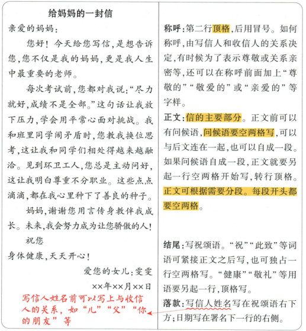

## 讲解

### 是什么

一般书信向具体收信者交流，常有称呼、正文、祝颂、落款。关系决定称谓，内容围本次交流目的。

### 怎么来的

原给妈妈的信以亲爱的妈妈定亲近关系，再用考试、同学冲突、尊重环卫工三个具体经历说明妈妈也是老师，感谢不只空赞。称呼顶格后冒号，问候正文空两格分段，祝与健康分别按原说明分行，署名日期居右。顺序帮助先辨收信人再读来意，尾部确认谁写和何时。

信封由邮递员投递，需可识别的地址姓名邮编，不宜只写父亲大人姐姐；信内亲属称谓不能直接取代信封投递信息。原范文xx日期是示意占位，保留不填真实日；未提供独立书信题，不能把范文虚构经历当学生自己事实。此范文可看原裁图确认版式。

### 什么时候能用

用于私人书信，不把通知标题等所有文种格式强加；题有特殊书写模板按题。

## 例题

**原资料中的说明或示例，非独立试题。** 本小节未配一题单独检验本概念，保留原材料并解释这一缺口。

1.一般书信:指私人往来的信件,由称呼、正文、结尾、落款组成。①

给妈妈的一封信

亲爱的妈妈：

您好！今天给您写信，是想告诉您，您不仅是我的妈妈，更是我人生中最重要的老师。

每次考试前,您都对我说:“尽力就好,成绩不是全部。”这句话让我放下压力,学会用平常心面对挑战。我和班里同学闹矛盾时,您教我换位思考,这让我和同学们相处得越来越融洽。见到环卫工人,您总是主动问好,这让我明白尊重不分职业。这些点点滴滴,都在我心里种下了善良的种子。

妈妈,谢谢您用言传身教伴我成长。未来,我会努力成为让您骄傲的人!

祝您

身体健康,天天开心!

爱您的女儿:雯雯

xx年xx月xx日

写信人姓名前可以写上与收信

人的关系，如“儿”“父”“你

的朋友”等

称呼:第二行顶格,后用冒号。如何称呼,由写信人和收信人的关系决定,有时候为了表示尊敬或关系亲密等,还可以在称呼前面加上“尊敬的”“敬爱的”或“亲爱的”等字样。

正文:信的主要部分。正文前可以有问候语,问候语要空两格写,可以与后文连在一起,也可以自成一段。如果问候语自成一段,正文就要另起一行空两格开始写,转行顶格。

正文可根据需要分段。每段开头都要空两格。

结尾:写祝颂语。“祝”“此致”等词语可紧接正文之后写,也可独占一行空两格写。“健康”“敬礼”等用语要另起一行,顶格写。

落款:写信人姓名写在祝颂语右下方;日期写在署名下一行的右侧。

① 知识拓展

信封写法

1. 写清收信人的邮政编码、详细地址及称呼。收信人的称呼位置居中。注意称呼是邮递员对收信人的称呼，不宜写“父亲大人”“姐姐”等。  

2. 写清发信人的详细地址及邮政编码。

## 易错

信内信封称谓混；正文问候顶格；祝颂不分层；原xx当实际日期。

资料定位（题目自带的考试标签按原书保留，未独立核实其真题身份）：

- CN-APP-C01：301-350/full.md 第2087—2126行；45925771-c421-4d57-ae85-8f75724b0ef9_origin.pdf实际PDF第45页。
