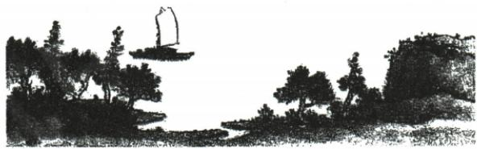

## 讲解

### 是什么

拓展型或开放型默写允许在符合要求的原诗文中选择，但对象、内容、句数和场景条件仍需满足。答案可以不唯一，所写文字必须是原句。

### 怎么来的

原浮云题给形象与表达情感或说理要求，原三答案分别作哲理、价值判断、送别表达，都合范围。选择熟句后还要解释它为何属于要求，不能一看开放就随便写任何诗。原诗题画以山水行舟为线索，客路青山外行舟绿水前同时对应景物关系，不是有船字即可。

开放主要发生在选哪句，不发生在怎么改字。字形、句序、两句配合须完整，不能把不同诗的半句拼成新诗。课内课外范围以题干为准，资料只给这三组及画题一组，全部保留而不自创新答案。若其他候选未有原资料证据，本条不冒称其为本书原详解。

### 什么时候能用

用于原浮云和诗题画题，画面不可见时不凭自动描述断意境。

## 例题

### 原例题 CN-MEM-E06

例1（2024 山东日照中考）小刚在学习古诗文时,发现古人常用“浮云”来表达情感或议论说理,如“\_\_\_\_,\_\_\_\_”。

**原答案**：原三个示例均可：不畏浮云遮望眼，自缘身在最高层；不义而富且贵，于我如浮云；浮云游子意，落日故人情。

**原解析（原文）**

拓展型默写要注意审题,抓住题干的提示,如“用‘浮云’来表达情感或议论说理”,答案符合题意即可。

答案 （示例 1）不畏浮云遮望眼 自缘身在最高层 （示例 2）不义而富且贵 于我如浮云 （示例 3）
浮云游子意 落日故人情

**完整解析（依据原解析展开）**

题限定古人用浮云表达情感或议论说理，既需出现浮云，也需符合两句要求。原三示例分别是不畏障碍的哲理、对不义富贵的态度、送别游子的情思，意义不同而均符合开放范围。只写浮云二字或改写解释都不是古诗文默写；符合开放题不意味着字形句序可以随意。实际任选一组合两句即可，三组原答案完整保留；资料未给第四组，不添自编诗句为原答案。

### 原例题 CN-MEM-E07

例2（2024江苏宿迁中考）【诗题画】根据下图画面的意境，题上合适的两句古诗。

**原答案**：客路青山外，行舟绿水前。

**原解析（原文）**

要抓住图中要素。图中有山、有树，还有一条小船正航行在水面之上。回忆与此画面对应的诗句即可。

答案 （示例）客路青山外 行舟绿水前

**完整解析（依据原解析展开）**

先看原画山树、水与行船，船在水上且青山相伴，与客路青山外、行舟绿水前所构画面相合。原题需两句古诗，写对物象关系比只找有船字更重要，不能选风暴雪景等与本画不合的熟句。次北固山下的这两句同时有山水行舟，原答案为示例不宣称唯一。墨色画不一定直接标绿色，绿水是所选诗句的对应意境，不凭图声称实测水色。原画保留，不用自动英文描述代图；没有完整图时不能继续猜意境。

## 易错

开放就编句；随便有关键字；两篇半句拼接；示例当唯一；无图凭描述猜。

资料定位（题目自带的考试标签按原书保留，未独立核实其真题身份）：

- CN-MEM-M01：151-200/full.md 第364—386行；1ad3b44f-08ed-4851-87f1-32092e466c4e_origin.pdf实际PDF第10页。
- CN-MEM-E06：151-200/full.md 第478—483行；1ad3b44f-08ed-4851-87f1-32092e466c4e_origin.pdf实际PDF第12页。
- CN-MEM-E07：151-200/full.md 第485—497行；1ad3b44f-08ed-4851-87f1-32092e466c4e_origin.pdf实际PDF第12页。
