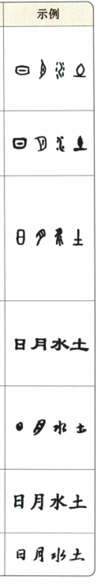

## 讲解

### 是什么

甲骨文、金文、篆书、隶书、草书、楷书、行书是本书七体比较的对象，侧重载体、构形与运笔特征。名称反映不同层面：甲骨、金文与刻铸载体关系突出，篆隶楷行草则更多指字形及书写风格，不能只背顺口次序判断图片。

### 怎么来的

原甲骨文细线、图画性较强、形态大小不一，与刻写龟甲兽骨有关；金文在青铜器上铸刻，原示例相对丰满圆转。篆书尤其小篆线条匀整、布局对称，图画意味逐渐减弱；隶书相对宽扁，横向展开并有波磔，显示由古文字向后世书写形态转变的联系。

楷书形体方正、笔画清楚，便于按字认结构；行书在清楚字形中有行笔呼应，比楷书流动而不像草书那样大量省连；草书常简省结构、强化连绵，但本书章草仍保留隶意、字字可独立，因此“所有草书都字字连在一起”并非充分判据。

看图先认横向或纵向比例，再看线条粗细、转折和收笔，最后看省笔、连笔程度，多项特征相互支持。字体发展存在并用、变体与艺术改造，不能把“甲金篆隶草行楷”的记忆口诀当唯一严格时间线，尤其不能说楷书出现后草书就消失。现代规范书写与书法作品鉴赏各有要求。

### 什么时候能用

用于原书示字对比与E06排除书体。图片须清楚且保留实际笔画；单个“整齐”“流畅”不够认书体，更不能直接认作者。艺术作品可能混合特点，应说明证据强弱。

## 例题

**原资料词形、词组或例句，非独立试题。** 本小节未配一题单独检验本概念，保留原材料并解释这一缺口。

原图自上而下：甲骨文、金文、篆书、隶书、草书、楷书、行书，所示为日月水土的相应形体。原节无七体全套独立选择题；E06的四幅原图在书法考点保留。

## 易错

口诀当严格朝代序列；所有草书都字字连；方正整齐就楷书；一行书图直接认唯一作者；手写简化当规范字缺笔。

资料定位（题目自带的考试标签按原书保留，未独立核实其真题身份）：

- CN-HAN-K06：1-50/full.md 第2076—2094行；ad46bf28-f349-4ec5-be96-627d25a69bc9_origin.pdf实际PDF第31页。
- CN-HAN-E06：1-50/full.md 第2224—2255行；ad46bf28-f349-4ec5-be96-627d25a69bc9_origin.pdf实际PDF第35页。
