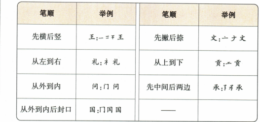

## 讲解

### 是什么

笔顺是写一个字时各笔的先后顺序。顺序须依规范和具体结构，不能由字写成后看起来一样就断言每种运笔次序都正确；笔顺规则是帮助掌握规范的概括，不取代具体字的逐笔核对。

### 怎么来的

原王用于先横后竖，文用于先撇后捺，礼从左到右，贡从上到下，问从外到内，承先中间后两边，国从外到内再封口。先看规则作用于哪一层结构：国先外框有关部分、再内部、最后封口，并不是把整个外框一次全部写完才写内部；文中的先撇后捺也不表示全字从撇开始。

原门的左上点先写，犬的右上点后写，函的下包上结构先上，匹、臣的三面包围先上内，过的左下包右上先右上。其共同作用是让部件在整体中按规范衔接；不能把一种包围结构的次序搬给方向不同的所有包围字。

原笔顺表含过程形态，OCR把未写完的中间字形识成冚、干等成字。下面保留原表图，以图中的逐步增笔为证据，不把那些识别结果拿来当新汉字或数学等式。若一图省略了中间笔次，就不能凭它擅自补称书中已经逐笔展示全部顺序；进一步查核应按规范笔顺表。

### 什么时候能用

用于本书列出的写字规则和临写。要区分规范字形、笔顺与书法运笔：草行书的艺术省连笔不直接替换规范楷书笔顺。未列具体字的次序时不只套口诀猜写。

## 例题

**原资料词形、词组或例句，非独立试题。** 本小节未配一题单独检验本概念，保留原材料并解释这一缺口。

原七规则和七字见图；原特殊例门、犬、函、匹、臣、过见来源。图中过程形态按原载体保留，非自编笔顺题。

## 易错

国外框先封口；文先撇后捺误作第一笔就是撇；转折算多笔；OCR过程形态当完整成字；廴被识作夌而照错偏旁写。

资料定位（题目自带的考试标签按原书保留，未独立核实其真题身份）：

- CN-HAN-K04：1-50/full.md 第2003—2062行；ad46bf28-f349-4ec5-be96-627d25a69bc9_origin.pdf实际PDF第30页。
