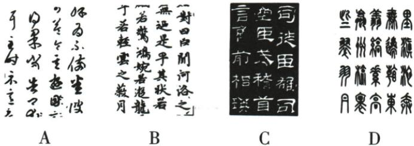

## 讲解

### 判据

题目给个人风格描述与多幅图，需把描述拆成可观察特征，再逐幅比对。书体特征可先排除，但作者和作品身份还须材料支持，不能由“好看、整齐”直接认名家。

### 流程

1.  圈题干所给精工整练、潇散闲逸、形态妩媚、韵致等要求，转为结构清楚、行笔呼应、形态舒展、整体节奏等观察方向。

2.  看各图省连笔和比例：A草化简省，C隶书横向展开，D篆形匀整对称。它们各自有证据，不用“一幅不美”这样的主观评价排除。

3.  比对B的结构与行笔特点，说明为什么与题干相符；按原解析确认赵孟頫行书《洛神赋》，不因作者兼擅楷书就把行书作品排除。

4.  对四项逐一写依据并给B。图区文字识别的错乱片段不代替实际笔画；原图必须随题保留。字体分类与文物真伪鉴定层级不同，题内判断不扩作无来源的鉴定。

## 例题

### 原例题 CN-HAN-E06

例1（2024云南中考）赵孟頫的书法有“精工整练，潇散闲逸，形态妩媚，韵致十足”的特点，下列属于其作品的一项是 （）

**OCR恢复说明**：原图逐项核对并保留；移除图像识别出的重复或错乱旁注，以原图作为字形证据，原题题干不改。

**原答案**：B。

**原解析（原文）**

由题干可知,“精工整练,潇散闲逸,形态妩媚,韵致十足”是行书的特点。A项作品结构简省,笔画勾连,不拘一格,为草书;B项作品与“精工整练,潇散闲逸,形态妩媚,韵致十足”相符,是行书,它是赵孟頫所写的《洛神赋》;C项作品用笔方圆兼备,横平竖直,古朴典雅,为隶书;D项作品结构严谨,对称平衡,线条匀称,为篆书。故选B。

答案 B

**完整解析（依据原解析展开）**

先看图中文字结构与运笔，再与题干形容相对照。A可见草化、省笔及较强勾连，属草书倾向，不能因洒脱便忽略简省程度。B兼有清楚结构与行笔呼应，形态舒展有韵致，符合题干特点，原解析认作赵孟頫《洛神赋》的行书，故正确。C横向展开和隶书波磔特征明显，原解析归隶书，不合所问作品特点。D线条匀整、对称平衡且篆书形体明显，不能把整齐直接当赵体。书体可以帮助排除，作者与作品的身份仍依原解析和来源材料，不能声称所有行书都是赵孟頫。

## 易错

只凭作者常见书体标签；全凭形容词无图形证据；有连笔全说草书；整齐全说楷书；选行书便认所有行书为赵；OCR乱字作观察依据。

资料定位（题目自带的考试标签按原书保留，未独立核实其真题身份）：

- CN-HAN-K07：1-50/full.md 第2096—2120行；ad46bf28-f349-4ec5-be96-627d25a69bc9_origin.pdf实际PDF第32、33页。
- CN-HAN-E06：1-50/full.md 第2224—2255行；ad46bf28-f349-4ec5-be96-627d25a69bc9_origin.pdf实际PDF第35页。
