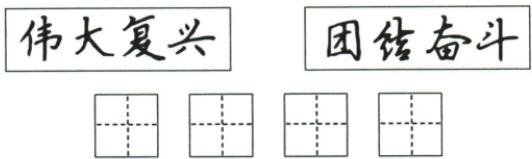

## 讲解

### 判据

要求“任选一幅临写”时，原示字不仅给内容，也给笔画和字体参照。先选定一幅再观察，不能把两幅各拿部分拼成新答案，也不能仅按自己习惯写相同文字。

### 流程

1.  确认两幅示字内容、所给四格与任选条件，选伟大复兴或团结奋斗其中一幅完整临写，四字次序照原图。

2.  看整字位置和部件关系，再看笔画长短、起收笔及行笔呼应。先在草稿上试写，可减少正式田字格中改动；不能只追求快而漏笔、把团的内件写偏。

3.  原方法建议字约占方格的2/3，这是本书对适中大小的提示，不是精确面积测量题。结合原示字安排重心、留白和间距，不把每字填满格。

4.  逐字复核字形正确、书写规范、字体特征明确，且不漏多错字。原题只有文字，没有需另占格的标点，不能套泛用方法添标点。实际手写效果需看学生作品，本条没有伪造临写图或评分结论。

## 例题

### 原例题 CN-HAN-E05

例 (2024 江苏淮安中考)从下面两幅字中任选一幅临写在田字格里。

**OCR恢复说明**：原图逐项核对并保留；移除图像识别出的重复或错乱旁注，以原图作为字形证据，原题题干不改。

**原答案**：原资料未单列文字答案；供临写的两幅文字为“伟大复兴”或“团结奋斗”，任选一幅。

**原解析（原文）**

注意临写字形正确、规范,字体特征明确。

**完整解析（依据原解析展开）**

这道题考按原书法示字临写，不是用任意熟悉字体把相同四字写完。先选择一幅，认清四个字及书体；按示字观察笔画方向、相对长短、部件位置和整体重心，再依原田字格安排大小与间距。复查不漏字、不换词、不增字，尤其团的外框与内件、奋的上下结构不可凭记忆粗略写。原详解要求字形正确、规范、字体特征明确；本条以这三项解释观察过程，不伪造手写答卷或宣布临写效果已验收。

## 易错

只抄文字忽略临写；两幅拼字；把2/3当精确面积标准；空格填满；图中没标点却追加；没有手写样本宣布书写达标。

资料定位（题目自带的考试标签按原书保留，未独立核实其真题身份）：

- CN-HAN-K09：1-50/full.md 第2218—2220行；ad46bf28-f349-4ec5-be96-627d25a69bc9_origin.pdf实际PDF第35页。
- CN-HAN-E05：1-50/full.md 第2205—2216行；ad46bf28-f349-4ec5-be96-627d25a69bc9_origin.pdf实际PDF第35页。
