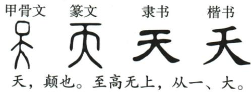

## 讲解

### 判据

给演变图与古代释义，先确定材料采用的分析层次，再解释部件如何表意或表音。答案须包含类别、部件含义、组合关系，不能只把现代字拆开就报类别。

### 流程

1.  阅读各时代字形和引文，明确原题要求依据图与“天，颠也。至高无上，从一、大”，而非只问现代楷字的笔画数。

2.  按题给口径认“大”为展开两手两脚的人形，“一”在头顶上方指示区域。说明两部分各自含义；材料没有给声旁依据，不能猜形声。

3.  把两部分合起来说明天的意义，依原题分析答会意，连同依据一起写。不能把一横只是任意装饰作为理由，也不把所有含一的字归会意。

4.  保留证据范围。香港中文大学字库从突出头部的人形解释早期字源，与本题依“从一、大”作组合分析不是同一层次；学习时标明原题口径，不把它写作全时期唯一结论。遇其他材料应重新看其证据，不能机械套本题答案。

## 例题

### 原例题 CN-HAN-E07

例2（2024 江苏连云港中考）根据小宇提供的汉字演变图片和《说文解字》的解释,请你探究“天”的造字方法并写出依据。

——《说文解字·一部》

**OCR恢复说明**：原图逐项核对并保留；移除图像识别出的重复或错乱旁注，以原图作为字形证据，原题题干不改。

**原答案**：会意。大是两手两脚分开的人形，用一横指示头顶上方区域，二者合起来表示天。

**原解析（原文）**

汉字的造字方法主要有象形、指事、会意、形声。根据《说文解字》“从一、大”，再根据“天”字篆文中两手分开的人形和其上的一横可知，“天”属于会意字。

答案 会意。大,是两手两脚分开的人形,用一横来指示人的头顶上方的区域,二者合在一起就是天。

**完整解析（依据原解析展开）**

本题明确让依据所给演变图和《说文解字》的解释探究。先认材料中的“大”为展开两手两脚的人形，再看上方一横指出头顶上方区域。两部分各有意义，组合表达天，按原题所采用的“从一、大”解释归会意。答题要写类别，再写两部件含义与合起来怎样表示天，不能只报会意或把一横说成声旁。此处保留原书的解读口径；古文字的天字来源还有大头人形等解释，不能把原材料分析推广为一切时代字形的唯一学术定论。

## 易错

只答会意没有依据；把头上横线当声旁；现代笔画拆分代替古字证据；一条原题答案覆盖所有时代；图上甲骨篆隶楷类别与六书混为一谈。

资料定位（题目自带的考试标签按原书保留，未独立核实其真题身份）：

- CN-HAN-K02：1-50/full.md 第1973—1977行；ad46bf28-f349-4ec5-be96-627d25a69bc9_origin.pdf实际PDF第29页。
- CN-HAN-E07：1-50/full.md 第2257—2272行；ad46bf28-f349-4ec5-be96-627d25a69bc9_origin.pdf实际PDF第35页。
