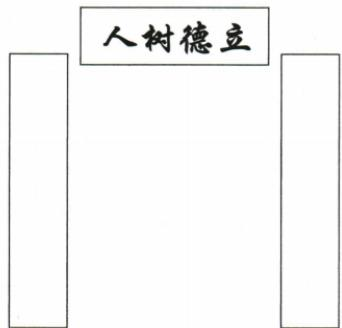

## 讲解

### 是什么

一般规范对联上联末字收仄声、下联末字收平声。按普通话新声韵，阴平阳平为平，上声去声为仄；按古声韵另有入声等分类。同一副不能把新旧声韵随意混用，以某些字凑出想要的结果。

### 怎么来的

原学校题翘楚的楚读chǔ，是上声仄；芳华的华读huá，是阳平平，据此分别定为上联和下联。先定读音、再定平仄、最后定上下，不能只看华是最后输入的那句而猜下联。某些古入声字在普通话变成一二声，处理其他古联时不能全套普通话，须先明确题采用口径。

原书称下联末字“押平声韵”，这里要分清平声收尾与押韵：前者指声调类别，后者指韵部呼应。对联一般要求上仄下平，并不要求两句押同一个韵。原“一三五不论，二四六分明”只是常见律句的简化提示，不涵盖所有句式，末字及实际节奏点不能凭奇数位就忽略。入门先稳定判断本题末字，不展开超出原题的格律创作要求。

### 什么时候能用

用于原末字可按普通话确定的联序题。对历史作品采用古音时，应查其原声韵口径；不凭现代读音判断所有旧联失律。联律允许某些从宽处理，不把口诀变成所有联语逐字机械相反的定律。

## 例题

### 原例题 CN-RHE-E03

例（2024 湖北中考）小雨和小雯为学校作了一副对联，小雨写的是“情系中华竞芳华”，小雯写的是“根植荆楚育翘楚”。请你确定上下联，参照横批把这副对联工整地抄写到相应位置(见下图)。

原图横批自右至左读作“立德树人”。

**OCR恢复说明**：实际PDF第6页核对横批方向与空位：OCR按左至右提为人树德立，竖排联图按右至左读为立德树人；保留原图，不绘造已填答案。

**原答案**：上联（右）：根植荆楚育翘楚；下联（左）：情系中华竞芳华。

**原解析（原文）**

“翘楚”的“楚”为仄声,所以“根植荆楚育翘楚”为上联;“芳华”的“华”为平声,所以“情系中华竞芳华”为下联。再结合横批“立德树人”,上联写在右边,下联写在左边,工整抄写即可。

答案 上联(右):根植荆楚育翘楚 下联(左):情系中华竞芳华

**完整解析（依据原解析展开）**

先确定末字读音。翘楚的楚读chǔ，上声为仄；芳华的华读huá，阳平为平。本题按普通话且这两字与原判定相合，用上仄下平确定根植荆楚育翘楚是上联，情系中华竞芳华是下联。再按原竖排联图右上联、左下联抄写，横批立德树人提示学校育人的共同主题，不能照输入顺序把小雨那句当上联。两联各七字，根植荆楚对应情系中华，育翘楚对应竞芳华；说明植根地方、培育人才与胸怀中华、竞展青春的联系。只判左右不足以完成工整抄写要求；无学生笔迹样本，不宣称实际书写得分。

## 易错

上平下仄；平仄当长短音；普通话一二声强判所有古字；下联平收就要求两联同韵；奇数位包括末字都不管。

资料定位（题目自带的考试标签按原书保留，未独立核实其真题身份）：

- CN-RHE-K04：101-150/full.md 第159—199行；eea7c185-7ccc-4027-b2e5-c01989eff064_origin.pdf实际PDF第5页。
- CN-RHE-E03：101-150/full.md 第234—246行；eea7c185-7ccc-4027-b2e5-c01989eff064_origin.pdf实际PDF第6页。
