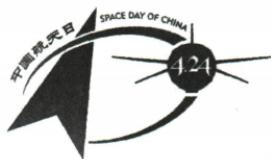

## 讲解

### 是什么

活动设计把学习主题转成参与者可完成的任务。名称点明主题和形式，形式决定怎样参与，方案还需对象、准备、过程和注意事项。

### 怎么来的

原航天讲座已给，再设计海报展与航模制作比赛，一项展示知识、一项动手实践，均服务航天主题且适合学校。若把讲座改叫报告会但内容完全一样，就没有新增两个不同活动。判断形式应看参与者实际做什么，而不只看名称是否换词。

原系列示例阅读演讲稿→撰写→比赛体现先积累后表达再展示的顺序。方案需要准备与过程让目标可执行，但只要求活动名称的题不须写长篇方案。可行性还与场所、时间、材料和安全有关，原题未给具体预算不编预算表冒充原答案；本章方案部分无独立原题，明确缺口。

### 什么时候能用

用于原航天活动与设计分类。按题目所求名称、形式或完整方案选择信息量。

## 例题

### 原例题 CN-ACT-E02

例2（2024 江苏淮安中考）中国航天日来临之际,学校举办主题为“航天梦·中国梦”的科普活动,请你完成下面的任务。

【我介绍】①阅读小贴士,向大家简要介绍“中国航天日”标识。

小贴士：

1970年4月24日，我国第一颗人造地球卫星“东方红一号”发射成功。以此为标志，我国将每年的4月24日设立为“中国航天日”。

【我设计】②请参照活动一,再设计两个活动。

活动一:开设航天科普讲座

活动二：

活动三：

【我邀请】③请写一段话,邀请校科技社王老师下周二下午两点在学校报告厅为大家开设航天科普讲座。

**原答案**：①中英文、4.24、箭头和卫星及航天精神；②海报展、航模制作比赛；③王老师您好，邀请下周二下午两点在学校报告厅讲座。

**原解析（原文）**

①本题考查图文转换。需将标识的数字、图案和小贴士中的文字结合起来,然后分析各组成元素的含义,意对即可。②本题考查设计活动形式。由活动一可知,设计的活动要紧扣“航天梦·中国梦”主题,符合学生生活实际。③本题考查口语交际中的邀请语。邀请语要能够交代清楚邀请活动的要点,可以参考“称谓+问候语+邀请活动要点+期待对方参与”的形式,注意礼貌得体。

答案 ①(示例)标识上方是“中国航天日”中英文,右边“4.24”既指“东方红一号”发射的日期,又是中国航天日日期。标识左侧箭头代表中国航天冲天而飞,右侧卫星代表我国发射的第一颗人造地球卫星“东方红一号”。这一标识旨在弘扬航天精神,激发探索创新热情,唱响“探索浩瀚宇宙、发展航天事业、建设航天强国”的主旋律。 ②(示例1)举行航天梦海报展 （示例2)举办航模制作比赛 ③(示例)王老师您好!诚挚地邀请您下周二下午两点在学校报告厅为大家开设航天科普讲座,非常感谢!

**完整解析（依据原解析展开）**

①按从文字到数字再图形的顺序介绍。中英文明确标识主题；4.24与小贴士相连，是1970发射日期的月日和每年纪念日；箭头表示飞向太空，卫星联系东方红一号。最后解释探索创新、弘扬航天精神，必须由图形及背景支持，不能只说外形好看。②任务是另设计两个活动，主题相同而形式与既有讲座不同；原海报展偏展示、航模制作比赛偏实践，均能由学校组织，不是把同一讲座更名两遍。③对科技社王老师用称谓礼貌问候，明确邀请目的、下周二下午两点、学校报告厅、为大家开设航天科普讲座，保留所有给定要素；不能只写欢迎参加而隐去讲座职责，或替老师承诺一定出席。原示例未给精确日历日期或其他姓名，本题不自加这些信息。

## 易错

只改名称不改形式；偏离主题；活动超学校能力；名称题写长方案；虚构预算。

资料定位（题目自带的考试标签按原书保留，未独立核实其真题身份）：

- CN-ACT-A06：151-200/full.md 第246—264行；1ad3b44f-08ed-4851-87f1-32092e466c4e_origin.pdf实际PDF第7页。
- CN-ACT-E02：151-200/full.md 第318—348行；1ad3b44f-08ed-4851-87f1-32092e466c4e_origin.pdf实际PDF第9页。
