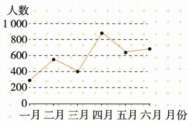
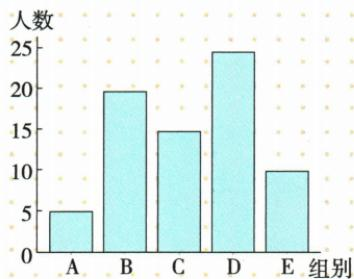
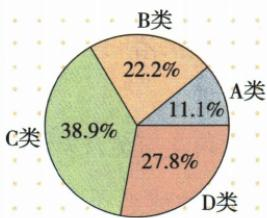
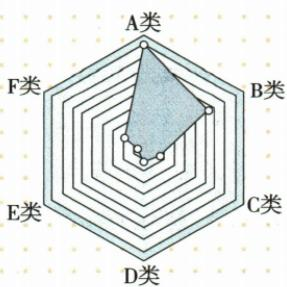

## 讲解

### 是什么

统计图表把同一范围内的数据按对象、时间或类别呈现。阅读须先确定标题、坐标、单位、图例与范围，再比较大小、变化或构成。

### 怎么来的

原表按销售部和产品交叉，横看同一部门各产品，纵看同一产品各部门，改变比较方向就改变问题。折线图按月份连点，可说先升后降再升，不能因为末点高于首点就说每月都增长。原条形A至E条高约5、20、15、25、10，比较D最高、A最低有图据；没有样本原因不能断定为什么某组人数多。

原扇形11.1、22.2、38.9、27.8百分比合100，体现整体构成，比例高不自动说明绝对总人数大。雷达图有六轴却没清楚刻度数字，本图只作类型示意，不猜精确数值。折线一月点约300，自动表250不采，读数需标近似。图表变化能支持相关判断，不能仅凭同时变化断因果。

### 什么时候能用

用于原图表类型示例。图像刻度模糊时保留原图并注明近似；若题问精确数值，资料不够须登记，不凭OCR补。

### 非连续性文本的同概念补充

非连续图文转换不能把数字一律改大部分少数而丢精度：题要数量应保数值单位，概括趋势才视要求概括。原年份2004等与三个量值未配完整材料或图表，读数有单位但所指对象缺，不能自连航天事件或推科学精神唯一答案。原画作放大白圈图缺失，未复原作原图。

## 例题

**原资料中的说明或示例，非独立试题。** 本小节未配一题单独检验本概念，保留原材料并解释这一缺口。

原折线图：一月约300，三月400，四月约900；4月至5月下降，5月至6月上升。原条形D最高A最低；原扇形C38.9%最大A11.1%最小。

**本章原方法与设问摘录（缺完整题及原答案）**

中考设问方式

1.(2024 四川广元中考)材料一中,有句话能直接表述图表 1 中有关我国的数据信息。请你参照这个方法,将图表 2 中有关中国的数据信息转换成文字表述。(简答题,考查图文信息转换)

2.(2024 山东德州中考)概括材料二图表中的主要信息。(简答题,考查图文信息转换)

3.(2024 江苏连云港中考)阅读材料二,写出你的探究发现。(简答题,考查图文信息转换)

(1) 时间: 2004 2007 2010 2013 2018 2020 2024

你的发现：

(2) 数字: 38 万千米、26 天、1731 克

你的发现：

(3)由此探究出的科学精神：\_\_\_\_

4.(2024 江苏镇江中考)请介绍《清明上河图》中放大处(图中白色圆圈所示)画面内容并点评其妙处。(简答题,考查图文信息转换)

方法总结

答非连续性文本图文信息转换题的方法；审题明旨；仔细审读题干,明确要提取的信息内容。

答非连续性文本图文信息转换题的方法；理解图表；观察图表要素,如图表名称、构图要素及特征、具体数据等。

答非连续性文本图文信息转换题的方法；整理作答；概括表述。注意有数字时需把数字转化为对应语言,如三分之一、大部分或少数等。

## 易错

末大就每期增；比较方向乱；百分比当绝对人数；相关当因果；模糊图给精确数；雷达无刻度硬读。

资料定位（题目自带的考试标签按原书保留，未独立核实其真题身份）：

- CN-ACT-A04：151-200/full.md 第161—240行；1ad3b44f-08ed-4851-87f1-32092e466c4e_origin.pdf实际PDF第5、6页。

资料定位（题目自带的考试标签按原书保留，未独立核实其真题身份）：

- CN-NON-M03：301-350/full.md 第1971—1993行；45925771-c421-4d57-ae85-8f75724b0ef9_origin.pdf实际PDF第43页。
