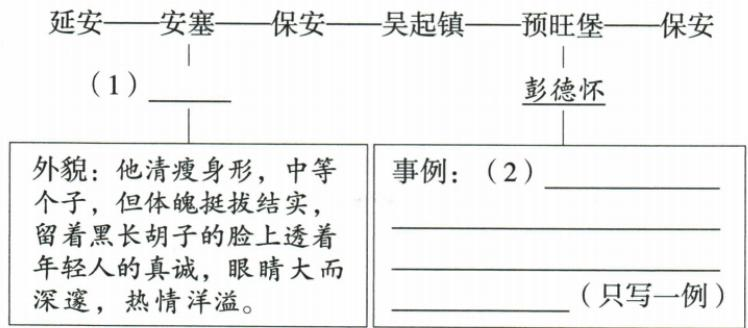

## 讲解

### 是什么

埃德加·斯诺《红星照耀中国》是纪实性很强的报告文学，含采访中国共产党与红军领导人、长征、政策策略和作者感受等。人物描写、第一手见闻与分析评价结合，作品有文学表达而不等小说虚构。

### 怎么来的

人物识别须用多种线索相互核：原周恩来清瘦、中等身材、黑胡子大眼，兼有规划采访的细心热情；彭德怀背心降落伞、分粮、让马给疲累者支持关心人民与革命意志。外貌不必独占，事件关系能进一步锁人，不把红军领导人的善良勇敢故事互移。

毛泽东简朴勤奋、朱德让马助农、贺龙敢当又愿受批评、徐海东窑工经历和伤战、红小鬼尽责等均在原表有动作依据。红小鬼为群体泛称，不能要求填一个固定人名。原清单还含1937等历史补充，不能将全部年表都声称斯诺1936现场亲历；长征1935陕北与1936会宁会师也不同层次。文字称疯人土匪要辨转述视角与后文评价，不断章作作者定性。

### 什么时候能用

用于本章该作品的体裁、结构、主题与所列事例。概述不能代替整部原著阅读；没有给出的段落、版本细节和人物故事不自补为来源证据。

## 例题

### 原例题 CN-BOOK-E01

例1 (2024 江苏淮安中考)下列对相关名著的表述正确的一项是 ( )

A.《西游记》中唐僧师徒西天取经，路遇火焰山受阻，孙悟空向观音菩萨借芭蕉扇。  
B.《经典常谈》是朱自清为中学生撰写的一部介绍古今中外文化经典的著作。  
C.《红星照耀中国》展示了中国共产党为民族解放而艰苦奋斗和牺牲奉献的崇高精神。  
D.《朝花夕拾》是鲁迅创作的小说集,既有温情与童趣,也有对人情世故的洞察。

**原答案**：C。

**原解析（原文）**

本题以选择题形式考查多部名著的主要内容、重要情节等,要求学生对名著中的主要人物、主要情节等要十分熟悉,做题时仔细辨析,不要张冠李戴。A. 孙悟空是向铁扇公主借芭蕉扇,不是观音菩萨; B.《经典常谈》是朱自清先生为中学生撰写的一部介绍我国传统文化经典的著作;D.《朝花夕拾》是鲁迅先生创作的回忆性散文集。

答案 C

**完整解析（依据原解析展开）**

A借扇对象错，三调芭蕉扇求借铁扇公主而非观音，须核人物与动作关系，不以西游中常求观音帮助混配。B经典常谈范围是我国传统文化经典，不是古今中外一概，朱自清和中学生两格合仍有范围错。C红星报告所述精神与作品概述一致，合。D朝花夕拾回忆性散文集，不是小说集，温情童趣概述合不能抵消体裁错。故C；四项各圈实体、关系、范围或体裁再核。

### 原例题 CN-BOOK-E02

例2（2024陕西中考）拍摄小组准备再现《红星照耀中国》中的两个采访场景，请补全资料。

**OCR恢复说明**：原mermaid人物与箭头错配，删除自动图代码并保留原题实际图片；未改题目条件。

**原答案**：（1）周恩来；（2）原两例均可，带饥荒农民取地主存粮分给穷人，或革命工作被出卖受拷打不屈。

**原解析（原文）**

(1)根据“清瘦身形”“中等个子”“体魄挺拔结实”“黑长胡子”“眼睛大而深邃”等特征可知,该人物为周恩来。(2)在斯诺眼中,彭德怀具有坚定的革命意志和强烈的正义感,对人民和士兵充满关爱。结合积累,写出关于彭德怀的一个事例即可。

答案 (1)周恩来 (2)(示例1)他领着处在饥荒中的农民攻入地主家,把地主的存粮都运走了,分给穷人。(示例2)他早年从事革命工作时被出卖,遭受严刑拷打,毫不屈服。

**完整解析（依据原解析展开）**

（1）题给外貌清瘦中等身材、黑长胡子、眼大深邃与红星书中周恩来特征相合，不能因另格已写彭德怀就给整个卡只填同一人。完整采访路线与场景信息按原图复核。周恩来还为斯诺规划行程，两类线索互证。（2）按只写一例任务，原第一例是带领饥荒农民取地主粮分给穷人，可说明关心贫苦人民和反抗压迫；第二例革命工作遭出卖、严刑不屈，可说明革命意志坚定。人物、动作、对象、结果须说具体，不能只写勇敢。下面两例都来自原答案，实际作答任选一例即可。

### 原例题 CN-BOOK-E05

例（2024 山东烟台中考）人们向来崇敬救急于困顿、救命于危难的英雄。学校开展以“救”为话题的名著阅读交流活动，小语制作了阅读卡，请帮他完善。

<table><tr><td>话题</td><td>篇目</td><td>摘录</td><td>梳理</td></tr><tr><td rowspan="3">救</td><td>《西游记》</td><td>【摘录一】八戒道:“实不瞒哥哥说,自你回后,我与沙僧保师父前行。只见一座黑松林,师父下马,教我化斋......他独步林间玩景,出得林,见一座黄金宝塔放光,他只当寺院,不期塔下有个妖精,被他拿住......”行者道:“贤弟,你起来。不是我去不成,既是妖精骂我,我就不能不降他,我和你去。”</td><td>(1)这一情节说的是唐僧被____(名称)抓去,八戒去花果山请行者营救师父。</td></tr><tr><td>《水浒传》</td><td>【摘录二】他道:“郑屠的钱,洒家自还他。你放这老儿还乡去。”那店小二那里肯放。他大怒,又开五指,去那小二脸上只一掌......且说他寻思,恐怕店小二赶去拦截金公,且向店里掇条凳子,坐了两个时辰。约莫金公去的远了,方才起身,径投状元桥来。</td><td>(2)这段文字写的是__________的情节。</td></tr><tr><td>《红星照耀中国》</td><td>【摘录三】这件衣服使他孩子气地高兴骄傲着,这是一件背心,是用在长征中射下来的敌人飞机上所得到的一把降落伞所做的......他也许是一个疯人和一个土匪,至少他是一个反叛者。可是,我很清楚地感觉到,这个反叛者,是具有很伟大的一副心肠的!</td><td>(3)文段中的“他”是________(人名)。根据对原著的阅读感悟,段中加点的“伟大的一副心肠”是指_________。这何尝不是一种“救”!</td></tr><tr><td colspan="2">思考探究</td><td colspan="2">(4)摘录材料都与“救”有关,但“救”中所体现出的思想情感是不同的。【摘录一】中的“救”是出于师徒情谊,是本分;【摘录二】中的“救”是出于________;【摘录三】中的“救”是出于________。</td></tr></table>

**原答案**：（1）黄袍怪；（2）鲁提辖（鲁达）救金氏父女；（3）彭德怀，爱党爱民、忠诚革命事业；（4）扶危济困是义气，救国救民是信仰。

**原解析（原文）**

(1)根据【摘录一】中“一座黄金宝塔放光,他只当寺院”“既是妖精骂我,我就不能不降他”可以确定此语段反映的是《西游记》中“猪八戒义激猴王”的相关情节,唐僧遇到的妖精是黄袍怪。(2)根据【摘录二】中的关键词“郑屠”“金公”“状元桥”可以判断此语段反映的是《水浒传》中“鲁提辖救金氏父女,拳打镇关西郑屠”的相关情节。(3)根据【摘录三】中关键句“这是一件背心……所做的”可以判断文段中的“他”是彭德怀。根据【摘录三】中关键词“疯人”“土匪”“反叛者”和“伟大的一副心肠”,结合《红星照耀中国》中相关章节可知,彭德怀的“反叛”是为了带领人民过上好日子,为共产主义事业努力奋斗。(4)要注意两点:一是注意句式应和前句“‘救’是出于师徒情谊,是本分”一致;二是注意结合名著相关情节分析人物行动背后蕴含的思想情感。

答案 (1) 黄袍怪 (2) 鲁提辖(鲁达)救金氏父女 (3) 彭德怀 爱党爱民、忠诚于中国革命事业的坚定意志 (4) 扶危济困(或疾恶如仇), 是义气 救国救民(或为国为民), 是信仰

**完整解析（依据原解析展开）**

（1）黄金宝塔、八戒去花果山义激猴王的关系锁定黄袍怪，不是看见唐僧被抓就任选其他妖。（2）郑屠、金公、状元桥与鲁提辖救金氏父女对应；掌打阻拦店小二、坐等两时辰保护父女走远，既见疾恶如仇也见粗中有细。（3）降落伞制背心线索指彭德怀，伟大心肠结合原书关心人民和革命意志解释；疯人土匪反叛者是需辨的外界视角，不等于作者最终全盘谴责。（4）比较同一救下的动机层：师徒情谊与本分；鲁达对陌生弱者扶危济困、疾恶如仇为义气；彭德怀救国救民是信仰。按出于什么、是什么的并列结构填写，不把三格都改成无证据的勇敢。完整原摘录和全部小问一起保留。

原七组人物/群体和长征表完整见[篇目人物情节查阅](名著篇目人物与情节查阅.csv)。原采访与主题救题均按完整材料解析。

## 易错

报告文学当小说；外貌一词唯一锁人；各领导人故事互移；红小鬼唯一姓名；历史补充全采访亲历；断章土匪标签。

资料定位（题目自带的考试标签按原书保留，未独立核实其真题身份）：

- CN-BOOK-B05：101-150/full.md 第1393—1455行；eea7c185-7ccc-4027-b2e5-c01989eff064_origin.pdf实际PDF第31、32、33、34页。
- CN-BOOK-E01：151-200/full.md 第17—26行；1ad3b44f-08ed-4851-87f1-32092e466c4e_origin.pdf实际PDF第1页。
- CN-BOOK-E02：151-200/full.md 第28—45行；1ad3b44f-08ed-4851-87f1-32092e466c4e_origin.pdf实际PDF第1页。
- CN-BOOK-E05：151-200/full.md 第97—103行；1ad3b44f-08ed-4851-87f1-32092e466c4e_origin.pdf实际PDF第3页。
