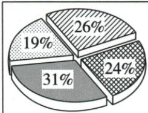

## 错法

31%比26/24/19高便称大多数学生都爱讲故事，并让自己最喜欢的配音改为讲故事，混相对最多、过半与个人立场。数字看起来支持最受欢迎，却没有支持超过一半或本人必同群体。

## 正解

逐项图例31/26/24/19合100，31只相对最大，过半需大于50而本图不满足。原最多Story、最少drama，并由Personally独立写配音最喜欢，两立场都合题。原班级调查不能扩成全部学校和全国学生；没有人数不能自报具体选择人数。

## 例题

### 原例题 EN-WRITE-E06

# 例（2024 山东济宁中考）

你校英文报编辑想了解最受学生欢迎的英语社团活动。假如你是英语课代表李华,请结合下图你班的调查结果,给编辑写一篇报告。内容须包括:

1. 调查结果的描述及简单评价；  
2.你本人最喜欢的社团活动(从调查结果中任选其一)及理由陈述。

**原图图例对应（已核实际第21页）**：Story telling 31%；English drama 19%；English songs 26%；Fun dubbing 24%。原图把Story印作Stroy，教学说明用正确拼写，图像保留原样。

# 最受学生欢迎的英语社团活动

注意：

1.文中不得出现任何透露考生真实身份的信息；  
2.100 词左右(开头已给出,不计入总词数)。

参考词汇：

take part in, raise one's interest (in), be helpful to, improve one's English, learn more about different cultures

Dear editor,

Yesterday we did a survey in our class about the most popular activities by the school English club. Here are the results.

Li Hua

**OCR恢复说明**：原页与图块核验：必要提示图保留原尺寸无损压缩；OCR生成的错误Mermaid或无图例意义的方位表删除，原提取在归档保留。

**原答案**：原资料分段范文，完整见原写作指导；不是唯一答案。

**原解析（原文）**

<table><tr><td colspan="2">Step 1 认真审题,明确要求</td></tr><tr><td colspan="2">主题:最受学生欢迎的英语社团活动文体:应用文人称:以第一、三人称为主时态:以一般现在时为主要点:1.描述调查结果并简单评价;2.介绍你本人最喜欢的社团活动,并陈述理由。</td></tr><tr><td>Step 2 分析要点,编制提纲</td><td>Step 3 巧用词句,衔接成文</td></tr><tr><td>开头:直入主题,交代调查的内容</td><td>Dear editor, Yesterday we did a survey in our class about the most popular activities by the school English club. Here are the results.</td></tr><tr><td>正文:描述调查结果Story telling is the most popular activity:31% English songs come next:26%Fun dubbing is also quite popular:24%English drama is the least popular:19%</td><td>According to the survey, “Story telling” is the most popular activity, with 31% of the students choosing it (with 的复合结构). “English songs” comes next, preferred by 26% of the students (过去分词短语). “Fun dubbing” is also quite popular, attracting 24% of the students (动词-ing 短语). “English drama”, however, is the least popular, with only 19% of the students showing interest (with 的复合结构).</td></tr><tr><td>结尾:介绍你本人最喜欢的社团活动,并陈述理由最喜欢的社团活动:Fun dubbing理由:interesting; improve my English pronunciation and intonation; learn more about different cultures; raise my interest in English and make learning more enjoyable</td><td>Personally, I enjoy Fun dubbing the most. It is not only interesting, but also helps to improve my English pronunciation and intonation. Moreover (衔接词引出补充内容), it allows me to learn more about different cultures through various movie clips. This activity raises my interest in English and makes learning more enjoyable.Li Hua</td></tr></table>

**完整解析（依据原解析展开）**

先看图例纹理再配百分比：Story telling31、English songs26、Fun dubbing24、English drama19，合100。最大31只是在这四项里相对最多，没有过半；不能写most students多数学生都选讲故事，也不能凭19最少推无人喜欢。原先did survey说明昨日调查，is most popular报告结果，时间职责不同。

第一要求描结果和简单评价，原四项均写，most/next/also/least排序正确；第二要求本人从四项任选最爱及原因，原Fun dubbing并配pronunciation/intonation、culture、interest理由。最爱24的项目并不违背班里31最大，个人喜好不必等群体第一。不能将全班调查外推全校或全国，缺样本总人数不能算具体人数。

原with31%...choosing等补充描述比例，不是主句第二谓语；preferred被学生偏好，attracting为活动吸引学生，原分词解释不使学生一定必须使用这种压缩写法。新增102词与100左右相近。原图Stroy印字错，应Story，保图原样并在转写标明，不改31数值。图表主体与评价有依据，个人理由按原范文，不伪装为图表证明的事实。

资料定位（题目自带的考试标签按原书保留，未独立核实其真题身份）：

- EN-WRITE-E06：351-377/full.md 第818—860行；c4413d3a-76e4-4669-bc73-e940488b52e5_origin.pdf实际PDF第21、22页。
