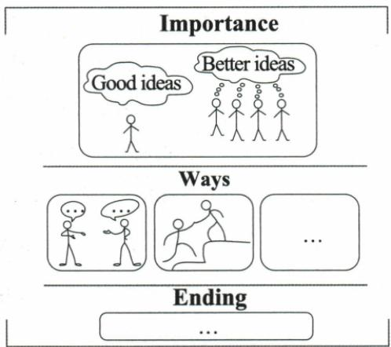

## 讲解

### 是什么

句式多样用不同结构表达需要的信息关系，而非让每段都含从句和倒装。句子要先有明确谓语与对象，复杂结构的每一分句或修饰都应对应任务中的意义。

### 怎么来的

原范文建议用advise+人+to动作；目的用so that+主语谓语或同主体to动作；计划用will/plan/going to；对比用过去与现在两时间；期待look forward to后名词或-ing。不同功能决定结构，不是把所有原清单开头抄进任何文章。

经历稿已发生visited/learned用过去，仍认可的意义deepens用现在。苏轼历史led/left过去，现有影响have left或is regarded有当前参照，个人will learn未来愿望。因此“介绍人物通常一般现在”是常见现状说明，不能覆盖历史贡献。图表昨日did survey与现读is most popular也可同篇共存。

which/where修饰具体事件或地方；Only in this way can...为强调条件的倒装，基本句型已有知识，不能再创造另一重复概念。原it is high time that we took...表达现在该行动的语气，took不是记过去已采取；在初中首次接触可作原资料拓展，普通正确句同样能完成倡议，不强制掌握此结构才会写作。

### 什么时候能用

只在关系和时点清晰的现有稿上选择已经会用的结构。书中未为每个句式配题，只用七篇实际范文检查出现的结构，其余仍是原资料表达候选。不能用复杂句掩盖漏要点和超字数。

## 例题

### 原例题 EN-WRITE-E02

# 例（2024 福建中考）

假设你是李华,学校上周五开展了为期一天的实践活动。你的笔友 Henry 对这次活动很感兴趣。请你结合以下提示,用英语给他写一封信,谈谈活动过程及你的感想。词数 80 左右。

注意事项：

1. 必须包含所有提示信息, 可适当发挥, 开头已给出, 不计入总词数;  
2. 意思清楚, 表达通顺, 行文连贯, 书写规范;  
3.请勿在文中使用真实的姓名、校名和地名。

Dear Henry,

I'm glad that you're interested in our school study tour last Friday.

Yours,

Li Hua

**OCR恢复说明**：原页与图块核验：必要提示图保留原尺寸无损压缩；OCR生成的错误Mermaid或无图例意义的方位表删除，原提取在归档保留。

**原答案**：原资料分段范文，完整见原写作指导；不是唯一答案。

**原解析（原文）**

<table><tr><td colspan="2">Step 1 认真审题,明确要求</td></tr><tr><td colspan="2">主题:向笔友介绍实践活动 文体:应用文(书信)人称:以第一人称为主 时态:以一般过去时为主要点:1.介绍实践活动的过程;2.抒发自己的感想。</td></tr><tr><td>Step 2 分析要点,编制提纲</td><td>Step 3 巧用词句,衔接成文</td></tr><tr><td>开头:引出主题,说明写信的目的</td><td>Dear Henry,I&#x27;m glad that you&#x27;re interested in our school study tour last Friday.Let me tell you something about it.</td></tr><tr><td>正文:第一部分具体介绍上周五实践活动的过程;第二部分抒发自己的感想过程:1.in the morning, visit the History Museum2.after lunch, go to the Folk Culture Center感想:deepen our love for our country, enrich our understanding of traditional Chinese art</td><td>In the morning, we visited the History Museum. We learned about the history of the Long March. Then we listened to the stories of the Red Army, which greatly touched us (定语从句). After lunch, we went to the Folk Culture Center, where we enjoyed paper cutting art (定语从句). We also watched local opera performances that are wonderful (定语从句).The tour not only deepens our love for our country but also enriches our understanding of traditional Chinese art!</td></tr><tr><td>结尾:表达祝愿</td><td>Best wishes! Yours, Li Hua</td></tr></table>

**完整解析（依据原解析展开）**

信给Henry，写上周五已发生实践活动与感想。原图先History Museum，学Long March、听Red Army stories，再Folk Culture Center享paper cutting，省略号允许相关发挥，不是删掉必需三活动。原范文上午visited/learned/listened，午后went/enjoyed/watched，按事件过去；The tour deepens/enriches写现在仍认可的作用，与过去活动区分，不能看到全篇过去就一律把感受也改过去。

原图只明确参观顺序，不直接给上午、午后、当地戏曲，范文这些是资料本身许可发挥后的具体化。不要在讲解中声称这些细节都印在图上。定语从句which greatly touched us接听故事所带来的触动，where说明文化中心活动；wonderful现在评价演出性质可成立，不能绝对说watched后that are皆错。

逐要求核三活动、过程、感想、书信和无真实信息齐全，原新增正文83词与80左右接近。原OCR Mermaid把两个场馆画循环，原图箭头只由museum到center，删除错误重画文字并保原图。范文学习重点是以时间和事件衔接，不强制学生用非限制性定语从句。

### 原例题 EN-WRITE-E05

# 例（2024 江苏徐州中考）

假定你是徐州的一名九年级学生李华。你校英文报正组织题为“A famous person in the history of Xuzhou”的征文活动,你选择的人物是苏轼(1077—1079年间任徐州知州)。请结合以下要点写一篇英语短文,参加征文活动。

  
苏轼

他带领人民抗洪水，修苏堤，建黄楼，寻煤炭，在徐期间著有大量诗词。

当他离开徐州时，百姓依依不舍。

以上内容给你的启示……

注意：

1. 征文需包括以上三个要点；  
2.词数90左右；  
3.征文中不得泄露个人信息。

提示词:苏堤 Su Causeway;黄楼 Huanglou Pavilion

**OCR恢复说明**：原页与图块核验：必要提示图保留原尺寸无损压缩；OCR生成的错误Mermaid或无图例意义的方位表删除，原提取在归档保留。

**原答案**：原资料分段范文，完整见原写作指导；不是唯一答案。

**原解析（原文）**

<table><tr><td colspan="2">Step 1 认真审题,明确要求</td></tr><tr><td colspan="2">主题:介绍人物(苏轼)文体:记叙文人称:以第三人称为主时态:以一般过去时为主要点:1.介绍苏轼的身份和历史地位;2.阐述苏轼在徐州的具体贡献;3.苏轼的贡献对自己的启示。</td></tr><tr><td>Step 2 分析要点,编制提纲</td><td>Step 3 巧用词句,衔接成文</td></tr><tr><td>开头:介绍苏轼的身份和历史地位身份:Su Dongpo;a famous poet, writer, and politician历史地位:one of the greatest poets; leave a lasting influence on Xuzhou</td><td>A famous person in the history of XuzhouSu Shi, also known as Su Dongpo, was a famous poet, writer, and politician in ancient China. He is widely regarded as one of the greatest poets in Chinese history. Su Shi&#x27;s contributions to Xuzhou, in particular, have left a lasting influence on the city.</td></tr><tr><td>正文:阐述苏轼在徐州的具体贡献1.finish the construction of the Su Causeway and the Huanglou Pavilion2.discover coal3.create many poems</td><td>He led people to finish the construction of the Su Causeway and the Huanglou Pavilion, which showed his wisdom and kindness (定语从句). Su Shi also discovered coal in the area. Besides, Su Shi was a productive poet. During the years he lived in Xuzhou (定语从句), he created many poems. When Su Shi eventually left Xuzhou (时间状语从句), the people there were very sad.</td></tr><tr><td>结尾:苏轼的贡献对自己的启示</td><td>Su Shi is a good example for me and I will learn from him. His behaviour reminds me to be a kind and creative man, and his contributions to the city will never be forgotten.</td></tr></table>

**完整解析（依据原解析展开）**

原题给苏轼在徐州的贡献、离开时百姓不舍、自己的启示，身份为1077—1079任徐州知州。贡献逐项有抗洪、苏堤、黄楼、煤炭、诗词。原范文先诗人作家政治家及地位，再写建设两处、发现煤与创作诗，后sad和kind/creative启示；但是未明确写抗洪，且未明写题给任职年段，不能以长文和多个从句替代要点清单。

原created/led/discovered/left讲历史事件用过去，is regarded/have left表达现在评价和影响，I will learn个人愿望；介绍人物方法清单的一般现在只指常见现状，不覆盖历史事迹。原which showed...修建设所体现的特点；During the years he lived...限定在徐时期，不使无限年代混淆。

扣标题后原正文139词，明显长于90左右，并有抗洪缺点。两问题保留并指出，未把缺点偷偷补进原范文，也未编新增英文范答。学生正式写作应优先保题给贡献与启示，再压缩空泛身份评价；不能将原范文当覆盖完整的唯一标准。历史仅依题内材料处理，未据此认证历史细节或真题来源。

### 原例题 EN-WRITE-E07

例（原页标为2024四川成都中考；身份未独立认证）

你校英语报就“团队合作”这一话题征稿。请根据以下图示，以“Be a Good Team Member”为题投稿。

Be a Good Team Member   

注意：

1.词数80左右；  
2.文中不能出现真实姓名及学校名称。

**OCR恢复说明**：原页与图块核验：必要提示图保留原尺寸无损压缩；OCR生成的错误Mermaid或无图例意义的方位表删除，原提取在归档保留。实际第23页原例标签恢复，原图Importance分区、交谈与助人动作均核验，OCR只留Ways和Ending不能取代全图。

**原答案**：原资料分段范文，完整见原写作指导；不是唯一答案。

**原解析（原文）**

<table><tr><td colspan="2">Step 1 认真审题,明确要求</td></tr><tr><td colspan="2">主题:团队合作 文体:议论文人称:以第二、三人称为主 时态:以一般现在时为主要点:1.点明团队合作的重要性;2.介绍成为一名好的团队成员的方法;3.再次点明主题,表达自己的感受。</td></tr><tr><td>Step 2 分析要点,编制提纲</td><td>Step 3 巧用词句,衔接成文</td></tr><tr><td>开头:结合图片内容,点明团队合作的重要性,引出主题——如何成为一名好的团队成员</td><td>Be a Good Team MemberTeamwork has a great influence on students.What if you meet a problem? Maybe you have a solution,but if you talk with your teammates(条件状语从句),you will have better ideas.How can you be a good team member? I&#x27;ll share some of my ideas with you.</td></tr><tr><td>正文:介绍成为一名好的团队成员的方法1.talk with your team actively and in a friendly way2.give them a hand3.ask the teacher for help</td><td>First,you should talk with your team actively and in a friendly way.You can broaden your thinking and inspire more ideas by communicating with others.Besides,it is rude to talk loudly with others. Everyone in the team should follow the team rules and respect each other.Second,when your teammates are in trouble(时间状语从句),you should give them a hand.Third,when you disagree with each other about a problem(时间状语从句),you can ask the teacher for help.</td></tr><tr><td>结尾:总结前文,再次点明主题,表达自己的感受</td><td>In my opinion,as a team member,everyone should be kind, helpful and nice to others.Only in this way can our team get better and better.(倒装句)</td></tr></table>

**完整解析（依据原解析展开）**

题定团队合作，图分Importance、Ways、Ending。首区一个人Good ideas与团队Better ideas表协作改善想法，第二区交谈及拉起/帮助他人两画给方法，省略号允许再列合主题的方法，结尾回主旨。原范文提出合作重要，再友善交流、尊重规则、帮困难队员、分歧求老师帮助，最后善意互助与团队进步，与原图对应。

原when teammates in trouble是情况出现时帮助，不可只陈述大家应该好而不说明怎么做；because型理由不是每条必须同词，原by communicating说明方法，broaden/inspire说明作用。Only in this way置首的can our team为倒装，概念见基本句型；不强迫未学会的学生靠倒装成篇。

按扣标题口径原正文151词，约为题定80的近两倍。它提供丰富组织素材，但不能称字数合格范本。正式稿需先保重要性、图示两方法与收尾，再缩次要论述；本加工不虚构另篇“原范文”。原OCR只给Ways/Ending几个框，缺首区和动作，已核图恢复，不单凭自动Mermaid猜寓意。原真题标签由实际第23页补回但未认证。

## 易错

题型常见时态不强迫每一谓语相同；非谓语不是独立主句。原句套式中未完成槽位不能直接誊写成答案。

资料定位（题目自带的考试标签按原书保留，未独立核实其真题身份）：

- EN-WRITE-K03：351-377/full.md 第540—542行；c4413d3a-76e4-4669-bc73-e940488b52e5_origin.pdf实际PDF第9页。
- EN-WRITE-E02：351-377/full.md 第667—700行；c4413d3a-76e4-4669-bc73-e940488b52e5_origin.pdf实际PDF第15页。
- EN-WRITE-E05：351-377/full.md 第785—808行；c4413d3a-76e4-4669-bc73-e940488b52e5_origin.pdf实际PDF第19、20页。
- EN-WRITE-E07：351-377/full.md 第870—893行；c4413d3a-76e4-4669-bc73-e940488b52e5_origin.pdf实际PDF第23页。
