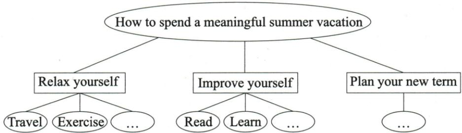

## 讲解

### 是什么

词汇变化是在语境里选更确切或避免机械重复的表达，必须保原意、对象、强度和句法结构。所谓高级词清单通常是候选素材，不是可以逐词互换的等式。

### 怎么来的

原表development后给progress与become better：前两者名词，后者动词结构，不能放同一名词槽。can说明主体能做，enable/allow通常让另一人获得能力或许可，需重建主语、受事和to动作，逐词替换会改变谁做什么。grow可主体自身增长，raise通常有人提升某物，不只长短不同。

many/much后a number of只修复数可数名词，much量类需选能修不可数的短语；various强调不同种类，不保证数量“大量”。like、be fond of、fall in love with、be crazy about的程度或变化过程不同，不为避免重复把轻微喜欢改成狂热或开始爱上。harmful指出造成伤害，不能把bad任何负面评价都升级为有害。原outstanding是优秀杰出，不是外向；与词汇辨析卡保持一致。

and可并列成分，as well as/together with附加不必使谓语同复数；because从句与as a result of名词性原因的替换要同步改结构。be prepared for偏准备好的状态，prepare for偏做准备；in need of是结构片段，不能直接替换完整有限定谓语need。

### 什么时候能用

仅在已有底稿意义、主干和时间正确后优化，用自己能正确再写的候选。完整原候选及逐组核查见本目录教学CSV；没有原题检验每一组，不声称全部同义与完全可换。

## 例题

### 原例题 EN-WRITE-E03

例 (2024 黑龙江齐齐哈尔中考)

时光飞逝,难忘的初中生活即将结束,你们将迎来一个轻松、愉快的假期。如何能让你的假期更加丰富多彩?请根据下面的思维导图,以“How to spend a meaningful summer vacation”为题目写一篇短文,合理规划一下你的假期生活。

要求:1.字迹工整,段落清晰,表达清楚,语法正确,行文连贯;  
2.要点必须包含所有相关信息,并适当发挥;  
3.首段已给出,不计入总词数;   
4.词数：80—100词。

# How to spend a meaningful summer vacation

I will graduate from junior high school. During the vacation, I'll do something meaningful and prepare well for the future.

**OCR恢复说明**：原页与图块核验：必要提示图保留原尺寸无损压缩；OCR生成的错误Mermaid或无图例意义的方位表删除，原提取在归档保留。

**原答案**：原资料分段范文，完整见原写作指导；不是唯一答案。

**原解析（原文）**

<table><tr><td colspan="2">Step 1 认真审题,明确要求</td></tr><tr><td colspan="2">主题:安排假期生活 文体:说明文人称:以第一人称为主 时态:以一般将来时为主要点:1.具体介绍假期计划;2.表达愿望。</td></tr><tr><td>Step 2 分析要点,编制提纲</td><td>Step 3 巧用词句,衔接成文</td></tr><tr><td>开头:开门见山,引出文章主题</td><td>How to spend a meaningful summer vacationI will graduate from junior high school. During the vacation, I&#x27;ll do something meaningful and prepare well for the future.</td></tr><tr><td>正文:具体介绍自己的假期计划1.放松自我:travel around;exercise;listen to music2.提升自我:read some books;learn to cook;volunteer to help out in our community3.规划新学期:make a perfect study plan</td><td>First, I&#x27;ll relax. I want to travel around so that I will know more about the culture in our country(目的状语从句). To keep healthy (动词不定式作目的状语), I&#x27;ll exercise for at least one hour a day. Exercise makes me full of energy. Also, I love music. I&#x27;ll listen to music. Second, I&#x27;ll improve myself. I&#x27;ll read some books I like (定语从句) and learn to cook for my parents. Besides (用衔接词引出补充内容), I&#x27;ll volunteer to help out in our community. For the coming new term, I&#x27;ll make a perfect study plan.</td></tr><tr><td>结尾:表达愿望</td><td>I hope I will spend a wonderful and meaningful vacation.</td></tr></table>

**完整解析（依据原解析展开）**

题定有意义假期，导图三主支放松、提升、新学期。原范文放松支含travel/exercise和music补充，提升支read/learn cook及volunteer补充，新学期支make study plan，不能因为第二支写了学习就删第三支独立计划。原首段已给且不计字数，新增从First起。

将来方案用I'll+原形relax/exercise/read/volunteer/make；want、love说明目前意愿喜好，Exercise makes写一般作用，不将全篇每一谓语都变将来。so that I will know表旅行目的，To keep healthy为同一I锻炼目的；books I like省略关系词修books，原形like因I，不是read后自动likes。besides加志愿服务，属于提升分支补充，不误归另一无关主题。

新增正文按记录93词，在80—100内。原至少每天一小时是这篇范文个人计划，不上升成任何学生的健康处方。原将perfect作为愿望修study plan，不用它证明任何计划必无缺陷。写法要点是三支都保、有行动和意义，不仅重复meaningful。

### 原例题 EN-WRITE-E06

# 例（2024 山东济宁中考）

你校英文报编辑想了解最受学生欢迎的英语社团活动。假如你是英语课代表李华,请结合下图你班的调查结果,给编辑写一篇报告。内容须包括:

1. 调查结果的描述及简单评价；  
2.你本人最喜欢的社团活动(从调查结果中任选其一)及理由陈述。

**原图图例对应（已核实际第21页）**：Story telling 31%；English drama 19%；English songs 26%；Fun dubbing 24%。原图把Story印作Stroy，教学说明用正确拼写，图像保留原样。

# 最受学生欢迎的英语社团活动

注意：

1.文中不得出现任何透露考生真实身份的信息；  
2.100 词左右(开头已给出,不计入总词数)。

参考词汇：

take part in, raise one's interest (in), be helpful to, improve one's English, learn more about different cultures

Dear editor,

Yesterday we did a survey in our class about the most popular activities by the school English club. Here are the results.

Li Hua

**OCR恢复说明**：原页与图块核验：必要提示图保留原尺寸无损压缩；OCR生成的错误Mermaid或无图例意义的方位表删除，原提取在归档保留。

**原答案**：原资料分段范文，完整见原写作指导；不是唯一答案。

**原解析（原文）**

<table><tr><td colspan="2">Step 1 认真审题,明确要求</td></tr><tr><td colspan="2">主题:最受学生欢迎的英语社团活动文体:应用文人称:以第一、三人称为主时态:以一般现在时为主要点:1.描述调查结果并简单评价;2.介绍你本人最喜欢的社团活动,并陈述理由。</td></tr><tr><td>Step 2 分析要点,编制提纲</td><td>Step 3 巧用词句,衔接成文</td></tr><tr><td>开头:直入主题,交代调查的内容</td><td>Dear editor, Yesterday we did a survey in our class about the most popular activities by the school English club. Here are the results.</td></tr><tr><td>正文:描述调查结果Story telling is the most popular activity:31% English songs come next:26%Fun dubbing is also quite popular:24%English drama is the least popular:19%</td><td>According to the survey, “Story telling” is the most popular activity, with 31% of the students choosing it (with 的复合结构). “English songs” comes next, preferred by 26% of the students (过去分词短语). “Fun dubbing” is also quite popular, attracting 24% of the students (动词-ing 短语). “English drama”, however, is the least popular, with only 19% of the students showing interest (with 的复合结构).</td></tr><tr><td>结尾:介绍你本人最喜欢的社团活动,并陈述理由最喜欢的社团活动:Fun dubbing理由:interesting; improve my English pronunciation and intonation; learn more about different cultures; raise my interest in English and make learning more enjoyable</td><td>Personally, I enjoy Fun dubbing the most. It is not only interesting, but also helps to improve my English pronunciation and intonation. Moreover (衔接词引出补充内容), it allows me to learn more about different cultures through various movie clips. This activity raises my interest in English and makes learning more enjoyable.Li Hua</td></tr></table>

**完整解析（依据原解析展开）**

先看图例纹理再配百分比：Story telling31、English songs26、Fun dubbing24、English drama19，合100。最大31只是在这四项里相对最多，没有过半；不能写most students多数学生都选讲故事，也不能凭19最少推无人喜欢。原先did survey说明昨日调查，is most popular报告结果，时间职责不同。

第一要求描结果和简单评价，原四项均写，most/next/also/least排序正确；第二要求本人从四项任选最爱及原因，原Fun dubbing并配pronunciation/intonation、culture、interest理由。最爱24的项目并不违背班里31最大，个人喜好不必等群体第一。不能将全班调查外推全校或全国，缺样本总人数不能算具体人数。

原with31%...choosing等补充描述比例，不是主句第二谓语；preferred被学生偏好，attracting为活动吸引学生，原分词解释不使学生一定必须使用这种压缩写法。新增102词与100左右相近。原图Stroy印字错，应Story，保图原样并在转写标明，不改31数值。图表主体与评价有依据，个人理由按原范文，不伪装为图表证明的事实。

## 易错

不要为高级而提升事实强度；名词、动词、限定结构不能不改句架地互换。various、many和a number of对象与含义都需核。

资料定位（题目自带的考试标签按原书保留，未独立核实其真题身份）：

- EN-WRITE-K02：351-377/full.md 第530—538行；c4413d3a-76e4-4669-bc73-e940488b52e5_origin.pdf实际PDF第8、9页。
- EN-WRITE-E03：351-377/full.md 第708—741行；c4413d3a-76e4-4669-bc73-e940488b52e5_origin.pdf实际PDF第16、17页。
- EN-WRITE-E06：351-377/full.md 第818—860行；c4413d3a-76e4-4669-bc73-e940488b52e5_origin.pdf实际PDF第21、22页。
