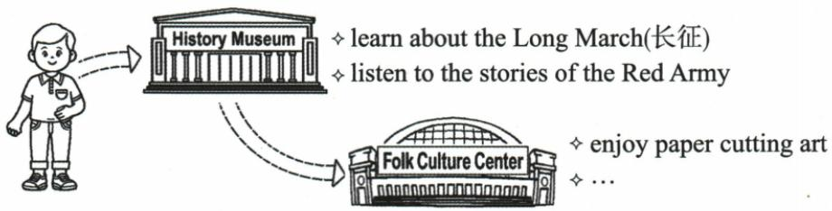

## 讲解

### 判据

题给上周五实践图和笔友，要求过程及感想。先把每个场所与活动挂对，再按原箭头先后写已发生事件。

### 流程

1. 原museum两活动学长征/听红军，center剪纸，箭头从前到后；不按OCR循环反推先后。
2. 过去事件visited/learned/listened/went/enjoyed保持，上午午后为原范文合法发挥，不冒称原图指定。
3. 原戏曲是省略号允许的范文细节，只在此来源记录，不能另造与研学无关娱乐。
4. 原感想deepens/enriches写仍认可的意义，允许现时参照，不强求所有句过去。
5. 核活动三项、过程、感想与书信完整；给开头不计字数，原83词接近80，不能把给定首段一起计数。

## 例题

### 原例题 EN-WRITE-E02

# 例（2024 福建中考）

假设你是李华,学校上周五开展了为期一天的实践活动。你的笔友 Henry 对这次活动很感兴趣。请你结合以下提示,用英语给他写一封信,谈谈活动过程及你的感想。词数 80 左右。

注意事项：

1. 必须包含所有提示信息, 可适当发挥, 开头已给出, 不计入总词数;  
2. 意思清楚, 表达通顺, 行文连贯, 书写规范;  
3.请勿在文中使用真实的姓名、校名和地名。

Dear Henry,

I'm glad that you're interested in our school study tour last Friday.

Yours,

Li Hua

**OCR恢复说明**：原页与图块核验：必要提示图保留原尺寸无损压缩；OCR生成的错误Mermaid或无图例意义的方位表删除，原提取在归档保留。

**原答案**：原资料分段范文，完整见原写作指导；不是唯一答案。

**原解析（原文）**

<table><tr><td colspan="2">Step 1 认真审题,明确要求</td></tr><tr><td colspan="2">主题:向笔友介绍实践活动 文体:应用文(书信)人称:以第一人称为主 时态:以一般过去时为主要点:1.介绍实践活动的过程;2.抒发自己的感想。</td></tr><tr><td>Step 2 分析要点,编制提纲</td><td>Step 3 巧用词句,衔接成文</td></tr><tr><td>开头:引出主题,说明写信的目的</td><td>Dear Henry,I&#x27;m glad that you&#x27;re interested in our school study tour last Friday.Let me tell you something about it.</td></tr><tr><td>正文:第一部分具体介绍上周五实践活动的过程;第二部分抒发自己的感想过程:1.in the morning, visit the History Museum2.after lunch, go to the Folk Culture Center感想:deepen our love for our country, enrich our understanding of traditional Chinese art</td><td>In the morning, we visited the History Museum. We learned about the history of the Long March. Then we listened to the stories of the Red Army, which greatly touched us (定语从句). After lunch, we went to the Folk Culture Center, where we enjoyed paper cutting art (定语从句). We also watched local opera performances that are wonderful (定语从句).The tour not only deepens our love for our country but also enriches our understanding of traditional Chinese art!</td></tr><tr><td>结尾:表达祝愿</td><td>Best wishes! Yours, Li Hua</td></tr></table>

**完整解析（依据原解析展开）**

信给Henry，写上周五已发生实践活动与感想。原图先History Museum，学Long March、听Red Army stories，再Folk Culture Center享paper cutting，省略号允许相关发挥，不是删掉必需三活动。原范文上午visited/learned/listened，午后went/enjoyed/watched，按事件过去；The tour deepens/enriches写现在仍认可的作用，与过去活动区分，不能看到全篇过去就一律把感受也改过去。

原图只明确参观顺序，不直接给上午、午后、当地戏曲，范文这些是资料本身许可发挥后的具体化。不要在讲解中声称这些细节都印在图上。定语从句which greatly touched us接听故事所带来的触动，where说明文化中心活动；wonderful现在评价演出性质可成立，不能绝对说watched后that are皆错。

逐要求核三活动、过程、感想、书信和无真实信息齐全，原新增正文83词与80左右接近。原OCR Mermaid把两个场馆画循环，原图箭头只由museum到center，删除错误重画文字并保原图。范文学习重点是以时间和事件衔接，不强制学生用非限制性定语从句。

## 易错

感想应联系参观活动而非独立励志套话；原where所修中心与which所指触动不混。

资料定位（题目自带的考试标签按原书保留，未独立核实其真题身份）：

- EN-WRITE-K05：351-377/full.md 第657—665行；c4413d3a-76e4-4669-bc73-e940488b52e5_origin.pdf实际PDF第14页。
- EN-WRITE-E02：351-377/full.md 第667—700行；c4413d3a-76e4-4669-bc73-e940488b52e5_origin.pdf实际PDF第15页。
